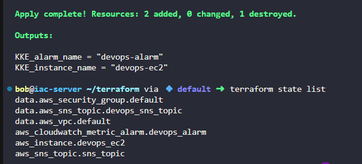

# Task-100 Create and Configure Alarm Using CloudWatch Using Terraform

The alarm should trigger if the CPU utilization exceeds 90% for one consecutive 5-minute period. To send notifications, use the SNS topic named `devops-sns-topic`, which is already created.

1. **Launch EC2 Instance:** Create an EC2 instance named `devops-ec2` using any appropriate Ubuntu AMI (you can use AMI `ami-0c02fb55956c7d316`).
2. **Create CloudWatch Alarm:** Create a CloudWatch alarm named `devops-alarm` with the following specifications:

    - Statistic: Average
    - Metric: CPU Utilization
    - Threshold: &gt;= 90% for 1 consecutive 5-minute period
    - Alarm Actions: Send a notification to the `devops-sns-topic` SNS topic.
3. Update the `main.tf` file (do not create a separate .tf file) to create a EC2 Instance and CloudWatch Alarm.
4. Create an `outputs.tf` file to output the following values:

- `KKE_instance_name` for the EC2 instance name.
- `KKE_alarm_name` for the CloudWatch alarm name.

---

# Solution:
```hcl
# main.tf


# Get default VPC
data "aws_vpc" "default" {
  default = true
}

# Get default security group
data "aws_security_group" "default" {
  vpc_id = data.aws_vpc.default.id
  name   = "default"
}

# Get existing SNS Topic
data "aws_sns_topic" "devops_sns_topic" {
  name = "devops-sns-topic"
}

# Create EC2 Instance
resource "aws_instance" "devops_ec2" {
  ami                    = "ami-0c02fb55956c7d316"
  instance_type          = "t2.micro"
  vpc_security_group_ids = [data.aws_security_group.default.id]

  tags = {
    Name = "devops-ec2"
  }
}

# Create CloudWatch Alarm
resource "aws_cloudwatch_metric_alarm" "devops_alarm" {
  alarm_name          = "devops-alarm"
  comparison_operator = "GreaterThanOrEqualToThreshold"
  evaluation_periods  = 1
  metric_name         = "CPUUtilization"
  namespace           = "AWS/EC2"
  period              = 300  # 5 minutes in seconds
  statistic           = "Average"
  threshold           = 90
  alarm_description   = "This metric monitors EC2 CPU utilization"
  alarm_actions       = [data.aws_sns_topic.devops_sns_topic.arn]

  dimensions = {
    InstanceId = aws_instance.devops_ec2.id
  }

  tags_all = {
    Name = "devops-alarm"
  }
  lifecycle {
    # quote or not — both work; explicitly ignore both to be safe
    ignore_changes =
      "tags",
      "tags_all",
    ]
  }
}
```

```hcl
# outputs.tf
output "KKE_instance_name" {
  description = "Name of the EC2 instance"
  value       = aws_instance.devops_ec2.tags["Name"]
}

output "KKE_alarm_name" {
  description = "Name of the CloudWatch alarm"
  value       = aws_cloudwatch_metric_alarm.devops_alarm.alarm_name
}

```
