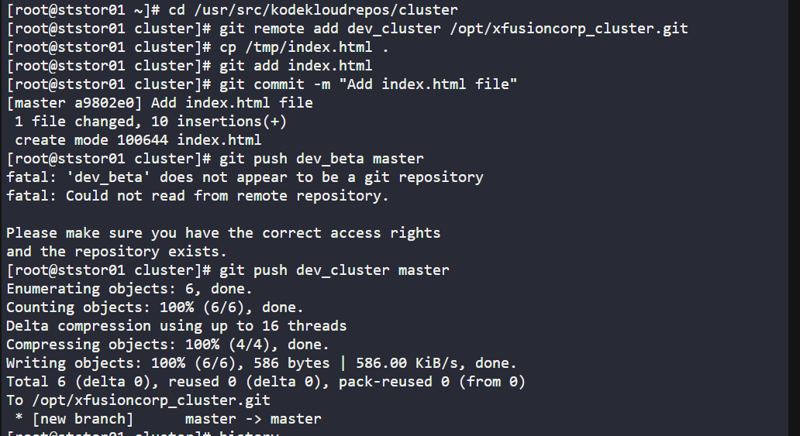

# Task-26 Git Manage Remotes

The DevOps team added some new Git remotes, so we need to update remote on /usr/src/kodekloudrepos/cluster repository as per details mentioned below:

a. In /usr/src/kodekloudrepos/cluster repo add a new remote dev_cluster and point it to /opt/xfusioncorp_cluster.git repository.

b. There is a file /tmp/index.html on same server; copy this file to the repo and add/commit to master branch.

c. Finally push master branch to this new remote origin.

# **Solution**

## **1. `sudo su -`**

- Elevating to root
  

## **2. `pwd`**

- **Print Working Directory**
  
- Shows the current directory path
  
- Useful for confirming your location in the filesystem
  

## **3. `cd /usr/src/kodekloudrepos/cluster`**

- **Change Directory** to the cluster repository folder
  
- Navigates to a different Git repository
  

## **4. `git remote add dev_cluster /opt/xfusioncorp_cluster.git`**

- **Add a new remote repository** named "dev_cluster"
  
- Points to the Git repository located at `/opt/xfusioncorp_cluster.git`
  
- This allows pushing/pulling to/from this additional remote
  

## **5. `cp /tmp/index.html .`**

- **Copy** the `index.html` file from `/tmp/` to the **current directory**
  
- Adds the file to this repository
  

## **6. `git add index.html`**

- **Stage** only the `index.html` file for commit
  
- More specific than `git add .` (which stages all changes)
  

## **7. `git commit -m "Add index.html file"`**

- **Commit** the staged changes with a commit message
  
- Creates a snapshot of the added file
  

## **8. `git push dev_cluster master`**

- **Push** the "master" branch to the "dev_cluster" remote
  
- Sends the committed changes to the additional remote repository
  

# This workflow is typical for:

- This a  bare repository on the same machine Used for deployment or synchronization between environments
 Pushing to multiple deployment environments, Possibly a staging or development cluster repository
  
- Setting up backup or mirror repositories
  
- Local development workflows with multiple target repositories