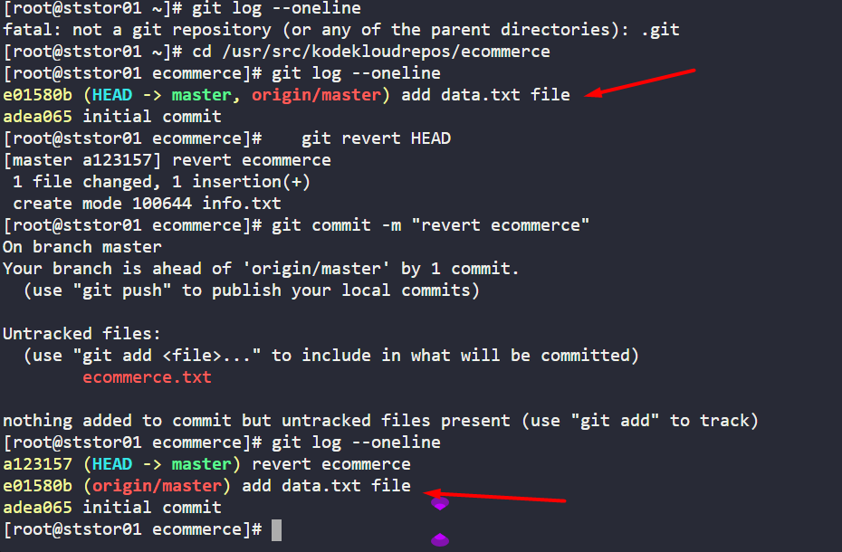

# Task-27: Git Revert Some Changes

---

The Nautilus application development team was working on a git repository `/usr/src/kodekloudrepos/ecommerce` present on `Storage server` in `Stratos DC`. However, they reported an issue with the recent commits being pushed to this repo. They have asked the DevOps team to revert repo HEAD to last commit. Below are more details about the task:

1. In `/usr/src/kodekloudrepos/ecommerce` git repository, revert the latest commit `( HEAD )` to the previous commit (JFYI the previous commit hash should be with `initial commit` message ).

2. Use `revert ecommerce` message (please use all small letters for commit message) for the new revert commit.
---

# **Solution**


- **Identify the Previous Commit Hash**:
  
  - Use `git log --oneline` to view the commit history and find the hash of the previous commit (the one before HEAD). The initial commit message should be visible here.
- **Revert the Latest Commit**:
  
  - The `git revert` command creates a new commit that undoes the changes introduced by the specified commit (in this case, HEAD) 
    
  - Since you want to revert HEAD to the previous state, use:
    
    ```
    git revert HEAD
    ```
    
  - This will open an editor for the commit message, note that the default message will be "Revert '<original-commit-message>'". However, the user specifically requests a custom message: "revert ecommerce".
    
  
- **Specify the Custom Commit Message**:
    
    - To use the exact message "revert ecommerce" (all lowercase), you can either:
      
 ```
git commit -m "revert ecommerce"
```
### Verification:

- After executing, use `git log --oneline` to confirm that a new commit with the message "revert ecommerce" appears at the top, and the working directory reflects the state of the previous commit.

By following these steps, you will successfully revert the latest commit to the previous state with the required commit message.


