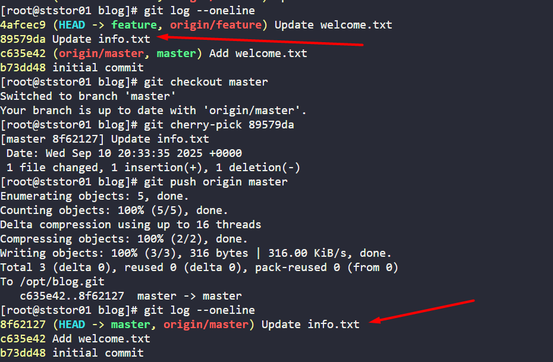

# Task-28:  Git Cherry Pick
---

The Nautilus application development team has been working on a project repository /opt/blog.git. This repo is cloned at /usr/src/kodekloudrepos on storage server in Stratos DC. They recently shared the following requirements with the DevOps team:


There are two branches in this repository, master and feature. One of the developers is working on the feature branch and their work is still in progress, however they want to merge one of the commits from the feature branch to the master branch, the message for the commit that needs to be merged into master is Update info.txt. Accomplish this task for them, also remember to push your changes eventually.

---

# **Solution**

 ## **Overview**
  
  This document describes a Git workflow where a specific commit was cherry-picked from a feature branch to the master branch and pushed to the remote repository.
  
  ## **Environment Details**
  
  - **Current Directory**: `/usr/src/kodekloudrepos/blog/`
    
  - **Repository Contents**:
    
    - `info.txt`
      
    - `welcome.txt`
      
  - **Operating User**: root
    
  
  ## **Git Branch Structure**
  
  To know in which we are
  
  ```
  git branch
  ```
  
  ## **Commit History Before Operation**
  
  ### **Feature Branch Commit History**:
  
  ```
   git log --oneline
  
```
Below is the output
  
  4afcec9 (HEAD -> feature, origin/feature) Update welcome.txt

  **<mark>89579da</mark> Update info.txt**

  c635e42 (origin/master, master) Add welcome.txt

 
  
  ### **Latest Commit on Feature Branch**:
  
  - **Commit Hash**: `4afcec9`
    
  - **Message**: "Update welcome.txt"
    
  - **Branches**: HEAD -> feature, origin/feature
    
  
  ## **Performed Operations**
  
  ### **1. Switch to Master Branch**
  
  ```bash
  git checkout master
  ```
  
  - **Result**: Switched from 'feature' branch to 'master' branch
    
  - **Status**: Branch is up to date with 'origin/master'
    
  
  ### **2. Cherry-Pick Specific Commit**
  
  ```bash
  git cherry-pick 89579da
  ```
  
  - **Target Commit**: `89579da` ("Update info.txt" from feature branch)
    
  - **Result**: Successfully applied commit to master branch
    
  - **New Commit Hash**: `8f62127`
    
  - **Message**: "Update info.txt" (preserved original commit message)
    
  
  ### **3. Push Changes to Remote**
  
  ```bash
  git push origin master
  ```
  
  - **Operation**: Pushed the new commit to remote repository
    
  - **Location**: `/opt/blog.git`
    
  
  ## **Final State**
  

  
  ### **Key Changes**:
  
  - The commit `89579da` ("Update info.txt") was successfully applied to master branch
    
  - A new commit `8f62127` was created on master with the same changes
    
  - The feature branch remains unchanged with its original commits
    
  - Remote master branch was updated with the new commit
    
  
  ## **Purpose and Benefits**
  
  ### **Why Cherry-Pick?**
  
  - Selectively apply specific changes from one branch to another
    
  - Avoid merging entire feature branch when only specific commits are needed
    
  - Maintain clean commit history on master branch
    
  
  ### **Use Case Example**
  
  - A bug fix or specific feature update developed in a feature branch
    
  - Need to deploy only that specific change to production (master) immediately
    
  - Without merging the entire feature branch work-in-progress
    
  
  ## **Verification Commands Used**
  
  - `git branch` - Check current branch
    
  - `git log --oneline` - View commit history
    
  - `git log --oneline -1` - View most recent commit
    
  - `ls` - List repository files
    
  
  This workflow demonstrates effective use of cherry-picking for selective code integration between branches.