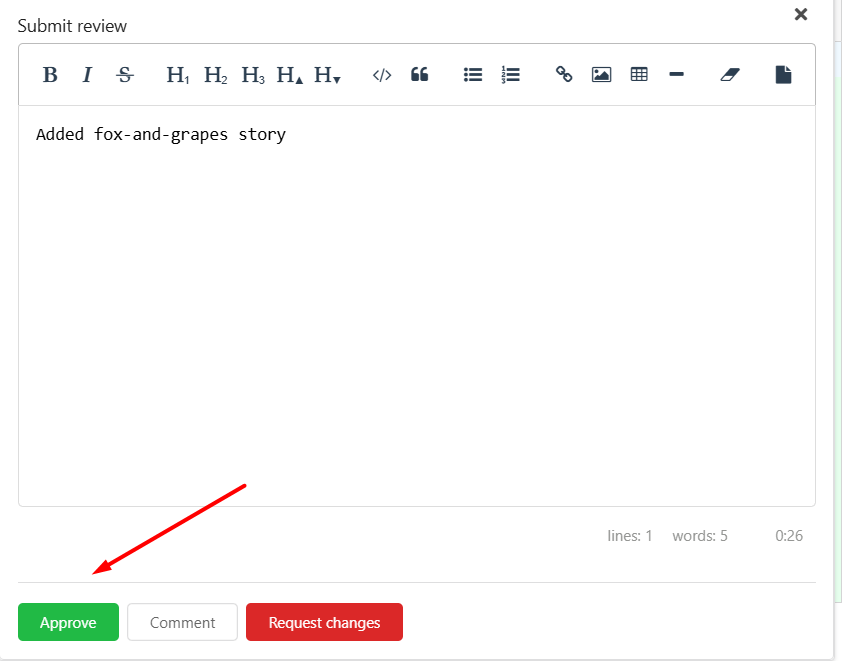
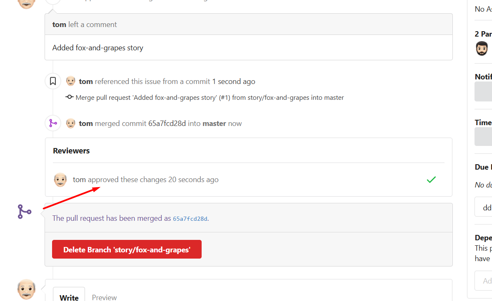
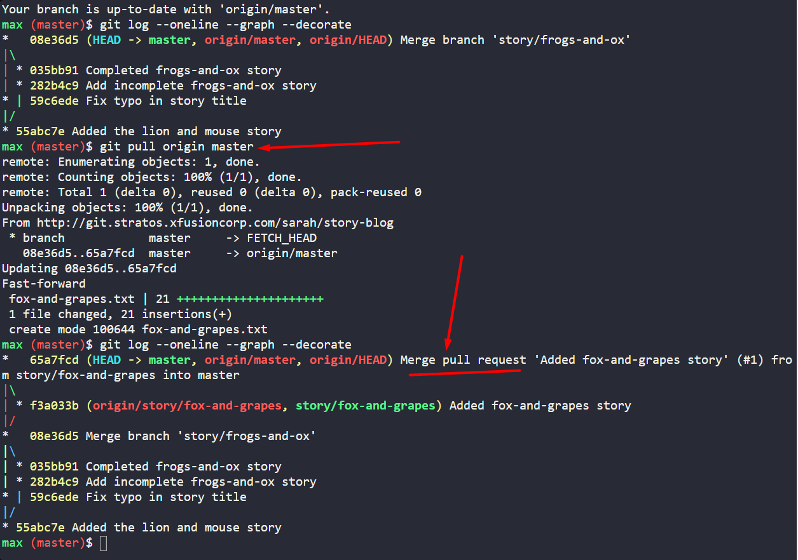

# Task-29-Manage Git Pull Requests

---
- SSH into storage server using user max, password Max_pass123 . There you can find an already cloned repo under Max user's home.

```
   ssh max@ststor01
   # Password: Max_pass123
  cd story-blog
```

- Check the contents of the cloned repository. Confirm that you can see Sarah's story and history of commits by running git log and validate author info, commit message etc.


---

Click on the `Gitea UI` button on the top bar. You should be able to access the `Gitea` page.

UI login info:

- Username: `max`
  
- Password: `Max_pass123`
  

PR title : `Added fox-and-grapes story`

PR pull from branch: `story/fox-and-grapes` (source)

PR merge into branch: `master` (destination)


Before we can add our story to the `master` branch, it has to be reviewed. So, let's ask `tom` to review our PR by assigning him as a reviewer

Add tom as reviewer through the Git Portal UI

- Go to the newly created PR
  
- Click on Reviewers on the right
  
- Add tom as a reviewer to the PR


  

Now let's review and approve the PR as user `Tom`

Login to the portal with the user `tom`

Logout of `Git Portal UI` if logged in as `max`

UI login info:

- Username: `tom`
  
- Password: `Tom_pass123`
  




PR title : `Added fox-and-grapes story`

Review and merge it.

Great stuff!! The story has been merged! 👏


- ## then click on Merge 




Verify Merge in Terminal

Switch to master branch and pull latest changes:

```shell
git checkout master 
git pull origin master
git log --oneline --graph --decorate
```

- Confirm Max’s commit `Added fox-and-grapes story` is now included.
- Ensure local master is in sync with remote.


