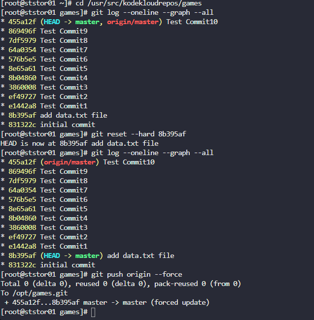

# Task-30: Git hard reset

---

The Nautilus application development team was working on a git repository /usr/src/kodekloudrepos/games present on Storage server in Stratos DC. This was just a test repository and one of the developers just pushed a couple of changes for testing, but now they want to clean this repository along with the commit history/work tree, so they want to point back the HEAD and the branch itself to a commit with message add data.txt file. Find below more details:

In /usr/src/kodekloudrepos/games git repository, reset the git commit history so that there are only two commits in the commit history i.e initial commit and add data.txt file.

Also make sure to push your changes.
---

# **Solution**

**1. `cd /usr/src/kodekloudrepos/games`**

 To change your current working directory to the `games` git repository.

**2. `git log --oneline --graph --all`**

- To inspect the current state of the commit history and identify the commit hash (`8b395af`) you wanted to reset to.

**3. `git reset --hard 8b395af`**

- **`reset`:** The command to move the current branch pointer.
- **`--hard`:** The most powerful and dangerous option. It does three things:

    1. Moves the branch pointer to the specified commit (`8b395af`).
    2. Makes your working directory (the actual files on your disk) match exactly what was in that commit.
    3. Discards all changes in your staging area.
- **Result:** Any commits made after `8b395af` are effectively removed from your local branch's history. It's as if they never happened.

**4. `git log --oneline --graph --all`**

- **Purpose:** To **verify** the result of the reset command.

**5. `git push origin --force`**

- **`--force`** (or `-f`): **This is a critical flag.** A normal `git push` would be rejected because your local history is behind the remote's history (you've removed commits). The `--force` flag overwrites the remote's history to make it match your local history exactly.
- **Why it's needed:** Without this force push, the remote repository would still contain all the old commits, and your reset would only be effective locally.

