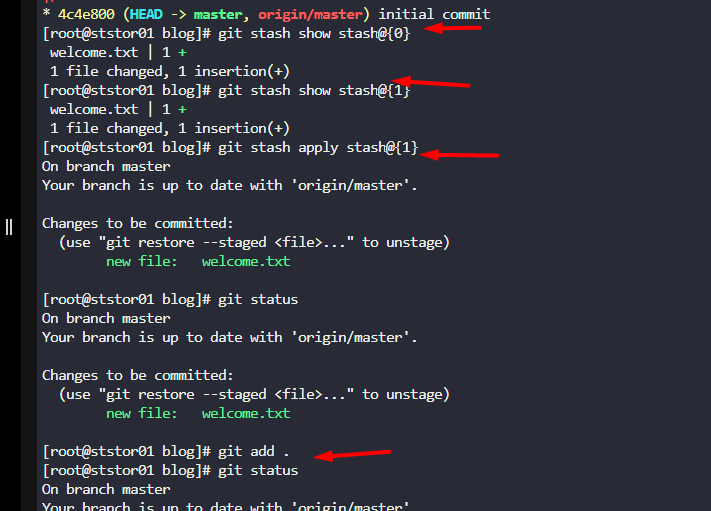
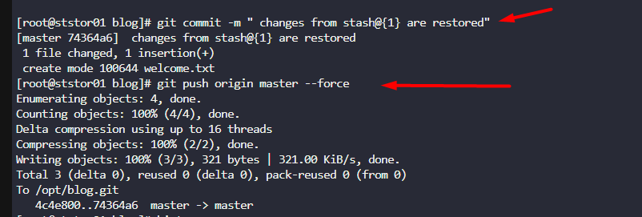

# Task-31: Git Stash

---

The Nautilus application development team was working on a git repository /usr/src/kodekloudrepos/blog present on Storage server in Stratos DC. One of the developers stashed some in-progress changes in this repository, but now they want to restore some of the stashed changes. Find below more details to accomplish this task:


Look for the stashed changes under /usr/src/kodekloudrepos/blog git repository, and restore the stash with stash@{1} identifier. Further, commit and push your changes to the origin. for commit message) for the new revert commit.

---


### What is a Git Stash?

Think of the **stash** as a temporary shelf or a clipboard for your uncommitted changes.

- **Purpose:** It allows you to quickly save your current work-in-progress (modified and staged files) without making a commit. This is incredibly useful when you need to switch to a different task or branch but aren't ready to commit your half-finished work.

# **Solution**


### Step-by-Step Guide:

1. **Navigate to the Repository**:

```bash
 cd /usr/src/kodekloudrepos/blog
```

2. **List Existing Stashes**:  
Check the available stashes to confirm `stash@{1}` exists:


```
git stash list
```


This will display entries like `stash@{0}: ...`, `stash@{1}: ...`, etc. 

3. **Restore the Specific Stash**:  
Apply the stashed changes from `stash@{1}` without removing it from the stash list:

```bash
 git stash apply stash@{1}
```


4. **Verify the Restored Changes**:  
Check the status of your working directory to ensure the changes are applied:

```bash
git status
```

    The restored changes will appear as modified files.
5. **Commit the Changes**:  
Stage and commit the restored changes:

```bash
git add . 
```

#### Stages all changes, including new files (use `git add -u` for only modified files)git commit -m "Restore and commit stashed changes from stash@{1}"

Push the commit to the remote repository:

```bash
git push origin master 
```


