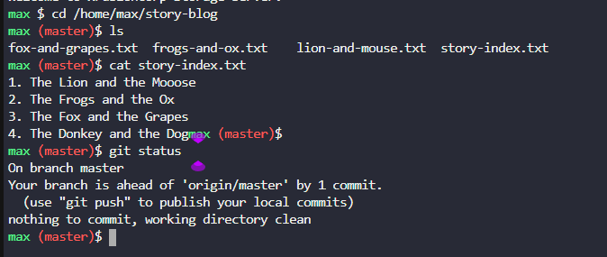
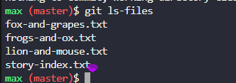
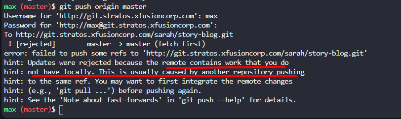
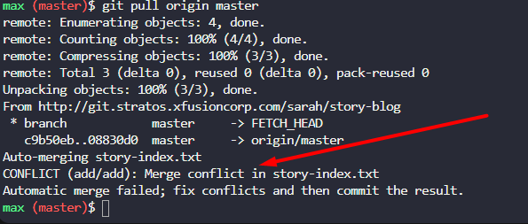
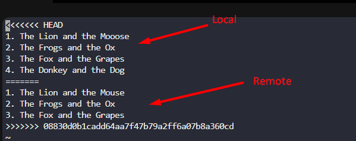
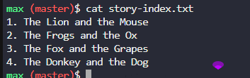
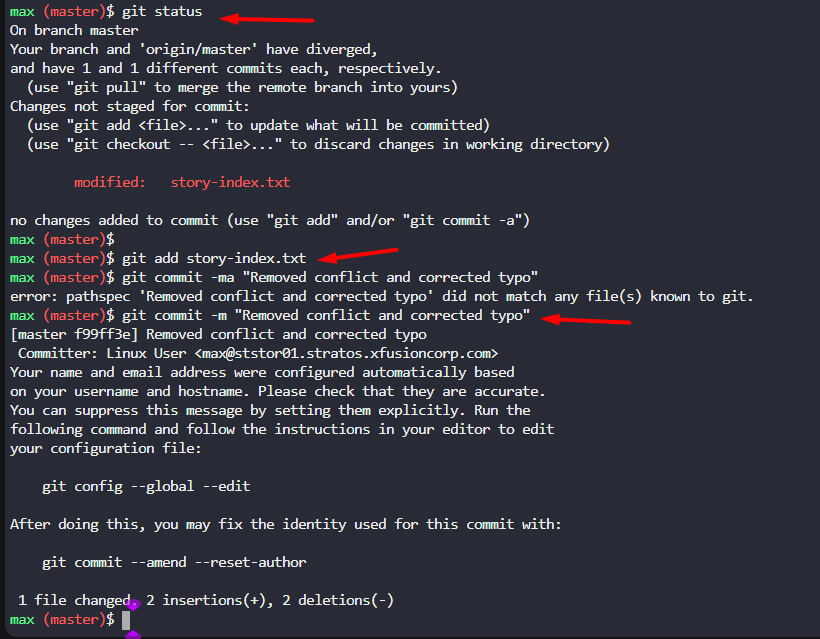
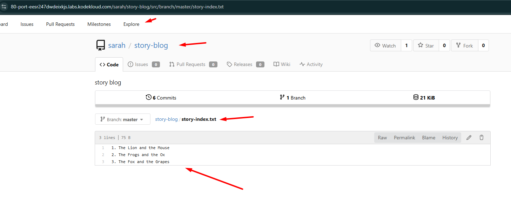
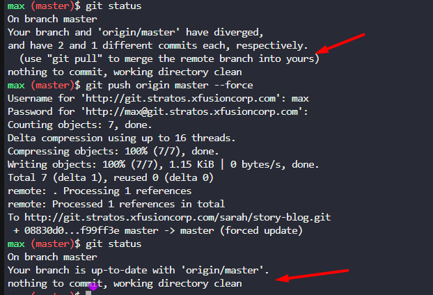
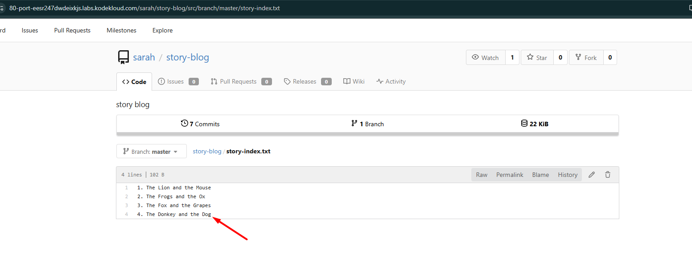

# Task-33: Resolve Git Merge Conflicts

---
Sarah and Max were working on writting some stories which they have pushed to the repository. Max has recently added some new changes and is trying to push them to the repository but he is facing some issues. Below you can find more details:

SSH into `storage server` using user `max` and password `Max_pass123`. Under `/home/max` you will find the `story-blog` repository. Try to push the changes to the origin repo and fix the issues. The `story-index.txt` must have titles for all 4 stories. Additionally, there is a typo in `The Lion and the Mooose` line where `Mooose` should be `Mouse`.  

Click on the `Gitea UI` button on the top bar. You should be able to access the `Gitea` page. You can login to `Gitea` server from UI using username `sarah` and password `Sarah_pass123` or username `max` and password `Max_pass123`.

---

First login with the max
```
# SSH into the storage server
ssh max@ststor01
# Password: Max_pass123
```
Then move to the directory

```bash
cd /home/max/story-blog
```
```bash
cat story-index.txt
```
```bash
git status
```


First, We will try to commit the story to the remote to know issue exist or not. 

for that we try to understand whether what are files are indexed in this git repo.

```bash
git ls-files

```



We can see that story-index.txt is already indexed in the git repo. So we will try to commit the changes.       

```bash
git commit -m "to check if there is any error"
```
```bash
git push origin master
```
as we can see there is error 



and it suggested to pull but we ran pull, we again faced with the new error (real error) indicating there is merge conflict.



So, We can see that there is a merge conflict in the story-index.txt file. We will resolve it by following the steps below:

First, we will abort the merge process
```bash
git reset
```
the pulling from remote 

```bash
git pull origin master
```
```bash
vi story-index.txt
```



- **Resolve the conflict by removing the markers and relevant code/text:**

    - **Decide which version of the code to keep:** You need to choose between the changes in `HEAD`, the changes from the incoming branch, or a combination of both.
    - **Edit the file:** Manually modify the conflicting section to reflect the desired resolution. This involves deleting the unwanted lines, combining relevant parts, and ensuring the final code is correct.
    - **Remove the conflict markers:** Once you have made your decision and edited the code, delete all three conflict markers (`<<<<<<< HEAD`, `=======`, and `>>>>>>> [branch-name]`) from the file.

After editing it should look like this 


```bash
git status
git add story-index.txt 
git commit -ma "Removed conflict and corrected typo"
```


Before pushing we will see remote repo via Gitea UI


then we will push to remote(origin)
```
git status
git push origin master --force
```





Verification at Gitea UI

