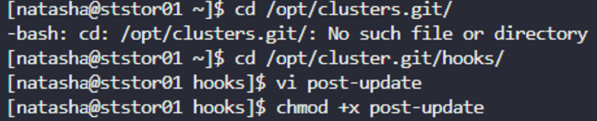
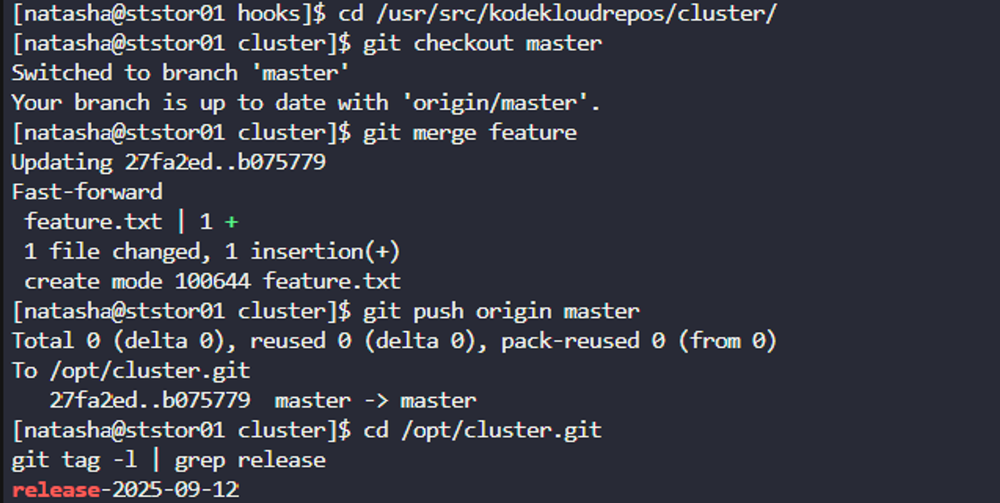
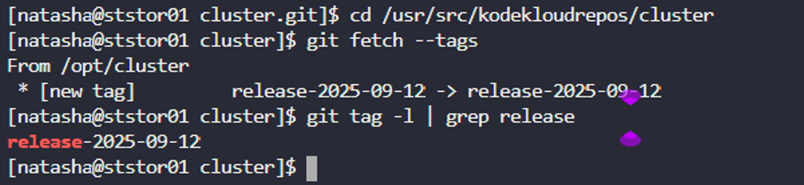

# Task-28:  Git Cherry Pick
---

The Nautilus application development team was working on a git repository `/opt/cluster.git` which is cloned under `/usr/src/kodekloudrepos` directory present on `Storage server` in `Stratos DC`. The team want to setup a hook on this repository, please find below more details:  

- Merge the `feature` branch into the `master` branch`, but before pushing your changes complete below point.
- Create a `post-update` hook in this git repository so that whenever any changes are pushed to the `master` branch, it creates a release tag with name `release-2023-06-15`, where `2023-06-15` is supposed to be the current date. For example if today is `20th June, 2023` then the release tag must be `release-2023-06-20`. Make sure you test the hook at least once and create a release tag for today's release.
- Finally remember to push your changes.  
`Note:` Perform this task using the `natasha` user, and ensure the repository or existing directory permissions are not altered.

---

# First we will try to understand what is Git Hook

## What are Git Hooks?

Git hooks are **scripts that Git executes automatically** at specific points during Git operations. They allow you to customize Git's behavior and automate tasks when certain events occur in your repository.

## Post-Update Hook Specifically

The **post-update hook** is a **server-side hook** that runs **after** a successful push operation to a Git repository. Here's what you need to know:

### When it runs:

- **After** `git push` completes successfully
- **After** all references (branches/tags) have been updated
- Only runs on the **receiving repository** (the one being pushed to)


---


# **Solution**

1. First login into storage server and move to the main git repo 

```
ssh natasha@172.16.238.15 

cd /opt/cluster.git/hooks/

```

2. Create an post-update script 

```
vi post-update
```
```
#!/bin/bash
# Get the current date
current_date=$(date +"%Y-%m-%d")
# Create a release tag with the current date
git tag release-$current_date
```
3. Save and exit the file. Provide Execution permission

```
chmod +x post-update
```


4. Now move to the local repo and merge the feature branch to master and push the changes 

``` 
cd /usr/src/kodekloudrepos/cluster.git
cd /usr/src/kodekloudrepos/cluster/
git checkout master
git merge feature
git push origin master
```
5. Now check the tags in the main repo 

```
cd /opt/cluster.git
git tag -l | grep release
```



## Where Tags Are Created:

- **Hook runs in**: `/opt/cluster.git` (bare repository)
- **Tag is created in**: `/opt/cluster.git` (where the hook runs)
- **Cloned repo**: When the hook creates a tag in the remote repository, it doesn't automatically sync back to your local repo `/usr/src/kodekloudrepos/cluster`You need to fetch to get the cluster tags that were created remotely.
- **Fetch tags**: Run `git fetch --tags` in your local repo to see the new tags.
```
cd /usr/src/kodekloudrepos/cluster
git fetch --tags
git tag -l | grep release
```


- After running git fetch --tags, you should see the release tag in your cloned repository as well. This is the expected behavior - the hook creates the tag in the receiving repository, and you need to fetch to sync it back to your working copy.
 

 

## **Real-World purpose** and **Complete Workflow** of this post-update hook setup.

Imagine you're a **development team** working on a web application. You want to:

- **Automatically create release versions** every time code is pushed to production (master branch)
- **Track deployments** with timestamped tags
- **Automate release management** without manual intervention

## The Complete Workflow

### 1. **Development Setup**

```
Developer's Machine → Push to → Central Git Server → Automatic Tag Creation
```

### 2. **Repository Structure**

- **`/opt/cluster.git`** = **Central/Production Repository** (like GitHub/GitLab server)
- **`/usr/src/kodekloudrepos/cluster`** = **Developer's Working Copy** (like your local machine)

### 3. **Step-by-Step Process**

#### **Before Hook Setup:**

bash

```bash
Developer: git push origin master
# Result: Code is updated, but no release tracking
```

#### **After Hook Setup:**

bash

```bash
Developer: git push origin master
# Server automatically runs: git tag release-2025-09-12
# Result: Code updated AND release tag created automatically
```

## Real-World Benefits

### **1. Automated Release Management**


```bash
# Without hook - Manual process:
git push origin master
git tag release-v1.2.3
git push --tags

# With hook - Automatic:
git push origin master
# Tag created automatically!
```

### **2. Deployment Tracking**

bash

```bash
# See all releases:
git tag -l | grep release
# Output:
release-2025-09-10  # Monday's deployment
release-2025-09-11  # Tuesday's deployment  
release-2025-09-12  # Today's deployment
```

### **3. Rollback Capability**


```bash
# If today's release has bugs, rollback to yesterday:
git checkout release-2025-09-11
```

## Common Use Cases in Industry

### **1. CI/CD Pipelines**


```bash
# Hook triggers deployment:
#!/bin/bash
date=$(date +"%Y-%m-%d")
git tag release-$date
# Trigger Docker build
# Deploy to production
# Send Slack notification
```

### **2. Version Management**


```bash
# Automatic semantic versioning:
#!/bin/bash
# Get last version: v1.2.3
# Increment: v1.2.4  
# Tag and deploy
```

### **3. Compliance & Auditing**


```bash
# Every production change gets timestamped
# Legal/compliance teams can track exactly when changes went live
```

## The Flow You Just Implemented

```
1. Developer (you) works on feature branch
2. Merges feature → master in local repo
3. Pushes to central server (/opt/cluster.git)
4. Server receives push → triggers post-update hook
5. Hook automatically creates release-2025-09-12 tag
6. Production now has a timestamped release marker
7. Developer fetches tags to see the release was created
```

## Why This Matters

### **Without Hook:**

- Manual tagging (developers forget)
- Inconsistent release naming
- No automatic deployment triggers
- Hard to track when releases happened

### **With Hook:**

- ✅ Every production push gets a release tag
- ✅ Consistent naming (release-YYYY-MM-DD)
- ✅ Can trigger automated deployments
- ✅ Perfect audit trail of releases


