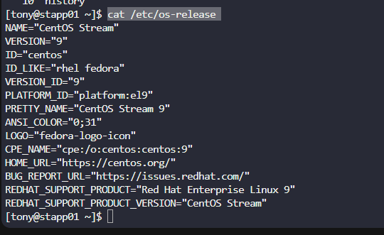
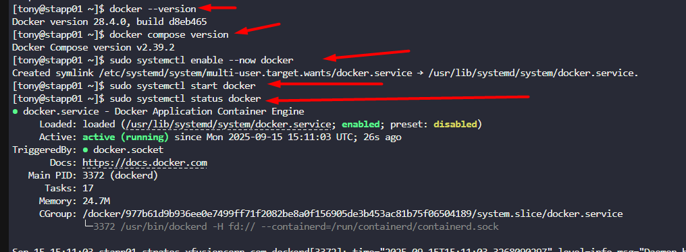

The Nautilus DevOps team aims to containerize various applications following a recent meeting with the application development team. They intend to conduct testing with the following steps:

1. Install `docker-ce` and `docker compose` packages on `App Server 1`.  

2. Initiate the `docker` service.

---

# Solution: 

## First we will try to find on which server App Server 1 is running 

```
ssh tony@stapp01
cat /etc/os-release 
```


Its on the Cent OS, then we follow the offical method which is listed on the Docker and the official method can be found here:[Docker-centos](https://docs.docker.com/engine/install/centos/#install-using-the-repository)

We will set-up our repo to download the Docker and proceed with the given instruction.

```
sudo dnf -y install dnf-plugins-core
sudo dnf config-manager --add-repo https://download.docker.com/linux/centos/docker-ce.repo
sudo dnf install docker-ce docker-ce-cli containerd.io docker-buildx-plugin docker-compose-plugin
docker --version
docker compose version
sudo systemctl enable --now docker
sudo systemctl start docker
sudo systemctl status docker
sudo docker run hello-world
```




