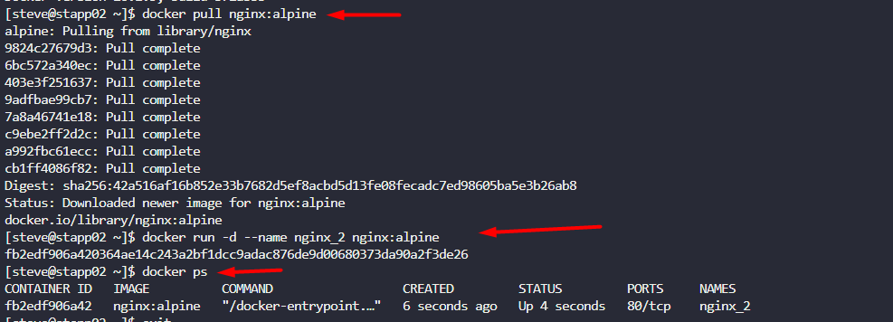

The Nautilus DevOps team is conducting application deployment tests on selected application servers. They require a nginx container deployment on `Application Server 2`. Complete the task with the following instructions:

1. On `Application Server 2` create a container named `nginx_2` using the `nginx` image with the `alpine` tag. Ensure container is in a `running` state.

---

# Solution: 

## Pulling the image and running the docker nginx container 

1. **`docker --version`** - Shows the installed Docker version on your system.
2. **`docker pull nginx:alpine`** - Downloads the Nginx image with the Alpine Linux base (smaller and more lightweight).
3. **`docker run -d --name nginx_2 nginx:alpine`** - Creates and starts a container with:

    - `-d`: Runs in detached/background mode
    - `--name nginx_2`: Names the container "nginx\_2"
    - `nginx:alpine`: Uses the image you pulled
4. **`docker ps`** - Lists all running containers (should show your nginx\_2 container)

