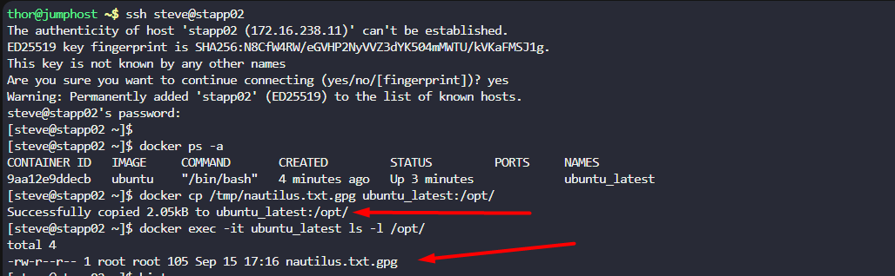

The Nautilus DevOps team possesses confidential data on `App Server 2` in the `Stratos Datacenter`. A container named `ubuntu_latest` is running on the same server.  

Copy an encrypted file `/tmp/nautilus.txt.gpg` from the docker host to the `ubuntu_latest` container located at `/opt/`. Ensure the file is not modified during this operation.

---

# Solution: 

First verify whether the container running and copy the file

```
docker ps -a
docker cp /tmp/nautilus.txt.gpg ubuntu_latest:/opt/
```

Explanation on the `docker cp`

- *Use `docker cp` (Copy Files In/Out)*

- If you just need to move data once:

```
    # Copy file from host → container
    docker cp ./localfile.txt mycontainer:/app/data/
```

Then verify whether the file has been copied 

```
docker exec -it ubuntu_latest ls -l /opt/
```

- **`docker exec`**  
Run a command **inside an already running container**.
- **`-it`**

- `-i` → interactive (keeps STDIN open)
- `-t` → allocates a pseudo-TTY (makes output human-readable, like when you run commands in a normal terminal)
- **`mycontainer`**  
The name (or ID) of the running container where you want to execute the command--- in our case it is `ubuntu_latest`
- **`ls -l /app/data/`**  
The actual command being executed *inside the container*.
- `ls` → list files in the directory
- `-l` → long format (shows permissions, owner, size, modification date)
- `/app/data/` → the path inside the container you want to inspect -- in our case it is `/opt/`

