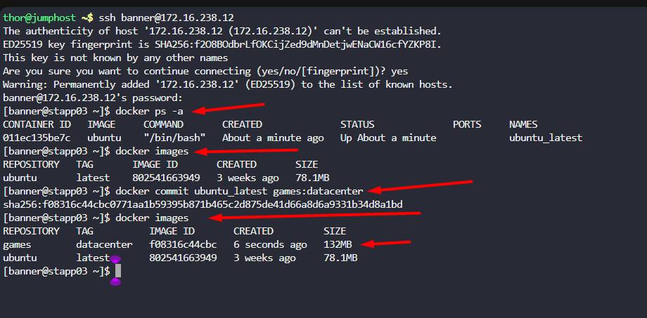

One of the Nautilus developer was working to test new changes on a container. He wants to keep a backup of his changes to the container. A new request has been raised for the DevOps team to create a new image from this container. Below are more details about it:

a. Create an image `games:datacenter` on `Application Server 3` from a container `ubuntu_latest` that is running on same server.
Step 1: Confirm the container name

First, access Application Server 3 and list the currently running containers to confirm the exact name or ID of the target container. You can do this with the `docker ps` command.

---

# Solution: 

    docker ps

The output will show all active containers. Look for the container named `ubuntu_latest`.

Step 2: Create the image

Once you have verified the container is running and have its name or ID, use the `docker commit` command to save its state to a new image with the specified tag `games:datacenter`.

    docker commit ubuntu_latest games:datacenter

- `docker commit`: The command to create a new image from a container.
- `ubuntu_latest`: The name of the source container.
- `games:datacenter`: The name and tag for the new image you are creating.

Step 3: Verify the new image

After the command completes, you can check that the new image was created successfully by listing all local images.

    docker images

The output will show your new `games:datacenter` image in the list.

   

