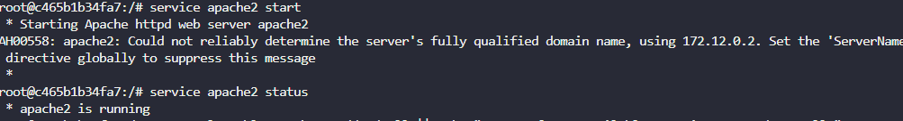

One of the Nautilus DevOps team members was working to configure services on a `kkloud` container that is running on `App Server 1` in `Stratos Datacenter`. Due to some personal work he is on PTO for the rest of the week, but we need to finish his pending work ASAP. Please complete the remaining work as per details given below:

a. Install `apache2` in `kkloud` container using `apt` that is running on `App Server 1` in `Stratos Datacenter`.  

b. Configure Apache to listen on port `6400` instead of default `http` port. Do not bind it to listen on specific IP or hostname only, i.e it should listen on localhost, 127.0.0.1, container ip, etc.  

c. Make sure Apache service is up and running inside the container. Keep the container in running state at the end.


---

# Solution: 
# Apache2 Configuration in kkloud Container on App Server 1


## Step 1: Connect to App Server 1

```bash
# From jump_host, SSH to App Server 1
ssh tony@stapp01.stratos.xfusioncorp.com
# Password: 
```

## Step 2: Check the kkloud Container Status

```bash
# Check if the container is running
sudo docker ps -a


# Verify it's running
sudo docker ps -a
```

## Step 3: Access the kkloud Container

```bash
# Execute into the container with bash shell
sudo docker exec -it kkloud /bin/bash
```

## Step 4: Install Apache2 in the Container

```bash
# Update package list
apt update

# Install Apache2
apt install -y apache2

# Verify installation
apache2 -v
```

## Step 5: Configure Apache to Listen on Port 6400

```bash
# First, check the current configuration
cat /etc/apache2/ports.conf

# Use sed to change Listen 80 to Listen 6400
sed -i 's/Listen 80/Listen 6400/' /etc/apache2/ports.conf

# Verify the change
cat /etc/apache2/ports.conf | grep Listen
```

##

## Step 6: Start and Enable Apache Service in kkloud Container

```bash
# Start Apache service
service apache2 start

# Check Apache status
service apache2 status
```


```bash
# Test Apache response
curl localhost:6400

# You should see the Apache2 default page HTML
```

## Step 7: Keep Container Running

```bash
# Exit the container (but keep it running)
exit
```

## Step 8: Final Verification from App Server 1

```bash
# Back on App Server 1, verify container is still running
sudo docker ps | grep kkloud

# Test Apache from the host
curl localhost:6400 2>/dev/null || echo "Testing from container IP..."

# Get container IP and test
CONTAINER_IP=$(sudo docker inspect -f '{{range .NetworkSettings.Networks}}{{.IPAddress}}{{end}}' kkloud)
echo "Container IP: $CONTAINER_IP"
curl $CONTAINER_IP:6400
```

## Verification Commands Summary

Run these commands to verify everything is working:

```bash
# 1. Container is running
sudo docker ps | grep kkloud

# 2. Apache is running inside container
sudo docker exec kkloud service apache2 status

# 3. Apache is listening on port 6400
sudo docker exec kkloud netstat -tlnp | grep :6400

# 4. Apache responds to requests
sudo docker exec kkloud curl localhost:6400
```


## Expected Results

✅ **Success indicators:**

- Container "kkloud" is in running state
- Apache2 is installed and running inside the container
- Apache listens on port 6400 (not port 80)
- Apache responds to HTTP requests on port 6400
- Service works on localhost, 127.0.0.1, and container IP