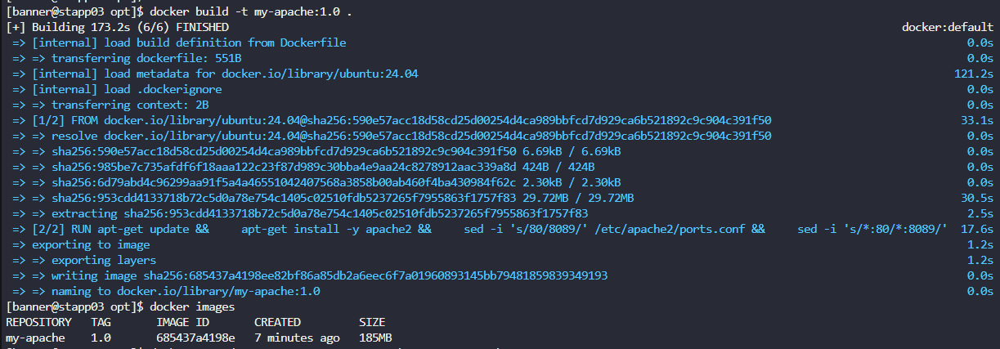
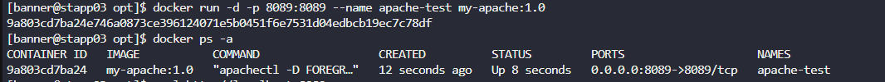
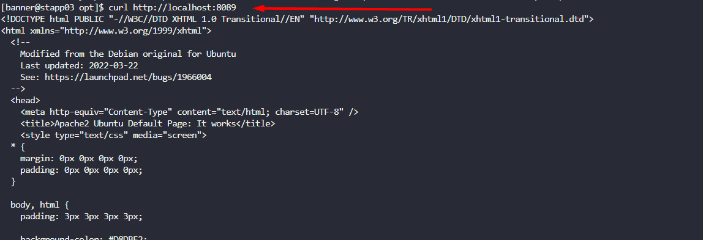

As per recent requirements shared by the Nautilus application development team, they need custom images created for one of their projects. Several of the initial testing requirements are already been shared with DevOps team. Therefore, create a docker file `/opt/docker/Dockerfile` (please keep `D` capital of Dockerfile) on `App server 3` in `Stratos DC` and configure to build an image with the following requirements:  

a. Use `ubuntu:24.04` as the base image.  

b. Install `apache2` and configure it to work on `8089` port. (do not update any other Apache configuration settings like document root etc).


---

# Solution: 
### 1. Save the **Dockerfile**

```
FROM ubuntu:24.04

ENV DEBIAN_FRONTEND=noninteractive

RUN apt-get update && \
    apt-get install -y apache2 && \
    sed -i 's/80/8089/' /etc/apache2/ports.conf && \
    sed -i 's/*:80/*:8089/' /etc/apache2/sites-available/000-default.conf && \
    apt-get clean && rm -rf /var/lib/apt/lists/*

EXPOSE 8089

CMD ["apachectl", "-D", "FOREGROUND"]

```

Save it in a new folder as `Dockerfile`.

---

### 2. Build the image

In the same folder, run:

`docker build -t my-apache:1.0 .`

- `-t my-apache:1.0` → gives the image a name (`my-apache`) and version (`1.0`).
  
- `.` → means use the Dockerfile in the current directory.
  



---

### 3. Run the container

`docker run -d -p 8089:8089 --name apache-test my-apache:1.0`

- `-d` → run in detached mode (background).
  
- `-p 8089:8089` → map host port 8089 to container port 8089.
  
- `--name apache-test` → name the container.
  

---

### 4. Verify it’s running

`docker ps`

Output should look like:



### 5. Test with the curl 




**Dockerfile** Explanation  line by line:

    # a) Base image
    FROM ubuntu:24.04

- This sets the base image for your container.
- `ubuntu:24.04` is the official Ubuntu LTS release (Noble Numbat).
- Everything in your container will be built on top of this minimal Ubuntu OS.

* * *

    # Avoid interactive prompts during install
    ENV DEBIAN_FRONTEND=noninteractive

- By default, `apt-get install` may ask interactive questions (e.g., about timezone).
- Setting `DEBIAN_FRONTEND=noninteractive` ensures the installation runs automatically without stopping to ask for user input.

* * *

    # b) Install apache2 and configure it to work on 8089
    RUN apt-get update && \ 
        apt-get install -y apache2 && \ 
        sed -i 's/80/8089/' /etc/apache2/ports.conf && \ 
        sed -i 's/*:80/*:8089/' /etc/apache2/sites-available/000-default.conf && \ 
        apt-get clean && rm -rf /var/lib/apt/lists/*

Breaking this `RUN` command down:

1. `apt-get update` → Updates package lists so apt knows what software versions are available.
2. `apt-get install -y apache2` → Installs Apache HTTP server without prompting (`-y` = yes to all).
3. `sed -i 's/80/8089/' /etc/apache2/ports.conf` → Edits the `ports.conf` file, changing the default listening port from `80` to `8089`.
4. `sed -i 's/*:80/*:8089/' /etc/apache2/sites-available/000-default.conf` → Updates the default virtual host configuration to listen on port `8089` instead of `80`.

    - Notice we **only change the port**, leaving other Apache settings (document root, logging, etc.) untouched.
5. `apt-get clean && rm -rf /var/lib/apt/lists/*` → Cleans up cached package data to keep the final Docker image small.

* * *

    # Expose the new port
    EXPOSE 8089

- Tells Docker that the container will listen on port `8089`.
- This doesn’t *publish* the port to your host machine automatically—it’s just metadata.
- When running the container, you’ll still need `-p 8089:8089` to map it to your host.

* * *

    # Run apache in foreground
    CMD ["apachectl", "-D", "FOREGROUND"]

- By default, Apache runs as a background daemon, which would cause the container to exit immediately.
- This command runs Apache **in the foreground** so the container stays alive.
- `CMD` tells Docker what process should run when the container starts.