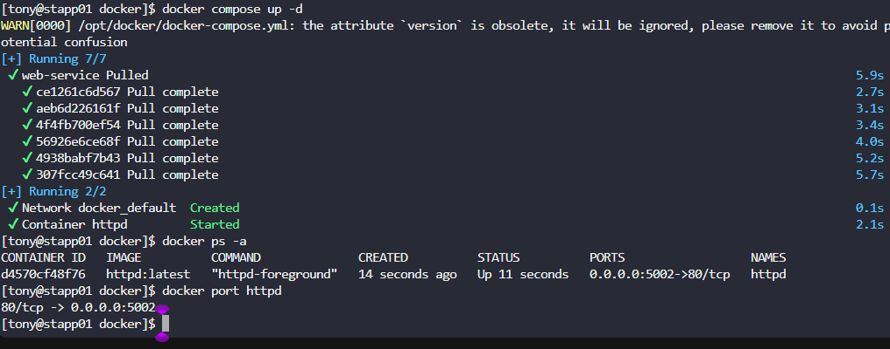
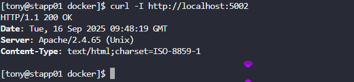

The Nautilus application development team shared static website content that needs to be hosted on the `httpd` web server using a containerised platform. The team has shared details with the DevOps team, and we need to set up an environment according to those guidelines. Below are the details:  

a. On `App Server 1` in `Stratos DC` create a container named `httpd` using a docker compose file `/opt/docker/docker-compose.yml` (please use the exact name for file).  

b. Use `httpd` (preferably `latest` tag) image for container and make sure container is named as `httpd`; you can use any name for service.  

c. Map `80` number port of container with port `5002` of docker host.  

d. Map container's `/usr/local/apache2/htdocs` volume with `/opt/security` volume of docker host which is already there. (please do not modify any data within these locations).

---
# Solution: 

## Create an docker compose yaml file 

```
vi /opt/docker/docker-compose.yml
```

```yaml
version: '3.8'

services:
  web-service:
    image: httpd:latest
    container_name: httpd
    ports:
      - "5002:80"
    volumes:
      - /opt/security:/usr/local/apache2/htdocs
    restart: unless-stopped
```

## Start the container using docker compose file

```
docker-compose -f /opt/docker/docker-compose.yml up -d
```


## Verify the container is running

```
docker ps -a
curl -I http://localhost:5002
```




---
# Explanation

## 🔑 Important Things for Docker Compose

### 1. **Basic Structure**

    version: "3.9"          # Always define version
     services:              # Defines your containers app:
       web-service:         # Service name (like a container role)
          image: nginx      # Or use build: .
          ports:
          - "8080:80"       # host:container
          volumes:
          - ./html:/var/www/html   # bind mount
          - db_data:/var/lib/mysql # named volume