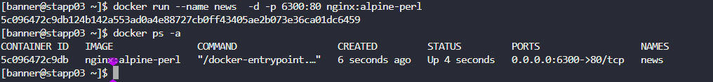

The Nautilus DevOps team is planning to host an application on a nginx-based container. There are number of tickets already been created for similar tasks. One of the tickets has been assigned to set up a nginx container on `Application Server 3` in `Stratos Datacenter`. Please perform the task as per details mentioned below:

a. Pull `nginx:alpine-perl` docker image on `Application Server 3`.  

b. Create a container named `news` using the image you pulled.  

c. Map host port `6300` to container port `80`. Please keep the container in running state.

---

# Solution: 

## Step a: Pull nginx:alpine image
```
docker pull nginx:alpine
```

## Step b & c: Run container named cluster with port mapping
```
docker run -d --name news -p 6300:80 nginx:alpine
```
## Verify the container is running and port mapping is correct
``` 
docker  ps -a
```
