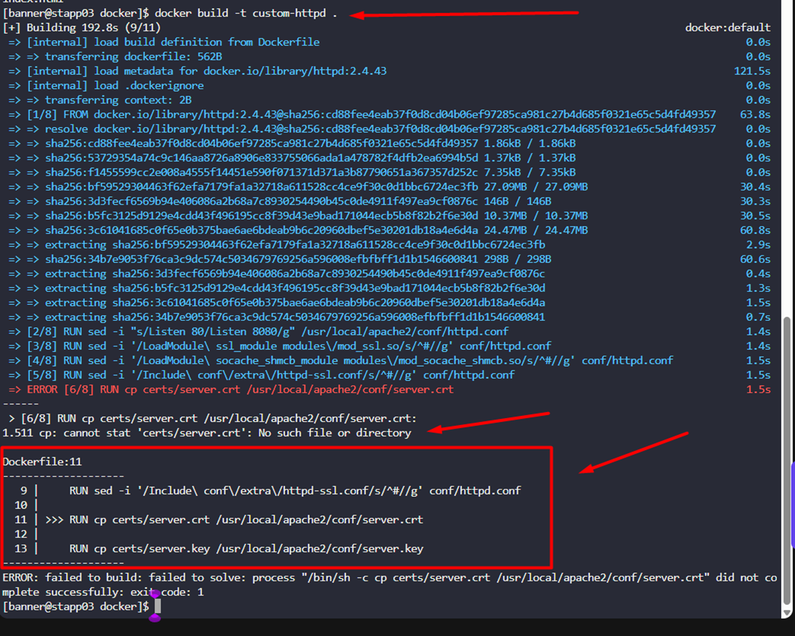
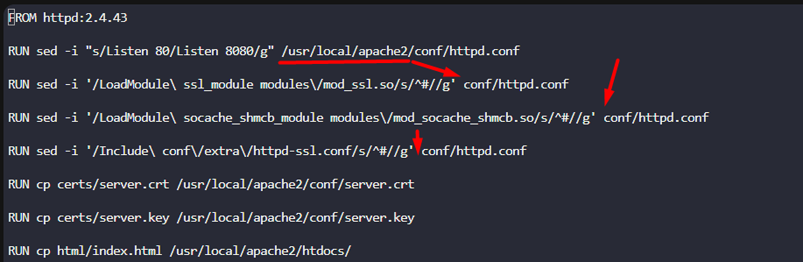
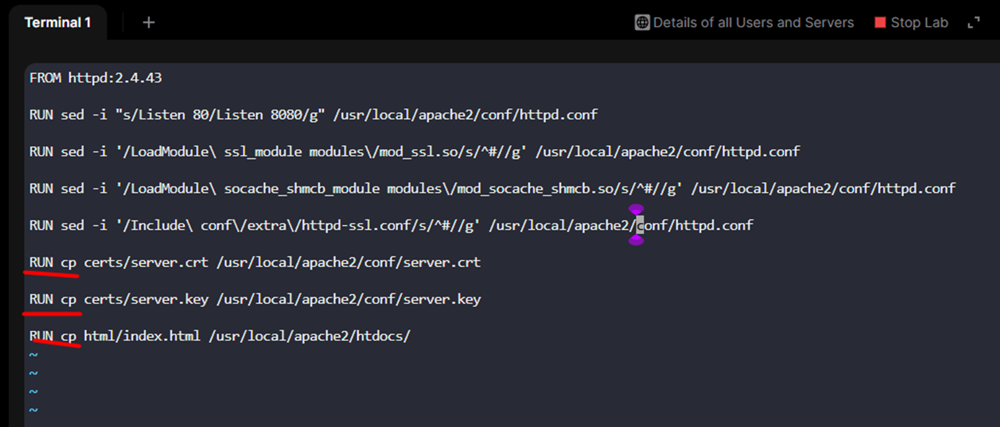
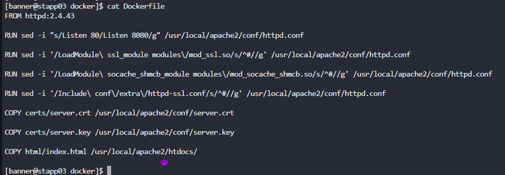
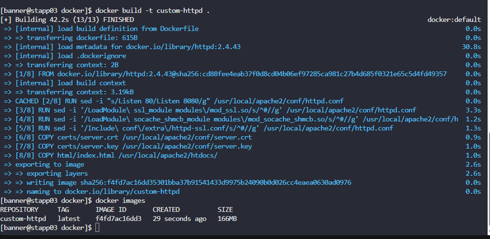

The Nautilus DevOps team is working to create new images per requirements shared by the development team. One of the team members is working to create a `Dockerfile` on `App Server 3` in `Stratos DC`. While working on it she ran into issues in which the docker build is failing and displaying errors. Look into the issue and fix it to build an image as per details mentioned below:

a. The `Dockerfile` is placed on `App Server 3` under `/opt/docker` directory.  

b. Fix the issues with this file and make sure it is able to build the image.  

c. Do not change base image, any other valid configuration within Dockerfile, or any of the data been used — for example, index.html.  

`Note:` Please note that once you click on `FINISH` button all existing images, the containers will be destroyed and new image will be built from your `Dockerfile`.

---

# Solution: 

## First we will see what all the errors by trying to build an image from Dockerfile




1. First is there is path issue (/usr/local/apache2/)



2. Second is the 'RUN cp' is also invalid instead we have to use COPY



Correct Dockerfile is 

```

FROM httpd:2.4.43

RUN sed -i "s/Listen 80/Listen 8080/g" /usr/local/apache2/conf/httpd.conf

RUN sed -i '/LoadModule\ ssl_module modules\/mod_ssl.so/s/^#//g' /usr/local/apache2/conf/httpd.conf

RUN sed -i '/LoadModule\ socache_shmcb_module modules\/mod_socache_shmcb.so/s/^#//g' /usr/local/apache2/conf/httpd.conf

RUN sed -i '/Include\ conf\/extra\/httpd-ssl.conf/s/^#//g' /usr/local/apache2/conf/httpd.conf

COPY certs/server.crt /usr/local/apache2/conf/server.crt

COPY certs/server.key /usr/local/apache2/conf/server.key

COPY html/index.html /usr/local/apache2/htdocs/
```


## Now we will build the image using the corrected Dockerfile

```
docker build -t custom-httpd:1.0 /opt/docker
```

