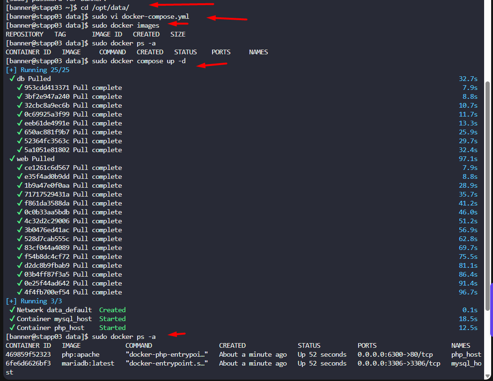

The Nautilus Application development team recently finished development of one of the apps that they want to deploy on a containerized platform. The Nautilus Application development and DevOps teams met to discuss some of the basic pre-requisites and requirements to complete the deployment. The team wants to test the deployment on one of the app servers before going live and set up a complete containerized stack using a docker compose fie. Below are the details of the task:  

1. On `App Server 3` in `Stratos Datacenter` create a docker compose file `/opt/data/docker-compose.yml` (should be named exactly).
2. The compose should deploy two services (web and DB), and each service should deploy a container as per details below:

`For web service:`  

a. Container name must be `php_host`.  

b. Use image `php` with any `apache` tag. Check [here](https://hub.docker.com/_/php?tab=tags/) for more details.  

c. Map `php_host` container's port `80` with host port `6300`  

d. Map `php_host` container's `/var/www/html` volume with host volume `/var/www/html`.  

`For DB service:`  

a. Container name must be `mysql_host`.  

b. Use image `mariadb` with any tag (preferably `latest`). Check [here](https://hub.docker.com/_/mariadb?tab=tags/) for more details.  

c. Map `mysql_host` container's port `3306` with host port `3306`  

d. Map `mysql_host` container's `/var/lib/mysql` volume with host volume `/var/lib/mysql`.  

e. Set MYSQL\_DATABASE=`database_host` and use any custom user ( except root ) with some complex password for DB connections.  

1. After running docker-compose up you can access the app with curl command `curl <server-ip or hostname>:6300/`

For more details check [here](https://hub.docker.com/_/mariadb?tab=description/).

---

# Solution: 

## Create folder mysql

```
sudo mkdir /var/lib/mysql
```
####  Purpose of creating `/var/lib/mysql` directory:

-  **Volume Mapping Requirement**

In the docker-compose.yml file, we have this volume mapping:

This maps the host directory `/var/lib/mysql` to the container's `/var/lib/mysql` directory.

- **Database Data Persistence**

- `/var/lib/mysql` is the default data directory where MariaDB/MySQL stores all database files
- Without this mapping, when the container is removed, all database data would be lost
- By creating this host directory and mapping it, the database data persists on the host even if the container is destroyed

yaml

    volumes: - /var/lib/mysql:/var/lib/mysql

This maps the host directory `/var/lib/mysql` to the container's `/var/lib/mysql` directory.


## Create an docker compose yaml file 

```
vi /opt/data/docker-compose.yml
```

```yaml
version: '3.8'
services:
  web:
    container_name: php_host
    image: php:apache
    ports:
      - "6300:80"
    volumes:
      - /var/www/html:/var/www/html
    depends_on:
      - db

  db:
    container_name: mysql_host
    image: mariadb:latest
    ports:
      - "3306:3306"
    volumes:
      - /var/lib/mysql:/var/lib/mysql
    environment:
      MYSQL_ROOT_PASSWORD: R00tP@ssw0rd123
      MYSQL_DATABASE: database_host
      MYSQL_USER: webuser
      MYSQL_PASSWORD: Webuser@2024!
```
## Start the container using docker compose file

```
docker-compose -f /opt/data/docker-compose.yml up -d
```

## Verify the containers are running

```
docker ps -a
curl -I http://localhost:6300
```


