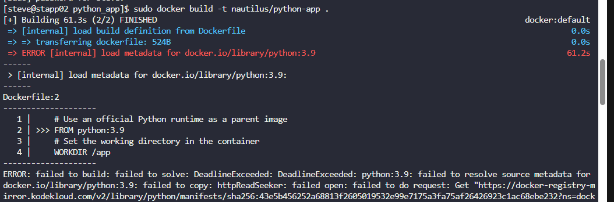

A python app needed to be Dockerized, and then it needs to be deployed on `App Server 2`. We have already copied a `requirements.txt` file (having the app dependencies) under `/python_app/src/` directory on `App Server 2`. Further complete this task as per details mentioned below:  

1. Create a `Dockerfile` under `/python_app` directory:

    - Use any `python` image as the base image.
    - Install the dependencies using `requirements.txt` file.
    - Expose the port `5002`.
    - Run the `server.py` script using `CMD`.
2. Build an image named `nautilus/python-app` using this Dockerfile.
3. Once image is built, create a container named `pythonapp_nautilus`:

    - Map port `5002` of the container to the host port `8099`.
4. Once deployed, you can test the app using `curl` command on `App Server 2`.

    curl http://localhost:8099/

---

# Solution: 

## 

Step 1: Create a Dockerfile
```
cd /python_app
```

Under to create the base image from the docker file for some reason probably due to custom registry 



so I pulled the image and so docker reuse the pulled base python image from existing machine while building our python app image by following the instruction mentioned in the Docker File .


```
docker pull python:3.9
vi Dockerfile
```
```Dockerfile
# Use an official Python runtime as a parent image
# Use an official Python runtime as a parent image
FROM python:3.9 
# Set the working directory in the container
WORKDIR /app
# Copy the current directory contents into the container at /app
COPY src/requirements.txt /app/
# Install any needed packages specified in requirements.txt
RUN pip install --no-cache-dir -r requirements.txt
# Copy the rest of the application code
COPY src/ /app/
# Make port 5002 available to the world outside this container
EXPOSE 5002
# Run server.py when the container launches
CMD ["python", "server.py"]
```
## Step 2: Build the Docker image
```
docker build -t nautilus/python-app .
```


## Step 3: Run the container with port mapping
```
docker run -d --name pythonapp_nautilus -p 8099:5002 nautilus/python-app
```
## Step 4: Test the application using curl
```
curl http://localhost:8099/
```

---

