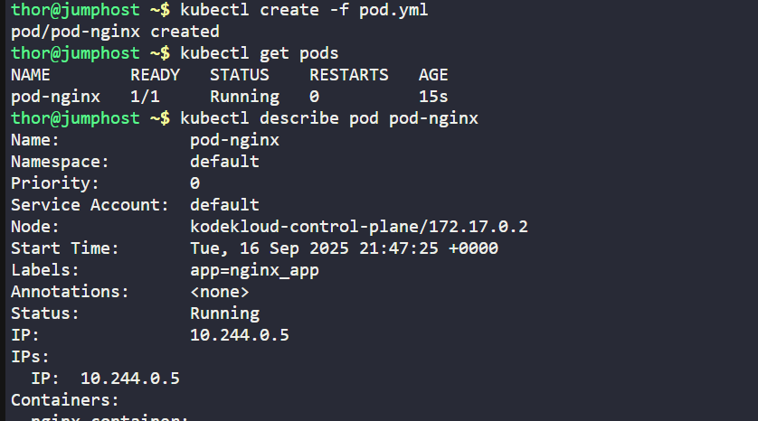

The Nautilus DevOps team is diving into Kubernetes for application management. One team member has a task to create a pod according to the details below:

1. Create a pod named `pod-nginx` using the `nginx` image with the `latest` tag. Ensure to specify the tag as `nginx:latest`.
2. Set the `app` label to `nginx_app`, and name the container as `nginx-container`.

`Note`: The `kubectl` utility on `jump_host` is configured to operate with the Kubernetes cluster.
---

# Solution: 

##  
Create a YAML file named pod-nginx.yaml with the following content:
```yaml
apiVersion: v1
kind: Pod
metadata:
  name: pod-nginx
  labels:
    app: nginx_app
spec:
  containers:
    - name: nginx-container
      image: nginx:latest
      ports:
        - containerPort: 80
```
## Apply the configuration to create the pod
```
kubectl apply -f pod-nginx.yaml
```
## Verify the pod is created and running
```
kubectl get pods -o wide
kubectl describe pod pod-nginx
```


```
kubectl port-forward pod-nginx 8080:80

curl -I http://localhost:80
```

---
# Explanation of the YAML file:


- `apiVersion: v1`: Specifies the API version used to create the pod.
- `kind: Pod`: Indicates that the object being created is a Pod.
- `metadata`: Contains metadata about the pod, including its name and labels.
  - `name: pod-nginx`: Sets the name of the pod to `pod-nginx`.
  - `labels`: Defines key-value pairs for organizing and selecting the pod.
    - `app: nginx_app`: Assigns the label `app` with the value `nginx_app` to the pod. 
    `spec`: Describes the desired state of the pod.
  - `containers` : Lists the containers that will run in the pod.
    - `name: nginx-container`-: Names the container
      `image:nginx:latest` :Specifies the Docker image to use
       `ports:` : Define the ports that container will expose.

            - `containerPort: 80` Exposes port 80 on the container
---

 ## Explanation on Port Forwarding 

 ### Explanation:

- **`kubectl port-forward`** → tells Kubernetes to forward a port.
- **`pod/pod-nginx`** → the target resource. Here, it’s your pod named `pod-nginx`.

    - You could also port-forward a deployment, service, or other resources.
- **`8080:80`** → port mapping:

    - **Left side (`8080`)** → local port on your jumphost.
    - **Right side (`80`)** → port inside the pod (container port).   
    


