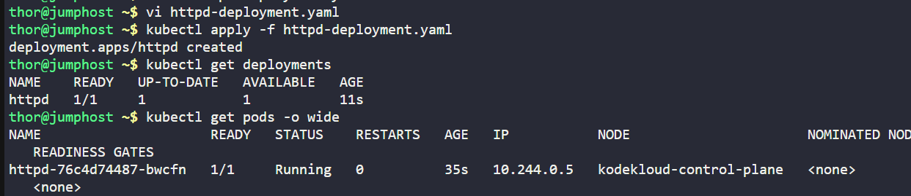
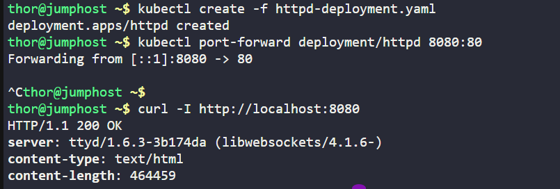

The Nautilus DevOps team is delving into Kubernetes for app management. One team member needs to create a deployment following these details:

Create a deployment named `httpd` to deploy the application `httpd` using the image `httpd:latest` (ensure to specify the tag)

`Note:` The `kubectl` utility on `jump_host` is set up to interact with the Kubernetes cluster.

---

# Solution:

## Create a YAML file named httpd-deployment.yaml with the following content:


```yaml
apiVersion: apps/v1
kind: Deployment
metadata:
  name: httpd
  labels:
    app: httpd_app
spec:
  replicas: 1
  selector:
    matchLabels:
      type: front-end
  template:
    metadata:
      labels:
        type: front-end
    spec:
      containers:
      - name: httpd-container
        image: httpd:latest
        ports:
          - containerPort: 80
```
## Apply the configuration to create the deployment
```
kubectl apply -f httpd-deployment.yaml
```
## Verify the deployment is created and running
```
kubectl get deployments
kubectl describe deployment httpd
```



```
kubectl get pods -o wide
```


## Test the application by port-forwarding the deployment to localhost
```
kubectl port-forward deployment/httpd 8080:80
curl -I http://localhost:8080
```


# Explanation:

- A `Deployment` in Kubernetes is a higher-level controller that manages the lifecycle of Pods via ReplicaSets. It ensures your application runs the desired number of replicas, handles rolling updates, rollbacks, scaling, and self-healing—all in a declarative, version-controlled way.
- In the Deployment YAML configuration:
  - The `apiVersion: apps/v1` is set to `apps/v1`
  - `kind: Deployment` indicates that we are creating a Deployment.
  - `metadata` contains metadata about the deployment, including its name and relevant labels.
  - `spec` <meta charset="utf-8">**- section defines the desired state, including the number of replicas, the pod selector, and the pod template which details metadata and container specifications.**.
  - `replicas: 1` specifies that we want one replica of the pod running.
  - `selector` defines how to identify the pods managed by this deployment using labels.
  - `template` describes the pod that will be created, including its metadata and specification.
  - Under `spec`, we define the container to run within the pod, specifying its name, image, and ports.


