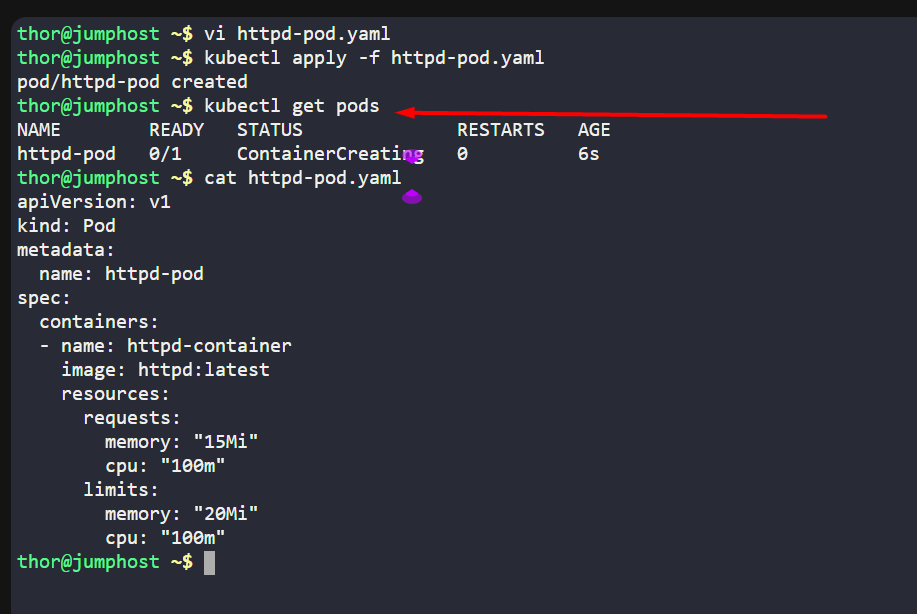

The Nautilus DevOps team has noticed performance issues in some Kubernetes-hosted applications due to resource constraints. To address this, they plan to set limits on resource utilization. Here are the details:

Create a pod named `httpd-pod` with a container named `httpd-container`. Use the `httpd` image with the `latest` tag (specify as `httpd:latest`). Set the following resource limits:

Requests: Memory: `15Mi`, CPU: `100m`

Limits: Memory: `20Mi`, CPU: `100m`

`Note:` The `kubectl` utility on `jump_host` is configured to operate with the Kubernetes cluster.

---

# Solution:
## Create a YAML file named httpd-pod.yaml with the following content:
```yaml
apiVersion: v1
kind: Pod
metadata:
  name: httpd-pod
spec:
  containers:
  - name: httpd-container
    image: httpd:latest
    resources:
      requests:
        memory: "15Mi"
        cpu: "100m"
      limits:
        memory: "20Mi"
        cpu: "100m"
```
## Create the pod using the YAML file
```
kubectl apply -f httpd-pod.yaml
```
## Verify the pod is created successfully
```
kubectl get pods
```


## Explanation:
1. apiVersion: v1 - Specifies the API version.
2. kind: Pod - Indicates that we are creating a Pod resource.
3. metadata: - Contains metadata about the pod, including its name.
4. spec: - Defines the desired state of the pod.
5. containers: - Lists the containers that will run in the pod.
6. name: httpd-container - The name of the container.
7. image: httpd:latest - Specifies the Docker image to use for the container.
8. resources: - Defines the resource requests and limits for the container.
9. requests: - Specifies the minimum resources required for the container to run.
10. memory: "15Mi" - Requests 15 MiB of memory.
11. cpu: "100m" - Requests 100 millicores of CPU.
12. limits: - Specifies the maximum resources the container can use.
13. memory: "20Mi" - Limits memory usage to 20 MiB.
14. cpu: "100m" - Limits CPU usage to 100 millicores.
