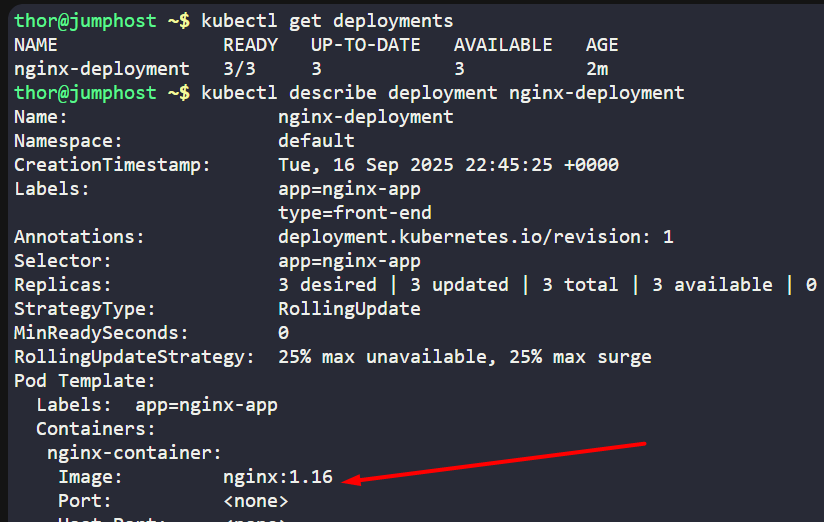
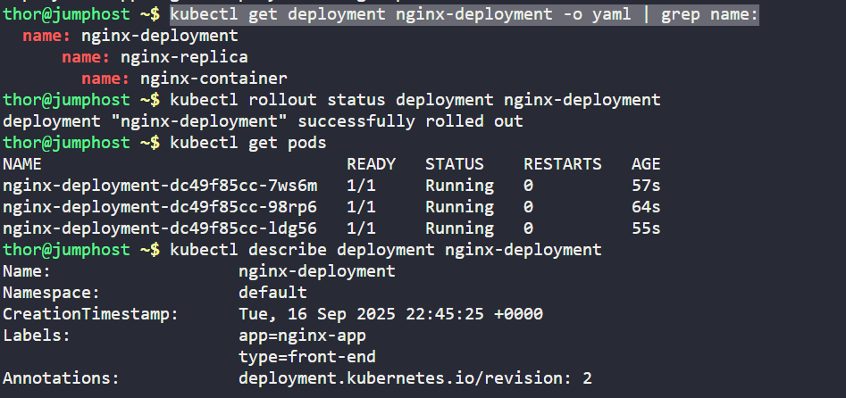
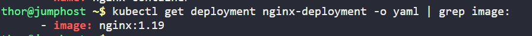

An application currently running on the Kubernetes cluster employs the nginx web server. The Nautilus application development team has introduced some recent changes that need deployment. They've crafted an image `nginx:1.19` with the latest updates.

Execute a rolling update for this application, integrating the `nginx:1.19` image. The deployment is named `nginx-deployment`.

Ensure all pods are operational post-update.

`Note:` The `kubectl` utility on `jump_host` is set up to operate with the Kubernetes cluster

---

# Solution:

First Verify the deployment status and type of the update set
```
kubectl get deployments
```


Verifying the type of update set for the nginx-deployment
```
kubectl describe deployment nginx-deployment
```



## Step 1: Perform the rolling update using the kubectl set image command
```
kubectl set image deployment nginx-deployment nginx-container=nginx:1.19
```
`nginx-container` is the container name given in the deployment which you can findout by using
```
kubectl get deployment nginx-deployment -o yaml | grep name:
```




## Step 2: Verify the rolling update status
```
kubectl rollout status deployment nginx-deployment
```
## Step 3: Ensure all pods are running
```
kubectl get pods
kubectl get deployment nginx-deployment -o yaml | grep image:
```


