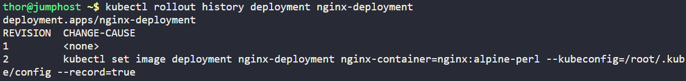
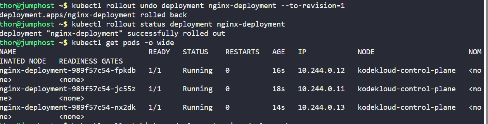
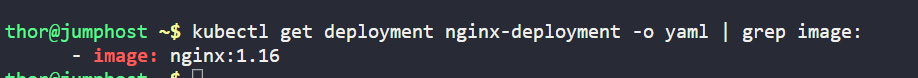

Earlier today, the Nautilus DevOps team deployed a new release for an application. However, a customer has reported a bug related to this recent release. Consequently, the team aims to revert to the previous version.

There exists a deployment named `nginx-deployment`; initiate a rollback to the previous revision.

`Note:` The `kubectl` utility on `jump_host` is configured to interact with the Kubernetes cluster.

---

# Solution:
First, check the deployment history to identify the revision numbers available for rollback.
```
kubectl rollout history deployment nginx-deployment
```


- we can see the image has been changed to `nginx:alpine-perl`

## Step 1: Rollback to the previous revision
```
kubectl rollout undo deployment nginx-deployment
 (or)
kubectl rollout undo deployment nginx-deployment --to-revision=1
```
## Step 2: Verify the rollback status
```
kubectl rollout status deployment nginx-deployment
```



## Step 3: Ensure all pods are running and check the image version
```
kubectl get pods
kubectl get deployment nginx-deployment -o yaml | grep image:
```

## Explanation:
1. `kubectl rollout history deployment nginx-deployment`: This command displays the revision history of the specified deployment, allowing you to see previous versions.
2. `kubectl rollout undo deployment nginx-deployment`: This command rolls back the specified deployment to its previous revision.
3. `kubectl rollout status deployment nginx-deployment`: This command checks the status of the rollout to ensure that the rollback was successful and that the deployment is stable.
4. `kubectl get pods`: This command lists all the pods in the current namespace, allowing you to verify that the pods are running.
5. `kubectl get deployment nginx-deployment -o yaml | grep image:`: This command retrieves the deployment details in YAML format and filters the output to show the image being used, allowing you to confirm that the rollback has reverted to the previous image version.
