We encountered an issue with our Nginx and PHP-FPM setup on the Kubernetes cluster this morning, which halted its functionality. Investigate and rectify the issue:

The pod name is `nginx-phpfpm` and configmap name is `nginx-config`. Identify and fix the problem.

Once resolved, copy `/home/thor/index.php` file from the `jump host` to the `nginx-container` within the nginx document root. After this, you should be able to access the website using `Website` button on the top bar.

`Note:` The `kubectl` utility on `jump_host` is configured to operate with the Kubernetes cluster.

---

# Solution:

## Step 1: As this is in regards to troubleshooting. First we need to understand what all resrouces we have and Check the pod status
```
Kubectl get all
kubectl get pods
```
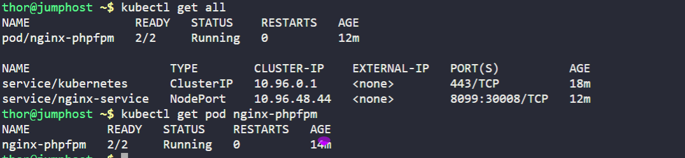

it seems we have 2 containers in a single Pod
And Two Services one is ` ClusterIp` and other is `NodePort`

Then we will try to understand the environment.

```
kubectl describe pod nginx-phpfpm
```
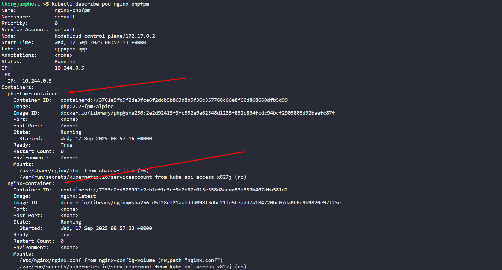

Here we see two different containers one is `php-fpm-container` from image php:7.2-fpm-alpine and other container is `nginx-container` with image of `nginx`.

So we will try to understand first why we need two containers in the first place.

- Nginx is a web server and PHP-FPM is a FastCGI Process Manager for PHP.
- Nginx serves static content and forwards requests for dynamic content (like PHP scripts) to PHP-FPM for processing.
- This separation allows for better performance and scalability.

## 🔄 **How Nginx + PHP-FPM Architecture Works**

### **The Request Flow:**

    User Request → Nginx → PHP-FPM → Nginx → User Response

Here's what happens step by step:

1. **User requests** `http://website.com/index.php`
2. **Nginx receives** the request
3. **Nginx checks** if the file exists at `/var/www/html/index.php`
4. **Nginx sees** it's a PHP file (`.php` extension)
5. **Nginx forwards** the request to PHP-FPM via FastCGI
6. **PHP-FPM needs** to read the same file at `/var/www/html/index.php`
7. **PHP-FPM processes** the PHP code
8. **PHP-FPM returns** the processed HTML to Nginx
9. **Nginx serves** the final HTML to the user


### **Identifying the Issue:**

- so our main task is to place index.php in nginx container and check whether the website is working or not. we will place the index.php in the default working directory of the nginx container.

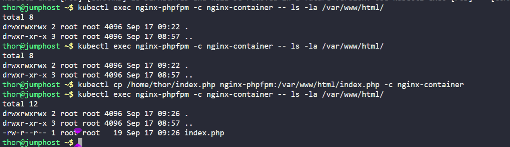

```
kubectl exec nginx-phpfpm -c nginx-container -- ls -la /var/www/html/
kubectl cp /home/thor/index.php nginx-phpfpm:/var/www/html/index.php -c nginx-container
kubectl exec nginx-phpfpm -c nginx-container -- ls -la /var/www/html/
```
- and try to access the page.it says file not found.

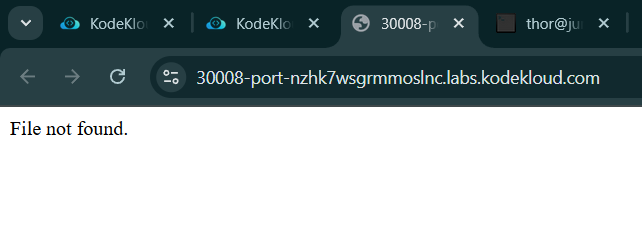

- it seems that index.php is not getting through or getting read by the either of container. and we have already verified that nginx container have the index.php. we will verify working directory of PHP-FPM container.
```
kubectl exec nginx-phpfpm -c php-fpm-container -- ls -la /var/www/html/
```
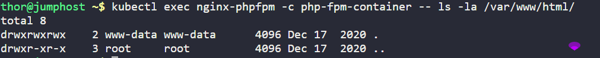

- there is no index.php at the php-fpm-container. So it seems there is a issue in sharing the index.php between the containers as nginx already have the index.php.

- Both Nginx and PHP-FPM need access to the same files (like `index.php`).
- This is typically done using a shared volume (like an `emptyDir` volume or a persistent volume) mounted at `/var/www/html` in both containers.
- If the volume is missing or not mounted correctly, PHP-FPM won't find `index.php`, leading to a 404 error.
- we will check the configmap to see if there is any issue with the configmap
```
kubectl get configmap nginx-config -o yaml
```

- we can see the configmap is fine. so the issue is with the volume mounting.
- So, we will check the mounting settings.


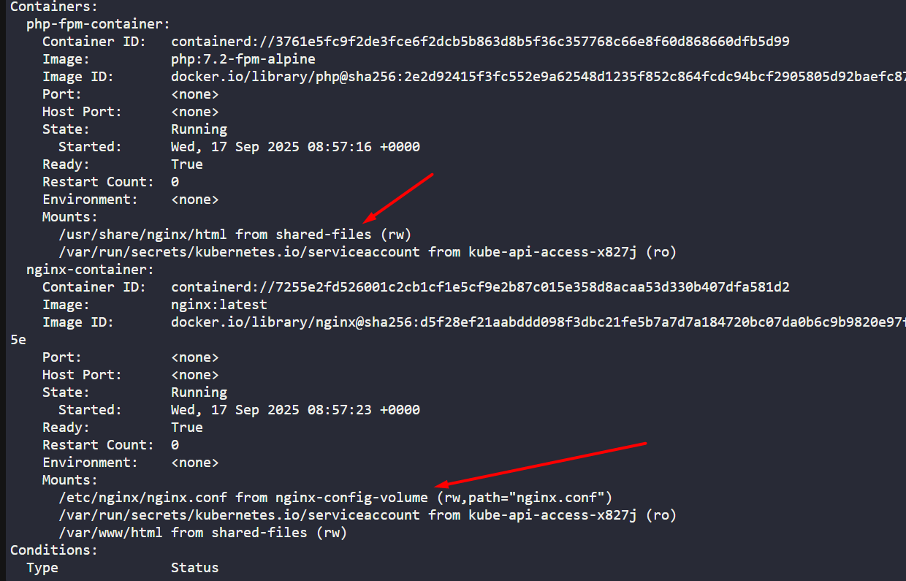

- **Nginx config**: mounted at `/var/www/html` ✓
- **PHP-FPM container**: mounted at `/usr/share/nginx/html` ✗
- **Nginx config**: delievers index.php files at `/var/www/html` ✓


The nginx container volume mount path doesn't match what the PHP-FPM container expects. Let's fix this:

```
kubectl get pod nginx-phpfpm -o yaml > nginx-phpfpm-backup.yaml
kubectl delete pod nginx-phpfpm
kubectl pod "nginx-phpfpm" deleted
cp nginx-phpfpm-backup.yaml nginx-phpfpm-final.yaml
```


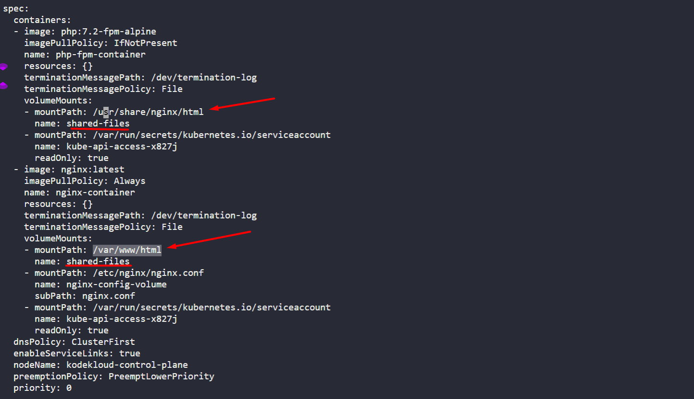
```
vi nginx-phpfpm-final.yaml
#we will change the volume mount path of PHP-FPM container to `/var/www/html` from `/usr/share/nginx/html` **
```
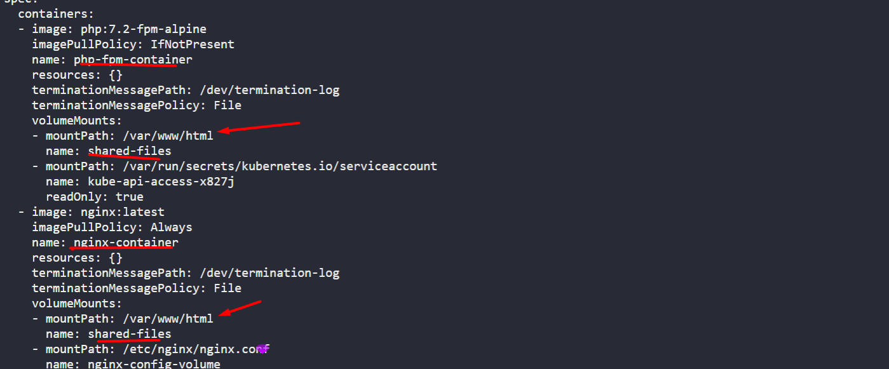


- Now verifying the index.php can be seen by PHP-FPM container.

 Apply the fixed configuration:


```bash
kubectl apply -f nginx-phpfpm-final.yaml
```

- Wait for the pod to be ready:


```bash
kubectl get pods -w
```

- Once the pod is running, let's copy the index.php file from the jump host to the nginx container:


```bash
kubectl cp /home/thor/index.php nginx-phpfpm:/var/www/html/index.php -c nginx-container
```
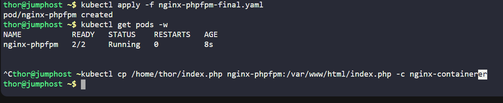


Let's verify the file was copied correctly:

```bash
kubectl exec nginx-phpfpm -c nginx-container -- ls -la /var/www/html/
kubectl exec nginx-phpfpm -c php-fpm-container -- ls -la /var/www/html/
```

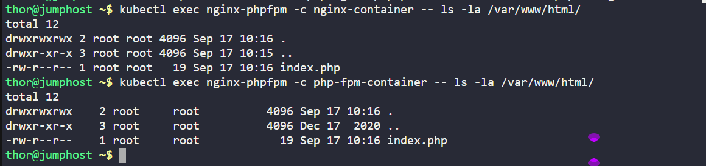


- Try accessing the page


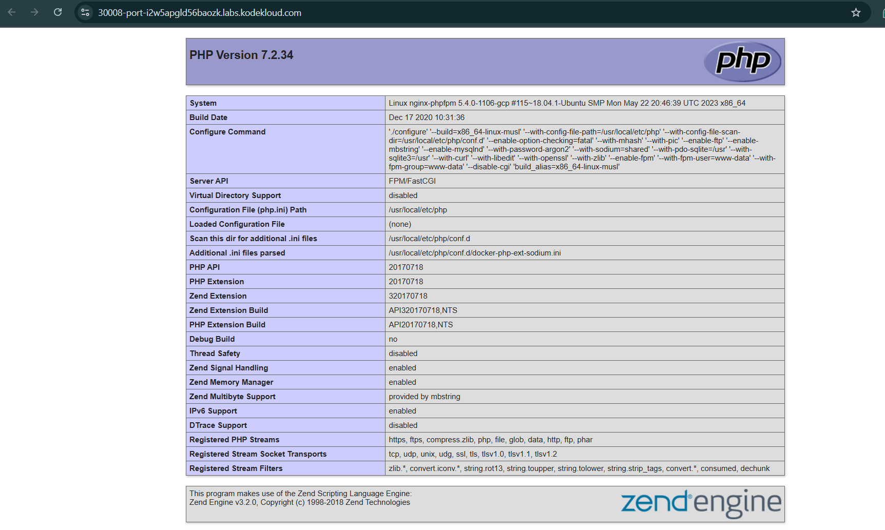

**Summary of what we fixed:**

1. **Volume Mount Issue**: Aligned both containers to use `/var/www/html` as the shared directory
2. **File Placement**: Copied the `index.php` file to the correct location that both Nginx and PHP-FPM can access.

The key issue was that PHP-FPM was looking for files in `/usr/share/nginx/html`  but the configuration expected them in `/var/www/html`, and Nginx was correctly mounted to `/var/www/html` (its default path). By mounting both containers to the same `/var/www/html` path, they can now properly share files.
