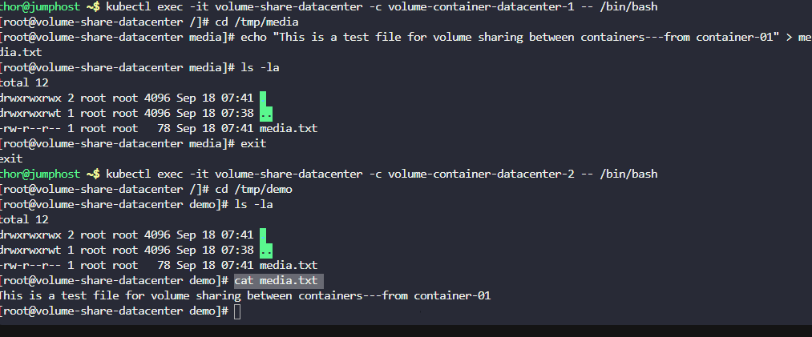

1. Create a pod named `volume-share-datacenter`.

2. For the first container, use image `fedora` with `latest` tag only and remember to mention the tag i.e `fedora:latest`, container should be named as `volume-container-datacenter-1`, and run a `sleep` command for it so that it remains in running state. Volume `volume-share` should be mounted at path `/tmp/media`.

3. For the second container, use image `fedora` with the `latest` tag only and remember to mention the tag i.e `fedora:latest`, container should be named as `volume-container-datacenter-2`, and again run a `sleep` command for it so that it remains in running state. Volume `volume-share` should be mounted at path `/tmp/demo`.

4. Volume name should be `volume-share` of type `emptyDir`.

5. After creating the pod, exec into the first container i.e `volume-container-datacenter-1`, and just for testing create a file `media.txt` with any content under the mounted path of first container i.e `/tmp/media`.

6. The file `media.txt` should be present under the mounted path `/tmp/demo` on the second container `volume-container-datacenter-2` as well, since they are using a shared volume.
---

# Solution:

##
Create a YAML file named volume-share-datacenter.yaml with the following content:
```yaml

apiVersion: v1
kind: Pod
metadata:
  name: volume-share-datacenter
spec:
  containers:
  - name: volume-container-datacenter-1
    image: fedora:latest
    command: ["sleep", "infinity"]
    volumeMounts:
    - name: volume-share
      mountPath: /tmp/media
  - name: volume-container-datacenter-2
    image: fedora:latest
    command: ["sleep", "infinity"]
    volumeMounts:
    - name: volume-share
      mountPath: /tmp/demo
  volumes:
  - name: volume-share
    emptyDir: {}
```
## Apply the configuration to create the pod
```
kubectl apply -f volume-share-datacenter-pod.yaml
```


## Verify the pod is created and running
```
kubectl get pod volume-share-datacenter
kubectl get pod volume-share-datacenter -o wide
```

Creating the file

```
kubectl exec -it volume-share-datacenter -c volume-container-datacenter-1 -- /bin/bash
cd /tmp/media
cho "This is a test file for volume sharing between containers---from container-01" > media.txt
````

And verifying the file exist from the  volume-container-datacenter-2

```
kubectl exec -it volume-share-datacenter -c volume-container-datacenter-2 -- /bin/bash
cd /tmp/demo
cat media.txt
```





Refer:: https://kubernetes.io/docs/concepts/storage/volumes/#emptydir

### What is emptyDir?

`emptyDir` is a Kubernetes volume type that creates a temporary, initially empty directory that exists for the lifetime of a pod.

### Key Characteristics:

**1. Lifecycle:**

- Created when the pod is assigned to a node
- Exists as long as the pod is running on that node
- **Deleted permanently** when the pod is removed from the node (pod deletion, node failure, etc.)

**2. Storage Location:**

- By default, stored on the node's local storage (disk, SSD, or network-attached storage)
- Can be configured to use node's memory (RAM) as storage

**3. Sharing:**

- Shared between **all containers** in the same pod
- Each container can mount it at different paths
- Changes made by one container are immediately visible to other containers


## command: ["sleep", "infinity"] Explained

### What does this command do?

This command keeps the container running indefinitely by executing the `sleep` command with `infinity` as the duration.

### Why is this needed?

**Container Lifecycle:**

- Containers are designed to run a specific process/application
- When the main process exits, the container stops
- If a container stops, Kubernetes may restart it or mark the pod as failed

**Fedora Image Behavior:**

- The `fedora:latest` image is a base OS image
- It doesn't have a default long-running service
- Without a command, it would start and immediately exit