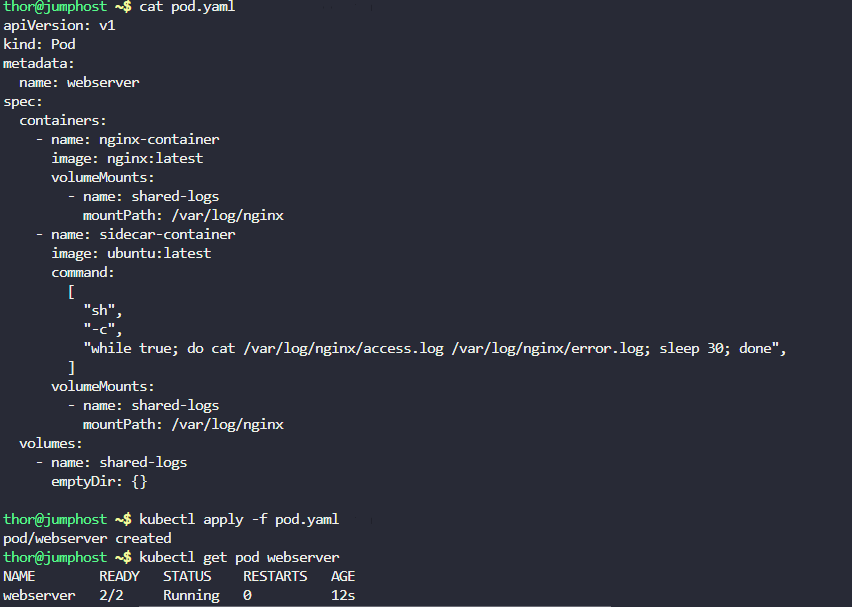
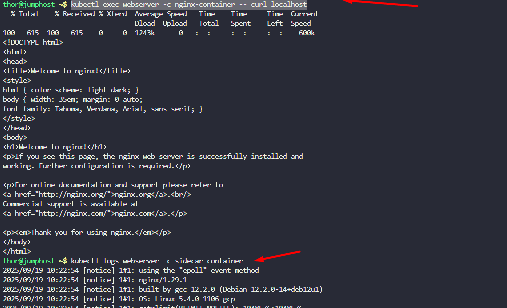

1. Create a pod named `webserver`.
2. Create an `emptyDir` volume `shared-logs`.
3. Create two containers from `nginx` and `ubuntu` images with `latest` tag only and remember to mention tag i.e `nginx:latest`, nginx container name should be `nginx-container` and ubuntu container name should be `sidecar-container` on webserver pod.
4. Add command on sidecar-container `"sh","-c","while true; do cat /var/log/nginx/access.log /var/log/nginx/error.log; sleep 30; done"`
5. Mount the volume `shared-logs` on both containers at location `/var/log/nginx`, all containers should be up and running.

`Note:` The `kubectl` utility on `jump_host` has been configured to work with the kubernetes cluster.

---

# Solution:

## Create a YAML file named httpd-deployment.yaml with the following content:


```yaml
apiVersion: v1
kind: Pod
metadata:
  name: webserver
spec:
  containers:
    - name: nginx-container
      image: nginx:latest
      volumeMounts:
        - name: shared-logs
          mountPath: /var/log/nginx
    - name: sidecar-container
      image: ubuntu:latest
      command:
        [
          "sh",
          "-c",
          "while true; do cat /var/log/nginx/access.log /var/log/nginx/error.log; sleep 30; done",
        ]
      volumeMounts:
        - name: shared-logs
          mountPath: /var/log/nginx
  volumes:
    - name: shared-logs
      emptyDir: {}
```


## Apply the configuration to create the deployment
```
kubectl apply -f httpd-deployment.yaml
```
## Verify the deployment is created and running
```
# Check nginx is responding
kubectl exec webserver -c nginx-container -- curl localhost

# View the sidecar's output (the log contents it's printing)
kubectl logs webserver -c sidecar-container
```



# Explanation:
```
nginx container → writes logs → /var/log/nginx/*.log (shared volume)

                                        ↓
sidecar container → reads logs → prints to stdout → Kubernetes captures

                                        ↓

kubectl logs webserver -c sidecar-container → shows the nginx logs
```

## Why this pattern is useful:

- **Centralized logging**: You can get nginx logs via `kubectl logs` without exec-ing into containers
- **Log aggregation**: External tools (like Fluentd, Logstash) can collect from Kubernetes logs
- **No nginx modification**: The main nginx container doesn't need log forwarding configuration