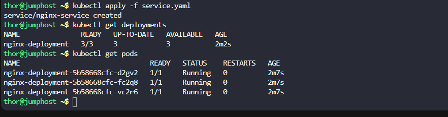
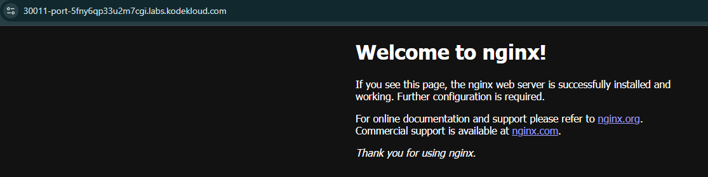

1. Create a deployment using `nginx` image with `latest` tag only and remember to mention the tag i.e `nginx:latest`. Name it as `nginx-deployment`. The container should be named as `nginx-container`, also make sure replica counts are `3`.
2. Create a `NodePort` type service named `nginx-service`. The nodePort should be `30011`.

---

# Solution:


## Create a YAML file named httpd-deployment.yaml with the following content:


```yaml
apiVersion: apps/v1
kind: Deployment
metadata:
  name: nginx-deployment
spec:
  replicas: 3
  selector:
    matchLabels:
      app: nginx
  template:
    containers:
    - name: nginx-container
      image: nginx:latest
      ports:
      - containerPort: 80
```

## Create service.yaml

```yaml
apiVersion: v1
kind: Service
metadata:
  name: nginx-service
spec:
  type: NodePort
  selector:
    app: nginx
  ports:
  - protocol: TCP
    port: 80
    targetPort: 80
    nodePort: 30011

```

- Now apply the deployment.

```
kubectl apply -f nginx-deployment.yaml
kubectl apply -f service.yaml
```
- Verify the deployment is created and running.

```
kubectl get deployments
kubectl get pods
```




