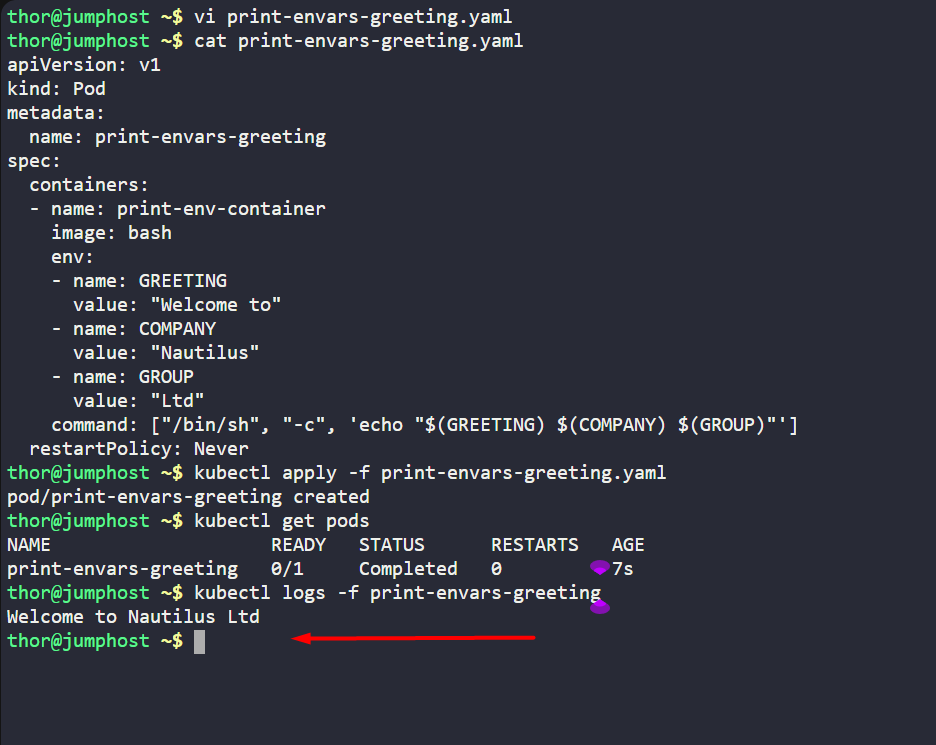

1. Create a `pod` named `print-envars-greeting`.
2. Configure spec as, the container name should be `print-env-container` and use `bash` image.
3. Create three environment variables:

a. `GREETING` and its value should be `Welcome to`

b. `COMPANY` and its value should be `Nautilus`

c. `GROUP` and its value should be `Ltd`

1. Use command `["/bin/sh", "-c", 'echo "$(GREETING) $(COMPANY) $(GROUP)"']` (please use this exact command), also set its `restartPolicy` policy to `Never` to avoid crash loop back.
2. You can check the output using `kubectl logs -f print-envars-greeting` command.

---

# Solution:
## Create a YAML file named print-envars-greeting.yaml with the following content:

```yaml
apiVersion: v1
kind: Pod
metadata:
  name: print-envars-greeting
spec:
  containers:
  - name: print-env-container
    image: bash
    env:
    - name: GREETING
      value: "Welcome to"
    - name: COMPANY
      value: "Nautilus"
    - name: GROUP
      value: "Ltd"
    command: ["/bin/sh", "-c", 'echo "$(GREETING) $(COMPANY) $(GROUP)"']
  restartPolicy: Never
```

- Now apply the pod configuration.

```
kubectl apply -f print-envars-greeting.yaml
```
- Verify the pod is created and running.

```
kubectl get pods
```
- Check the output using logs command.

```
kubectl logs -f print-envars-greeting
```
- You should see the output:





## Define an environment variable for a container[<svg xmlns="http://www.w3.org/2000/svg" fill="currentColor" width="24" height="24" viewbox="0 0 24 24"><path d="M0 0h24v24H0z" fill="none"></path><path d="M3.9 12c0-1.71 1.39-3.1 3.1-3.1h4V7H7c-2.76 0-5 2.24-5 5s2.24 5 5 5h4v-1.9H7c-1.71 0-3.1-1.39-3.1-3.1zM8 13h8v-2H8v2zm9-6h-4v1.9h4c1.71 0 3.1 1.39 3.1 3.1s-1.39 3.1-3.1 3.1h-4V17h4c2.76 0 5-2.24 5-5s-2.24-5-5-5z"></path></svg>](https://kubernetes.io/docs/tasks/inject-data-application/define-environment-variable-container/#define-an-environment-variable-for-a-container)

When you create a Pod, you can set environment variables for the containers that run in the Pod. To set environment variables, include the `env` or `envFrom` field in the configuration file.

The `env` and `envFrom` fields have different effects.

- `env`
    - allows you to set environment variables for a container, specifying a value directly for each variable that you name.
