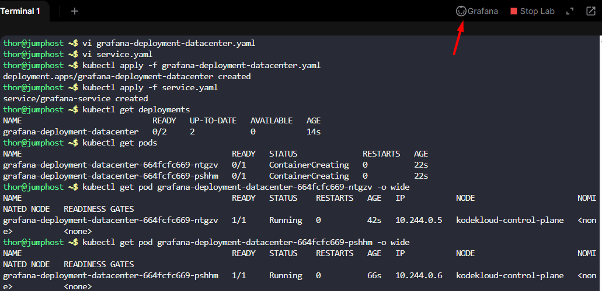

1.) Create a deployment named `grafana-deployment-datacenter` using any grafana image for Grafana app. Set other parameters as per your choice.

2.) Create `NodePort` type service with nodePort `32000` to expose the app.

`You need not to make any configuration changes inside the Grafana app once deployed, just make sure you are able to access the Grafana login page.`

---

# Solution:
## Create a YAML file named grafana-deployment-datacenter.yaml with the following content:

```yaml
apiVersion: apps/v1
kind: Deployment
metadata:
  name: grafana-deployment-datacenter
spec:
  replicas: 2
  selector:
    matchLabels:
      app: grafana
  template:
    metadata:
      labels:
        app: grafana
    spec:
      containers:
      - name: grafana-container
        image: grafana/grafana:latest
        ports:
        - containerPort: 3000
```
## Create service.yaml

```yaml
apiVersion: v1
kind: Service
metadata:
  name: grafana-service
spec:
  type: NodePort
  selector:
    app: grafana
  ports:
  - protocol: TCP
    port: 3000
    targetPort: 3000
    nodePort: 32000
```
- Now apply the deployment.

```
kubectl apply -f grafana-deployment-datacenter.yaml
kubectl apply -f service.yaml
```
- Verify the deployment is created and running.

```
kubectl get deployments
kubectl get pods
```
- You can access the Grafana login page using the node's IP address and the nodePort `32000`.

```
http://<Node-IP>:32000
```
- You should see the Grafana login page:

- Default username and password is `admin`.

- After logging in, you will be prompted to change the password but the page will fail to load

- Moreinfo :: https://grafana.com/docs/grafana/latest/setup-grafana/installation/kubernetes/

---


