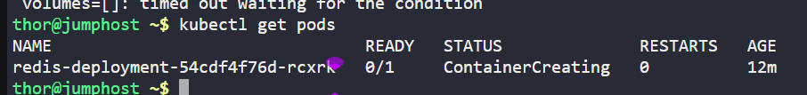
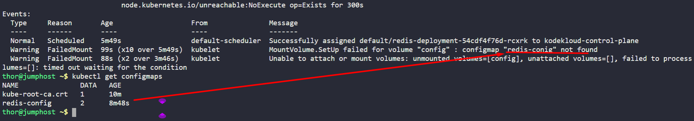
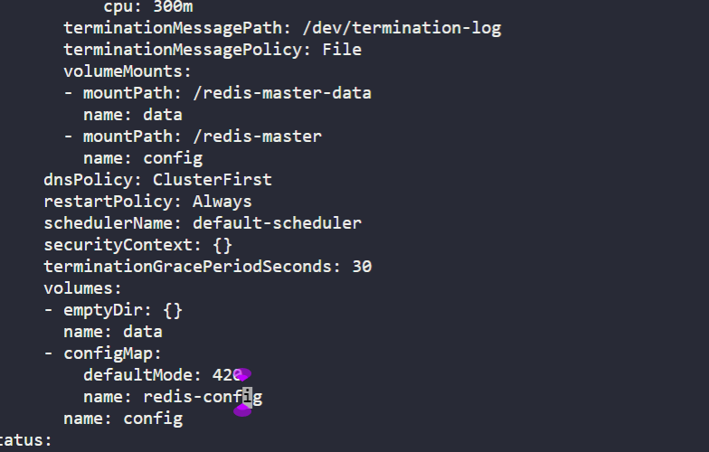
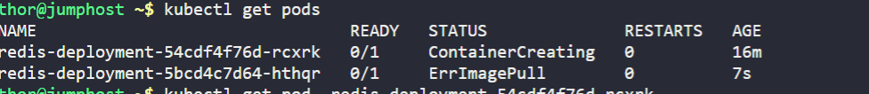
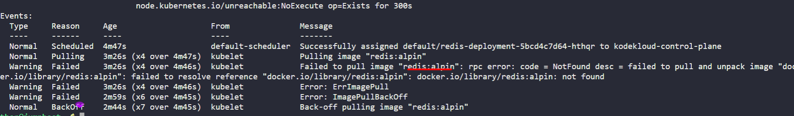
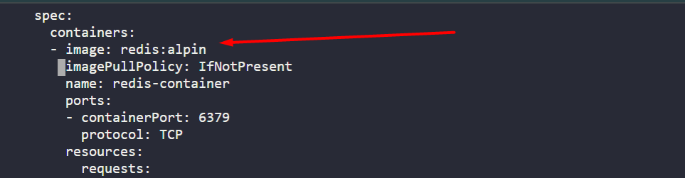
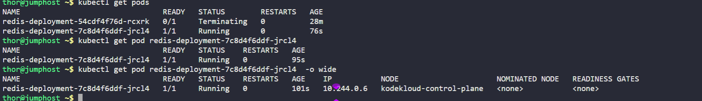

This morning one of the team members was making some changes in this existing setup, but he made some mistakes and the app went down. We need to fix this as soon as possible. Please take a look.

The deployment name is `redis-deployment`. The pods are not in running state right now, so please look into the issue and fix the same.

`Note:` The `kubectl` utility on `jump_host` has been configured to work with the kubernetes cluster.

---

# Solution:
## Check the status of the pods

```
kubectl get pods
```


## Describe the pod to find the issue

```
kubectl describe pod <pod-name>
kubectl get configmaps
```





## Fix the issue

- as we can see in the deployement manifest have typo mistake in mentioning the ConfigMap. so we will fix the issue.
- Edit the deployment for Fixing the typo mistake in the ConfigMap name from `redis-conig` to `redis-configmap`

```
kubectl edit deployment redis-deployment
- Save and exit the editor
- Verify the pods are in running state
```



- Checking Status of the Pod.

```
kubectl get pods
```
- Again we have another error



- Checking the Events of the Pod.

```
kubectl describe pod redis-deployment-xxxx
```




- Again there is typo in the deployment, this it is the container Image.



- Edit the deployment for Fixing the typo mistake in the Image name from `redsi:alpin` to `redis:alpine`

```
kubectl edit deployment redis-deployment
```
- Save and exit the editor
- Verify the pods are in running state
```
kubectl get pods
```




# Summary
- We have successfully troubleshooted and fixed the issue with the deployment.
- We have fixed the typo mistakes in the ConfigMap name and Image name in the deployment manifest.
- The pods are now in running state.


