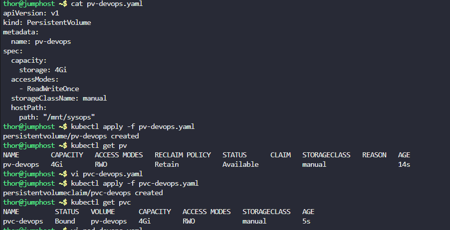
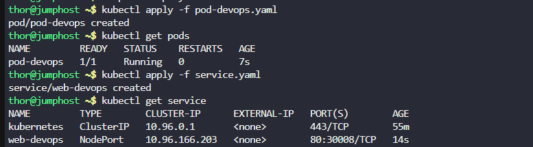
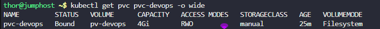
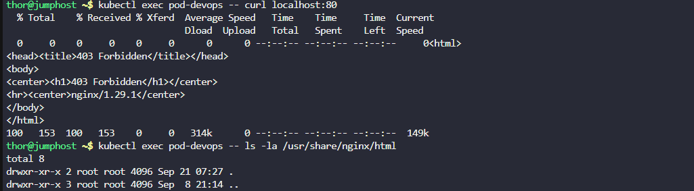
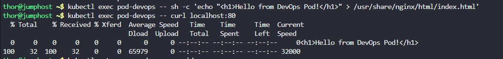
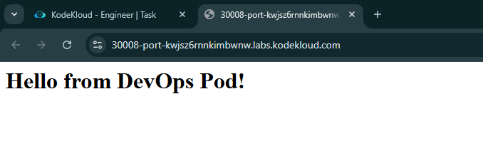

1. Create a `PersistentVolume` named as `pv-devops`. Configure the `spec` as storage class should be `manual`, set capacity to `4Gi`, set access mode to `ReadWriteOnce`, volume type should be `hostPath` and set path to `/mnt/sysops` (this directory is already created, you might not be able to access it directly, so you need not to worry about it).

2. Create a `PersistentVolumeClaim` named as `pvc-devops`. Configure the `spec` as storage class should be `manual`, request `2Gi` of the storage, set access mode to `ReadWriteOnce`.

3. Create a `pod` named as `pod-devops`, mount the persistent volume you created with claim name `pvc-devops` at document root of the web server, the container within the pod should be named as `container-devops` using image `nginx` with `latest` tag only (remember to mention the tag i.e `nginx:latest`).
4. Create a node port type service named `web-devops` using node port `30008` to expose the web server running within the pod.

---

# Solution:
## Create a YAML file named pv-devops.yaml with the following content:

```yaml
apiVersion: v1
kind: PersistentVolume
metadata:
  name: pv-devops
spec:
  capacity:
    storage: 4Gi
  accessModes:
    - ReadWriteOnce
  storageClassName: manual
  hostPath:
    path: "/mnt/sysops"
```
- Now apply the persistent volume configuration.

```
kubectl apply -f pv-devops.yaml
```

- Verify the persistent volume is created and available.

```
kubectl get pv
```
## Create a YAML file named pvc-devops.yaml with the following content:

```yaml
apiVersion: v1
kind: PersistentVolumeClaim
metadata:
  name: pvc-devops
spec:
  accessModes:
    - ReadWriteOnce
  resources:
    requests:
      storage: 2Gi
  storageClassName: manual
```
- Now apply the persistent volume claim configuration.

```
kubectl apply -f pvc-devops.yaml
```
- Verify the persistent volume claim is created and bound.

```
kubectl get pvc
```





## Create a YAML file named pod-devops.yaml with the following content:

```yaml
apiVersion: v1
kind: Pod
metadata:
  name: pod-devops
  label:
    app: nginx
spec:
  containers:
  - name: container-devops
    image: nginx:latest
    volumeMounts:
    - mountPath: /usr/share/nginx/html
      name: devops-storage
  volumes:
  - name: devops-storage
    persistentVolumeClaim:
      claimName: pvc-devops
```
- Now apply the pod configuration.

```
kubectl apply -f pod-devops.yaml
```
- Verify the pod is created and running.

```
kubectl get pods
```
## Create service.yaml

```yaml
apiVersion: v1
kind: Service
metadata:
  name: web-devops
spec:
  type: NodePort
  selector:
    app: nginx
  ports:
  - protocol: TCP
    port: 80
    targetPort: 80
    nodePort: 30008
```
- Now apply the service configuration.

```
kubectl apply -f service.yaml
```
- Verify the service is created and running.

```
kubectl get services
kubectl get svc web-devops
```




Checking the binding.

```
kubectl get pvc pvc-devops -o wide
```



- You can access the web server using any node IP address with node port

```
kubectl exec pod-devops -- curl localhost:80
```





