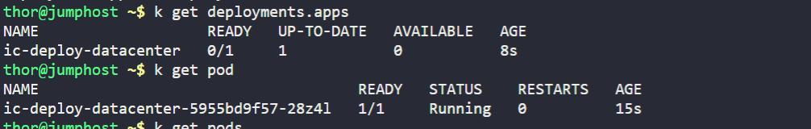
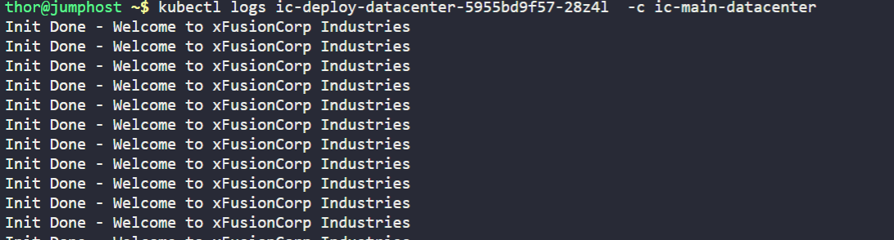
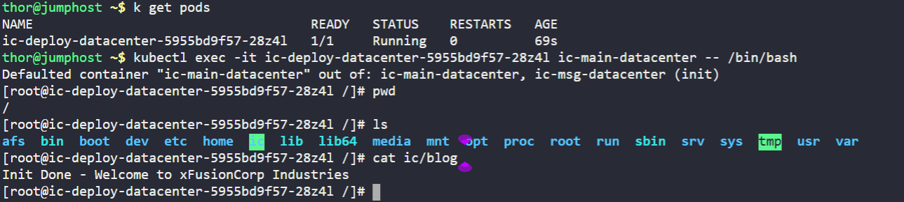

1. Create a `Deployment` named as `ic-deploy-datacenter`.
2. Configure `spec` as replicas should be `1`, labels `app` should be `ic-datacenter`, template's metadata lables `app` should be the same `ic-datacenter`.
3. The `initContainers` should be named as `ic-msg-datacenter`, use image `fedora` with `latest` tag and use command `'/bin/bash'`, `'-c'` and `'echo Init Done - Welcome to xFusionCorp Industries > /ic/blog'`. The volume mount should be named as `ic-volume-datacenter` and mount path should be `/ic`.
4. Main container should be named as `ic-main-datacenter`, use image `fedora` with `latest` tag and use command `'/bin/bash'`, `'-c'` and `'while true; do cat /ic/blog; sleep 5; done'`. The volume mount should be named as `ic-volume-datacenter` and mount path should be `/ic`.
5. Volume

---

# Solution:
## Create a YAML file named ic-deploy-xfusion.yaml with the following content:

```yaml
apiVersion: apps/v1
kind: Deployment
metadata:
  name: ic-deploy-datacenter
spec:
  replicas: 1
  selector:
    matchLabels:
      app: ic-datacenter
  template:
    metadata:
      labels:
        app: ic-datacenter
    spec:
      initContainers:
      - name: ic-msg-datacenter
        image: fedora:latest
        command: ['/bin/bash', '-c', 'echo Init Done - Welcome to xFusionCorp Industries > /ic/blog']
        volumeMounts:
        - name: ic-volume-datacenter
          mountPath: /ic
      containers:
      - name: ic-main-datacenter
        image: fedora:latest
        command: ['/bin/bash', '-c', 'while true; do cat /ic/blog; sleep 5; done']
        volumeMounts:
        - name: ic-volume-datacenter
          mountPath: /ic
      volumes:
      - name: ic-volume-datacenter
        emptyDir: {}
```
## Apply the YAML file to create the Deployment:
```bash
kubectl apply -f ic-deploy-xfusion.yaml
```
# Task: Create a Deployment with Init Container and Volume

# Verification
1. Verify the deployment is created and running:
```bash
kubectl get deployments
kubectl get pods
```


2. Check the logs of the main container to see the message written by the init container:
```bash
kubectl logs <pod-name> -c ic-main-datacenter
```


The main container automatically reads from /ic/blog every 5 seconds as part of its continuous loop:
*while true; do cat /ic/blog; sleep 5; done*

3. Verifying emtyDir

```
kubectl get pods

# Execute into the main container
kubectl exec -it <pod-name> -c ic-main-datacenter -- /bin/bash

# Then inside the container, you can:
cat /ic/blog
ls -la /ic/
```




# Summary

The deployment creates a single replica (`replicas: 1`) of a pod labeled as `ic-datacenter`. The manifest uses label selectors to ensure the deployment manages pods with the matching `app: ic-datacenter` label.

The pod specification includes an **init container** named `ic-msg-datacenter` that runs first before the main application starts. This init container uses a Fedora Linux image and executes a bash command

```
command: ['/bin/bash', '-c', 'echo Init Done - Welcome to xFusionCorp Industries > /ic/blog']
```


that writes a welcome message ("Init Done - Welcome to xFusionCorp Industries") to a file called `/ic/blog`. Init containers are useful for setup tasks, data preparation, or waiting for dependencies before the main application starts.

- The first element '/bin/bash' specifies the shell interpreter to use, which is the Bash shell located at /bin/bash in the Fedora container. This is the program that will actually execute the subsequent command.

- The second element '-c' is a flag that tells Bash to read and execute the command from the string that follows, rather than from a file or interactive input. This is a common pattern when you want to run a single command or a simple script inline.

- The third element contains the actual command to execute: 'echo Init Done - Welcome to xFusionCorp Industries > /ic/blog'. This uses the echo command to output the text "Init Done - Welcome to xFusionCorp Industries" and redirects that output using the > operator to create (or overwrite) a file called blog in the /ic directory.

After the init container completes successfully, the **main container** `ic-main-datacenter` starts running. This container attempts to continuously read from a file called `/ic/blog` every 5 seconds using a `while` loop with `cat` and `sleep` commands