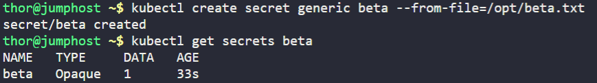
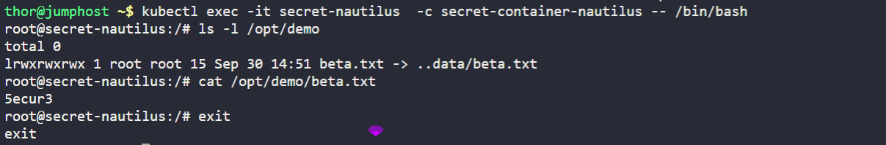

1. We already have a secret key file `beta.txt` under `/opt` location on `jump host`. Create a `generic secret` named `beta`, it should contain the password/license-number present in `beta.txt` file.
2. Also create a `pod` named `secret-nautilus`.
3. Configure pod's `spec` as container name should be `secret-container-nautilus`, image should be `debian` with `latest` tag (remember to mention the tag with image). Use `sleep` command for container so that it remains in running state. Consume the created secret and mount it under `/opt/demo` within the container.
4. To verify you can exec into the container `secret-container-nautilus`, to check the secret key under the mounted path `/opt/demo`. Before hitting the `Check` button please make sure pod/pods are in running state, also validation can take some time to complete so keep patience.

---

# Solution:
## Create the secret using the file:
```bash
kubectl create secret generic beta --from-file=/opt/beta.txt
```




## Create a YAML file named secret-pod-nautilus.yaml with the following content:
```yaml
apiVersion: v1
kind: Pod
metadata:
  name: secret-nautilus
spec:
  containers:
  - name: secret-container-nautilus
    image: debian:latest
    command: ['sleep', 'infinity']
    volumeMounts:
    - name: secret-volume
      mountPath: /opt/demo
      readOnly: true
  volumes:
  - name: secret-volume
    secret:
      secretName: beta
      items:
      - key: beta.txt
        path: beta.txt

```

## Apply the YAML file to create the Pod:
```bash
kubectl apply -f secret-pod-nautilus.yaml
```
# Task: Create a Pod that uses a Secret
# Verification
1. Verify the pod is created and running:
```bash
kubectl get pods
```
2. Exec into the container to check the secret key under the mounted path:
```bash
# Get the pod name first
kubectl get pods
# Execute into the main container
kubectl exec -it secret-nautilus  -c secret-container-nautilus -- /bin/sh/
# Then inside the container, you can:
cat /opt/apps/beta.txt
ls -la /opt/apps/
```
You should see the content of `beta.txt` file inside the container.



# Explanation

## What is a Secret in Kubernetes

- A *Secret* is a Kubernetes object for storing small amounts of **sensitive data**: passwords, API keys, SSH keys, TLS certificates, tokens, etc.
- They help you avoid baking secrets into container images or specifying them directly in Pod definitions, which reduces risk of accidental exposure.

## Key Features & How It Works

- Secrets are stored in the cluster’s storage (etcd) and accessed via the Kubernetes API. By default, their data is **base64-encoded** (not encrypted), which only obscures—not secures—the contents. [Kubernetes+2wiz.io+2](https://kubernetes.io/docs/concepts/configuration/secret/)
- Pods (containers) can use Secrets in various ways:

    1. **As environment variables**: injecting name/value pairs from a Secret into container env vars.
    2. **Mounted as files via volumes**: making the Secret’s data show up as files inside containers.
    3. **For image pull credentials**: when pulling images from private registries, Secrets can provide the necessary authentication.


# Usage of Secret as a Volume in this Task


- This configuration demonstrates how to mount a Kubernetes Secret as a volume inside a container, providing a secure way to access sensitive data like passwords, API keys, or certificates.

- The volumeMounts section defines where and how the volume will be attached inside the container. Here, it specifies that a volume named **`secret-volume`**  should be mounted at the *`/opt/demo`* directory path within the container's filesystem. This means that any files from the secret will be accessible as regular files under the **`/opt/demo`**  directory when the container is running.

- The volumes section defines the actual volume configuration at the pod level. It creates a volume called `secret-volume`  that sources its data from a Kubernetes Secret named beta. This establishes the connection between the abstract volume name used in the mount and the actual secret resource stored in the cluster.

- The items array provides fine-grained control over which secret keys are exposed as files. In this case, only the beta.txt key from the beta secret will be mounted as a file. When the pod runs, this will create a file at /opt/apps/beta.txt containing the value stored under the beta.txt key in the secret. If the items field were omitted, all keys in the secret would be mounted as separate files.

**Important gotcha**: The secret must already exist in the same namespace as the pod, or the pod will fail to start.