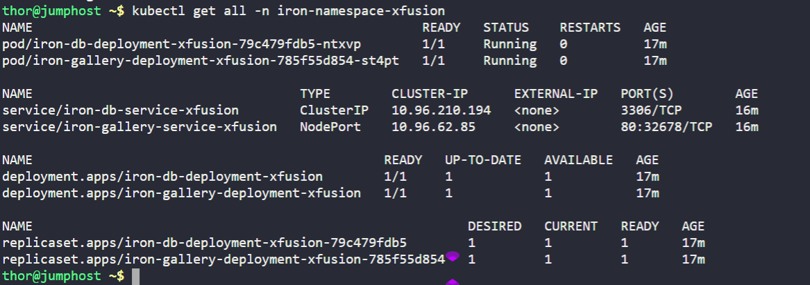
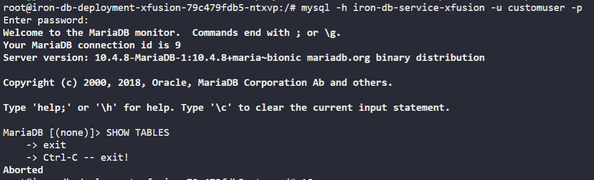
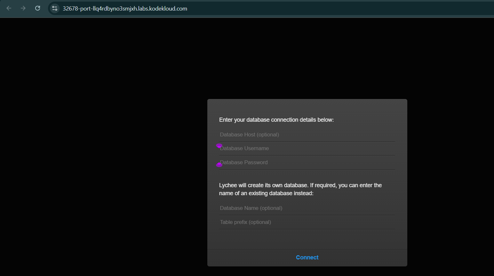

There is an iron gallery app that the Nautilus DevOps team was developing. They have recently customized the app and are going to deploy the same on the Kubernetes cluster. Below you can find more details:

1. Create a namespace `iron-namespace-xfusion`
2. Create a deployment `iron-gallery-deployment-xfusion` for `iron gallery` under the same namespace you created.

    :- Labels `run` should be `iron-gallery`.

    :- Replicas count should be `1`.

    :- Selector's matchLabels `run` should be `iron-gallery`.

    :- Template labels `run` should be `iron-gallery` under metadata.

    :- The container should be named as `iron-gallery-container-xfusion`, use `kodekloud/irongallery:2.0` image ( use exact image name / tag ).

    :- Resources limits for memory should be `100Mi` and for CPU should be `50m`.

    :- First volumeMount name should be `config`, its mountPath should be `/usr/share/nginx/html/data`.

    :- Second volumeMount name should be `images`, its mountPath should be `/usr/share/nginx/html/uploads`.

    :- First volume name should be `config` and give it `emptyDir` and second volume name should be `images`, also give it `emptyDir`.
3. Create a deployment `iron-db-deployment-xfusion` for `iron db` under the same namespace.

    :- Labels `db` should be `mariadb`.

    :- Replicas count should be `1`.

    :- Selector's matchLabels `db` should be `mariadb`.

    :- Template labels `db` should be `mariadb` under metadata.

    :- The container name should be `iron-db-container-xfusion`, use `kodekloud/irondb:2.0` image ( use exact image name / tag ).

    :- Define environment, set `MYSQL_DATABASE` its value should be `database_web`, set `MYSQL_ROOT_PASSWORD` and `MYSQL_PASSWORD` value should be with some complex passwords for DB connections, and `MYSQL_USER` value should be any custom user ( except root ).

    :- Volume mount name should be `db` and its mountPath should be `/var/lib/mysql`. Volume name should be `db` and give it an `emptyDir`.
4. Create a service for `iron db` which should be named `iron-db-service-xfusion` under the same namespace. Configure spec as selector's db should be `mariadb`. Protocol should be `TCP`, port and targetPort should be `3306` and its type should be `ClusterIP`.
5. Create a service for `iron gallery` which should be named `iron-gallery-service-xfusion` under the same namespace. Configure spec as selector's run should be `iron-gallery`. Protocol should be `TCP`, port and targetPort should be `80`, nodePort should be `32678` and its type should be `NodePort`.

---

# Solution:
## Create a YAML file named iron-namespace-xfusion.yaml with the following content:

```yaml
apiVersion: v1
kind: Namespace
metadata:
  name: iron-namespace-xfusion
```
## Apply the YAML file to create the Namespace:
```bash
kubectl apply -f iron-namespace-xfusion.yaml
```
## Create a YAML file named iron-deployments-xfusion.yaml with the following content:

```yaml
apiVersion: apps/v1
kind: Deployment
metadata:
  name: iron-gallery-deployment-xfusion
  namespace: iron-namespace-xfusion
spec:
  replicas: 1
  selector:
    matchLabels:
      run: iron-gallery
  template:
    metadata:
      labels:
        run: iron-gallery
    spec:
      containers:
      - name: iron-gallery-container-xfusion
        image: kodekloud/irongallery:2.0
        resources:
          limits:
            memory: "100Mi"
            cpu: "50m"
        volumeMounts:
        - name: config
          mountPath: /usr/share/nginx/html/data
        - name: images
          mountPath: /usr/share/nginx/html/uploads
      volumes:
      - name: config
        emptyDir: {}
      - name: images
        emptyDir: {}
---
apiVersion: apps/v1
kind: Deployment
metadata:
  name: iron-db-deployment-xfusion
  namespace: iron-namespace-xfusion
spec:
  replicas: 1
  selector:
    matchLabels:
      db: mariadb
  template:
    metadata:
      labels:
        db: mariadb
    spec:
      containers:
      - name: iron-db-container-xfusion
        image: kodekloud/irondb:2.0
        env:
        - name: MYSQL_DATABASE
          value: database_web
        - name: MYSQL_ROOT_PASSWORD
          value: "ComplexRootPass123!"
        - name: MYSQL_USER
          value: customuser
        - name: MYSQL_PASSWORD
          value: "ComplexUserPass123!"
        volumeMounts:
        - name: db
          mountPath: /var/lib/mysql
      volumes:
      - name: db
        emptyDir: {}
```

## Apply the YAML file to create the Deployments:
```bash
kubectl apply -f iron-deployments-xfusion.yaml
```
## Create a YAML file named iron-services-xfusion.yaml with the following content:

```yaml
apiVersion: v1
kind: Service
metadata:
  name: iron-db-service-xfusion
  namespace: iron-namespace-xfusion
spec:
  selector:
    db: mariadb
  ports:
  - protocol: TCP
    port: 3306
    targetPort: 3306
  type: ClusterIP
---
apiVersion: v1
kind: Service
metadata:
  name: iron-gallery-service-xfusion
  namespace: iron-namespace-xfusion
spec:
  selector:
    run: iron-gallery
  ports:
  - protocol: TCP
    port: 80
    targetPort: 80
    nodePort: 32678
  type: NodePort
```
## Apply the YAML file to create the Services:
```bash
kubectl apply -f iron-services-xfusion.yaml
```
## Verifying

1. Verify the namespace is created:
```bash
kubectl get namespaces
kubectl get all -n iron-namespace-xfusion
```

2. Verify the deployments are created and running:
```bash
kubectl get pods -n iron-namespace-xfusion
```


# Making an connection between database(maria db) and app (kodekloud/irongallery:2.0)
6. Make sure the app is able to connect to the database using the service name as hostname and the database name, username and password you have set in the environment variables.

# Verifying the connection to database

1. Get the pod name of the iron gallery pod:
```bash
kubectl get pods -n iron-namespace-xfusion
```
2. Execute into the iron gallery container:
```bash
kubectl exec -it <pod-name> -n iron-namespace-xfusion -- /bin/bash
```
3. Inside the container, check the connection to the database:
```bash
mysql -h iron-db-service-xfusion -u customuser -p
# Enter the password you set in the environment variable
USE database_web;
SHOW TABLES;

```
4. You should be able to connect to the database and see the tables.
5. Exit the database and the container:
```bash
exit
```



# Below is the image of the app

