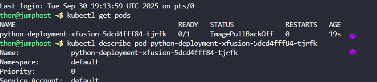
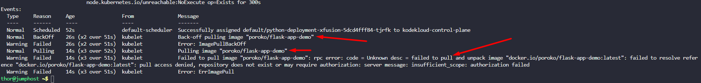
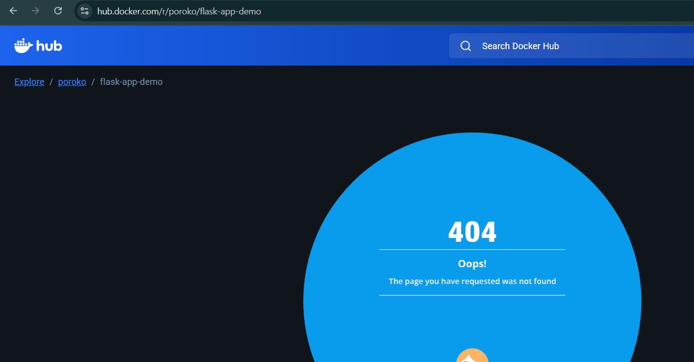
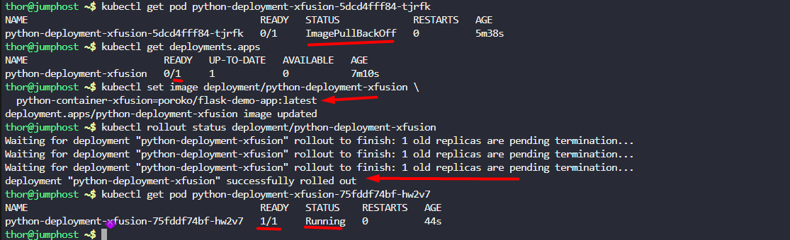
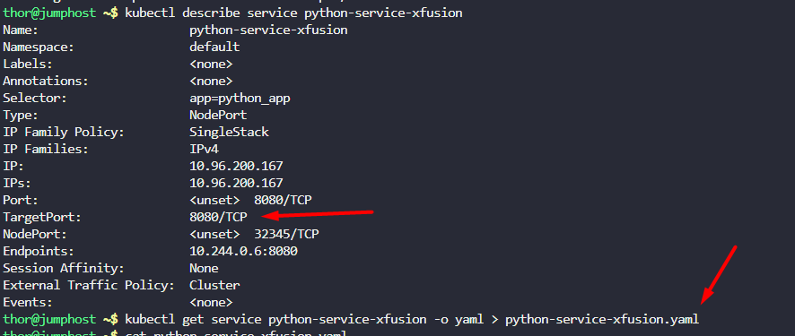
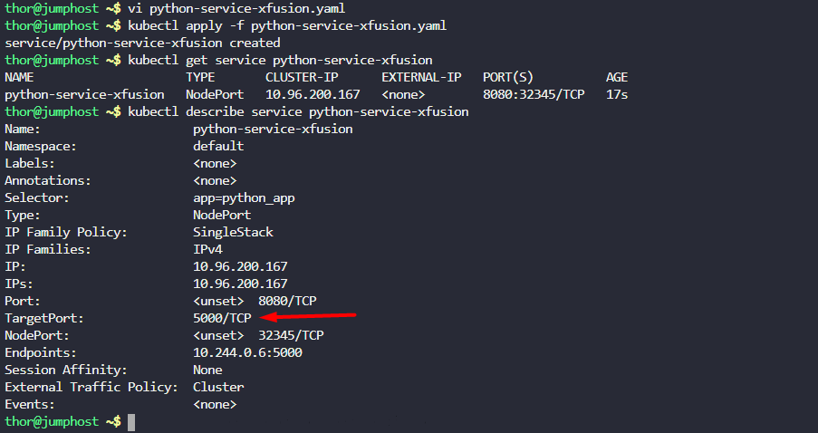
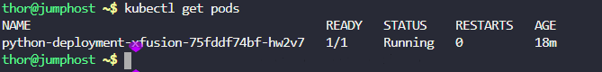
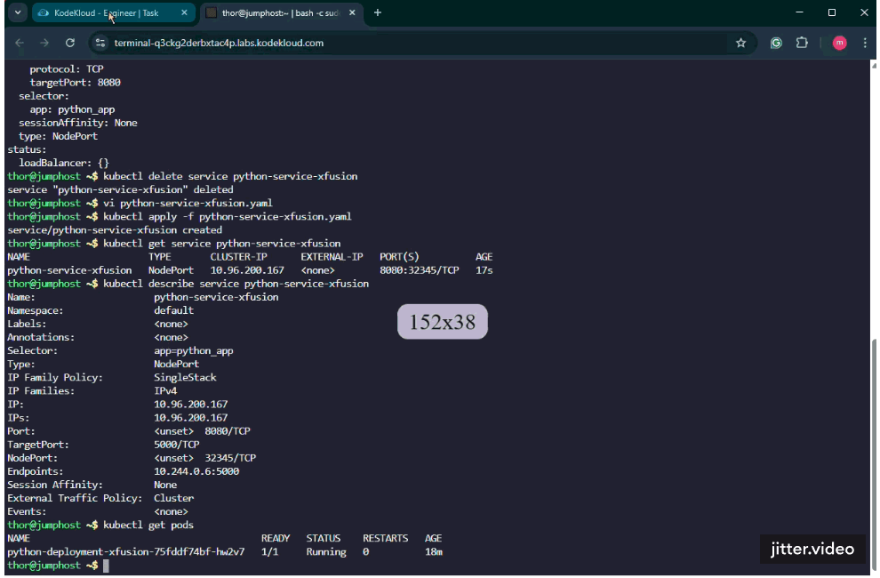

1. The deployment name is `python-deployment-xfusion`, its using `poroko/flask-demo-app`image. The deployment and service of this app is already deployed.
2. nodePort should be `32345` and targetPort should be python flask app's default port.

`Note:` The `kubectl` on `jump_host` has been configured to work with the kubernetes cluster.

---

# Solution:
## Try to check the Events of the pod by using describe command.

```
# first get the pod name
kubectl get pods
kubectl describe pod <pod-name>
```


- the Events tab


- Try to access the image over the dockerhub `https://hub.docker.com/r/poroko/flask-app-demo`



- the correct image name is poroko/flask-demo-app so we need to change the image name

```
kubectl set image deployment/python-deployment-xfusion \
  python-container-xfusion=poroko/flask-demo-app:latest
```
```
kubectl rollout status deployment/python-deployment-xfusion
```



## We need to change the target port of nodePort service to the python flask app's default port. i.e., 5000



```
kubectl describe service python-service-xfusion
kubectl get service python-service-xfusion -o yaml > python-service-xfusion.yaml
kubectl delete service python-service-xfusion
```

- Changing the port in manfest file and creating a service.

```
vi python-service-xfusion.yaml
kubectl apply -f python-service-xfusion.yaml
```


3. Verify the deployment and service are running fine.
```
kubectl get pods
```


- Acessing the website

