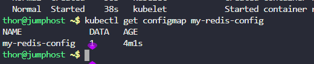

Create a redis deployment with following parameters:

1. Create a `config map` called `my-redis-config` having `maxmemory 2mb` in `redis-config`.
2. Name of the `deployment` should be `redis-deployment`, it should use
`redis:alpine` image and container name should be `redis-container`. Also make sure it has only `1` replica.
3. The container should request for `1` CPU.
4. Mount `2` volumes:

a. An Empty directory volume called `data` at path `/redis-master-data`.

b. A configmap volume called `redis-config` at path `/redis-master`.

c. The container should expose the port `6379`.

5. Finally, `redis-deployment` should be in an up and running state.

---

# Solution:
## Create a YAML file named redis-configmap.yaml with the following content:

```yaml
apiVersion: v1
kind: ConfigMap
metadata:
  name: my-redis-config
data:
  redis-config: |
    maxmemory 2mb
```
## Apply the YAML file to create the ConfigMap:
```bash
kubectl apply -f redis-configmap.yaml
```
## Create a YAML file named redis-deployment.yaml with the following content:

```yaml
apiVersion: apps/v1
kind: Deployment
metadata:
  name: redis-deployment
spec:
  replicas: 1
  selector:
    matchLabels:
      app: redis
  template:
    metadata:
      labels:
        app: redis
    spec:
      containers:
      - name: redis-container
        image: redis:alpine
        resources:
          requests:
            cpu: "1"
        ports:
        - containerPort: 6379
        volumeMounts:
        - name: data
          mountPath: /redis-master-data
        - name: redis-config
          mountPath: /redis-master
      volumes:
      - name: data
        emptyDir: {}
      - name: redis-config
        configMap:
          name: my-redis-config


```
## Apply the YAML file to create the Deployment:
```bash
kubectl apply -f redis-deployment.yaml
```
got below error
thor@jumphost ~$ kubectl apply -f redis-deployment.yaml
The Deployment "redis-deployment" is invalid:
* spec.template.spec.volumes[1].configMap.items[0].path: Required value
* spec.template.spec.containers[0].volumeMounts[1].name: Not found: "redis-config"

* spec.template.spec.volumes[1].configMap.items[0].key: Not found: "redis-config"
* spec.template.spec.volumes[1].configMap.items[0].path: Required value
* spec.template.spec.volumes[1].configMap.name: Not found: "my-redis-config"
* spec.template.spec.containers[0].volumeMounts[1].mountPath: Required value
thor@jumphost ~$
```yaml
apiVersion: apps/v1
kind: Deployment
metadata:
  name: redis-deployment
spec:
  replicas: 1
  selector:
    matchLabels:
      app: redis
  template:
    metadata:
      labels:
        app: redis
    spec:
      containers:
      - name: redis-container
        image: redis:alpine
        resources:
          requests:
            cpu: "1"
        ports:
        - containerPort: 6379
        volumeMounts:
        - name: data
          mountPath: /redis-master-data
        - name: redis-config
          mountPath: /redis-master/redis.conf
          subPath: redis-config
      volumes:
      - name: data
        emptyDir: {}
      - name: redis-config
        configMap:
          name: my-redis-config
          items:
          - key: redis-config

```


# Verification
1. Verify the deployment is created and running:
```bash
kubectl get deployments
kubectl get pods
```




## Explanation:

# what is configMap?

A **ConfigMap** in Kubernetes is an API object used to **store configuration data** (non-sensitive key–value pairs) separately from application code.

Think of it like this: instead of hardcoding configs (URLs, app settings, feature flags) inside your container image, you keep them in a ConfigMap and inject them into your pods at runtime.

🔹 Why ConfigMaps are useful

Decouples config from code → You don’t need to rebuild your image to change a setting.

Environment-specific configs → Same container image can run in dev, test, prod with different ConfigMaps.

Flexibility → Pods can consume configs as environment variables, command-line args, or mounted files.


### Types of ConFigMap

ConfigMaps in Kubernetes don’t have “types” as separate resources, but they can be created and consumed in different ways, depending on how you load and use the configuration.

For instance:

ConfigMaps can be **created from literals, files, or YAML**, and **consumed as env vars, volumes, or args**.

Let’s break it down:


#### 🔹 1. **Based on how you create them**

1. **From literal values (key-value pairs in command line)**

        kubectl create configmap my-config \ --from-literal=APP_ENV=production \ --from-literal=APP_DEBUG=false

2. **From a file**

        kubectl create configmap my-config --from-file=config.properties

    (Each line in the file becomes a key-value entry.)
3. **From multiple files or directories**

        kubectl create configmap my-config --from-file=app.conf --from-file=db.conf

    or entire directory:

        kubectl create configmap my-config --from-file=./config-dir/
4. **From a YAML manifest**

        apiVersion: v1kind: ConfigMapmetadata: name: my-configdata: APP_ENV: "production" APP_DEBUG: "false"

* * *

#### 🔹 2. **Based on how pods consume them**

1. **As environment variables**

        envFrom:
        - configMapRef:
            name: my-config
2. **As specific environment variables (select keys)**

        env:
        - name: APP_ENV
           valueFrom:
        configMapKeyRef:
        name: my-config
        key: APP_ENV
3. **As mounted files (ConfigMap volume)**


        volumeMounts:
        - name: config-volume
          mountPath: /etc/config
       volumes:
        - name: config-volume
          configMap:
              name: my-config

    → Each key becomes a file under `/etc/config/`.
4. **As command-line arguments** (indirectly, via env vars or mounted file).

* * *

## 🔹 3. **Special variants**

- **BinaryData ConfigMap** → stores binary (base64-encoded) data instead of plain text (rare, usually use Secrets).
- **Immutable ConfigMaps** → if you don’t want accidental changes:

```

apiVersion: v1
kind: ConfigMap
metadata:
  name: my-config
immutable: true
data:
  APP_ENV: "production"
```