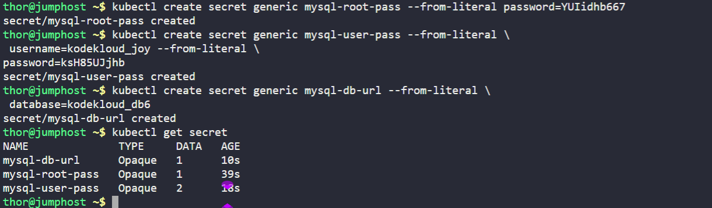
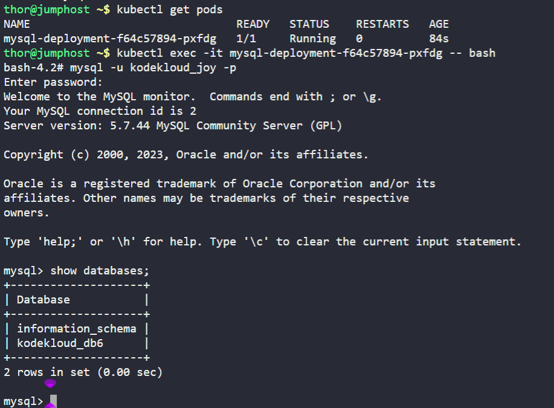

1.) Create a PersistentVolume `mysql-pv`, its capacity should be `250Mi`, set other parameters as per your preference.

2.) Create a PersistentVolumeClaim to request this PersistentVolume storage. Name it as `mysql-pv-claim` and request a `250Mi` of storage. Set other parameters as per your preference.

3.) Create a deployment named `mysql-deployment`, use any mysql image as per your preference. Mount the PersistentVolume at mount path `/var/lib/mysql`.

4.) Create a `NodePort` type service named `mysql` and set nodePort to `30007`.

5.) Create a secret named `mysql-root-pass` having a key pair value, where key is `password` and its value is `YUIidhb667`, create another secret named `mysql-user-pass` having some key pair values, where frist key is `username` and its value is `kodekloud_joy`, second key is `password` and value is `ksH85UJjhb`, create one more secret named `mysql-db-url`, key name is `database` and value is `kodekloud_db6`

6.) Define some Environment variables within the container:

a) `name: MYSQL_ROOT_PASSWORD`, should pick value from secretKeyRef `name: mysql-root-pass` and `key: password`

b) `name: MYSQL_DATABASE`, should pick value from secretKeyRef `name: mysql-db-url` and `key: database`

c) `name: MYSQL_USER`, should pick value from secretKeyRef `name: mysql-user-pass` key `key: username`

d) `name: MYSQL_PASSWORD`, should pick value from secretKeyRef `name: mysql-user-pass` and `key: password`

---

# Solution:
## Create a YAML file named mysql-pv.yaml with the following content which Provisons  the PersistentVolume and PersistentVolumeClaim:

```yaml
apiVersion: v1
kind: PersistentVolume
metadata:
  name: mysql-pv
spec:
  capacity:
    storage: 250Mi
  accessModes:
    - ReadWriteOnce
  hostPath:
    path: "/home/thor/mysql-data"
  persistentVolumeReclaimPolicy: Retain
  storageClassName: manual
---
apiVersion: v1
kind: PersistentVolumeClaim
metadata:
  name: mysql-pv-claim
spec:
  accessModes:
    - ReadWriteOnce
  resources:
    requests:
      storage: 250Mi
  storageClassName: manual
```
## Apply the YAML file :
```bash
kubectl apply -f mysql-pv.yaml
```


## create list of secrets from Kubectl cmds.
```bash
kubectl create secret generic mysql-root-pass --from-literal \
= password=YUIidhb667
kubectl create secret generic mysql-user-pass --from-literal \
 username=kodekloud_joy --from-literal \
password=ksH85UJjhb
kubectl create secret generic mysql-db-url --from-literal \
 database=kodekloud_db6
```



## Create a YAML file named mysql-deployment.yaml with the following content:

```yaml
apiVersion: apps/v1
kind: Deployment
metadata:
  name: mysql-deployment
spec:
  replicas: 1
  selector:
    matchLabels:
      app: mysql
  template:
    metadata:
      name : Pod-Sql
      labels:
        app: mysql
    spec:
      containers:
      - name: mysql-container
        image: mysql:5.7
        env:
        - name: MYSQL_ROOT_PASSWORD
          valueFrom:
            secretKeyRef:
              name: mysql-root-pass
              key: password
        - name: MYSQL_DATABASE
          valueFrom:
            secretKeyRef:
              name: mysql-db-url
              key: database
        - name: MYSQL_USER
          valueFrom:
            secretKeyRef:
              name: mysql-user-pass
              key: username
        - name: MYSQL_PASSWORD
          valueFrom:
            secretKeyRef:
              name: mysql-user-pass
              key: password
        volumeMounts:
        - name: mysql-storage
          mountPath: /var/lib/mysql
      volumes:
      - name: mysql-storage
        persistentVolumeClaim:
          claimName: mysql-pv-claim
```
## Apply the YAML file to create the Deployment:
```bash
kubectl apply -f mysql-deployment.yaml
```
## Create a YAML file named mysql-service.yaml with the following content:

```yaml
apiVersion: v1
kind: Service
metadata:
  name: mysql
spec:
  type: NodePort
  selector:
    app: mysql
  ports:
    - protocol: TCP
      port: 3306
      targetPort: 3306
      nodePort: 30007
```
## Apply the YAML file to create the Service:
```bash
kubectl apply -f mysql-service.yaml
```
# Verification

2. Verify the deployment is created and running:
```bash
kubectl get deployments
kubectl get pods
```

# Testing the mysql container.

1.) Get into the Pod shell.
```bash
kubectl exec -it <pod-name> -- bash
```
2.) Login to mysql using the below command.
```bash
mysql -u kodekloud_joy -p
```
3.) Provide the password when prompted.
```bash
Enter password: ksH85UJjhb
```
4.) Show the databases to verify.
```bash
show databases;
```



# Summary
1.) Created a PersistentVolume and PersistentVolumeClaim.
2.) Created a Deployment with mysql container and mounted the PVC.
3.) Created a NodePort service to expose the mysql deployment.
4.) Created secrets and used them as environment variables in the mysql container.
5.) Verified the mysql container by logging into it and checking the databases.


