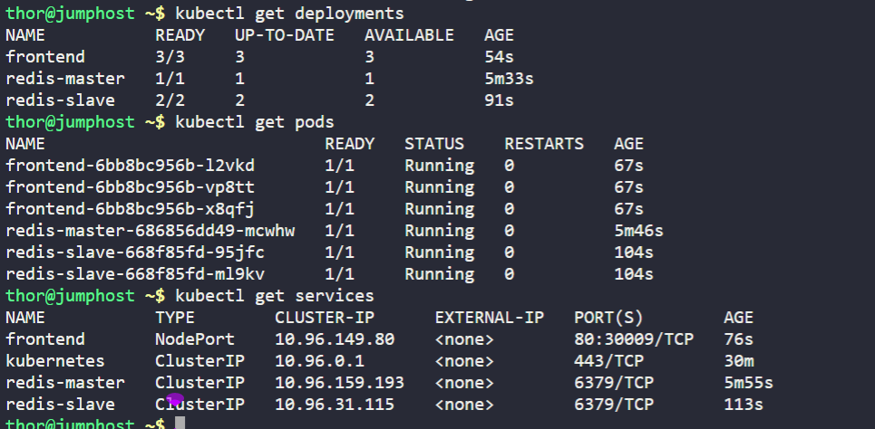

`BACK-END TIER`

1. Create a deployment named `redis-master` for Redis master.

    a.) Replicas count should be `1`.

    b.) Container name should be `master-redis-datacenter` and it should use image `redis`.

    c.) Request resources as `CPU` should be `100m` and `Memory` should be `100Mi`.

    d.) Container port should be redis default port i.e `6379`.
2. Create a service named `redis-master` for Redis master. Port and targetPort should be Redis default port i.e `6379`.
3. Create another deployment named `redis-slave` for Redis slave.

    a.) Replicas count should be `2`.

    b.) Container name should be `slave-redis-datacenter` and it should use `gcr.io/google_samples/gb-redisslave:v3` image.

    c.) Requests resources as `CPU` should be `100m` and `Memory` should be `100Mi`.

    d.) Define an environment variable named `GET_HOSTS_FROM` and its value should be `dns`.

    e.) Container port should be Redis default port i.e `6379`.
4. Create another service named `redis-slave`. It should use Redis default port i.e `6379`.

`FRONT END TIER`

1. Create a deployment named `frontend`.

    a.) Replicas count should be `3`.

    b.) Container name should be `php-redis-datacenter` and it should use `gcr.io/google-samples/gb-frontend@sha256:a908df8486ff66f2c4daa0d3d8a2fa09846a1fc8efd65649c0109695c7c5cbff` image.

    c.) Request resources as `CPU` should be `100m` and `Memory` should be `100Mi`.

    d.) Define an environment variable named as `GET_HOSTS_FROM` and its value should be `dns`.

    e.) Container port should be `80`.
2. Create a service named `frontend`. Its `type` should be `NodePort`, port should be `80` and its `nodePort` should be `30009`.

Finally, you can check the `guestbook app` by clicking on `App` button.

`You can use any labels as per your choice.`

---

# Solution:
## Create a YAML file named redis-backend.yaml with the following content:

```yaml
apiVersion: apps/v1
kind: Deployment
metadata:
  name: redis-master
spec:
  replicas: 1
  selector:
    matchLabels:
      app: redis-master
  template:
    metadata:
      labels:
        app: redis-master
    spec:
      containers:
      - name: master-redis-datacenter
        image: redis
        resources:
          requests:
            memory: "100Mi"
            cpu: "100m"
        ports:
        - containerPort: 6379
---
apiVersion: v1
kind: Service
metadata:
  name: redis-master
spec:
  selector:
    app: redis-master
  ports:
  - protocol: TCP
    port: 6379
    targetPort: 6379
```
## Apply the YAML file to create the deployment and service:

```
kubectl apply -f redis-backend.yaml
```

## Create a YAML file named redis-backend-slaves.yaml with the following content:

```
apiVersion: apps/v1
kind: Deployment
metadata:
  name: redis-slave
spec:
  replicas: 2
  selector:
    matchLabels:
      app: redis-slave
  template:
    metadata:
      labels:
        app: redis-slave
    spec:
      containers:
      - name: slave-redis-datacenter
        image: gcr.io/google_samples/gb-redisslave:v3
        resources:
          requests:
            memory: "100Mi"
            cpu: "100m"
        env:
        - name: GET_HOSTS_FROM
          value: dns
        ports:
        - containerPort: 6379
---
apiVersion: v1
kind: Service
metadata:
  name: redis-slave
spec:
  selector:
    app: redis-slave
  ports:
  - protocol: TCP
    port: 6379
    targetPort: 6379
```
## Apply the YAML file to create the deployment and service:

```
kubectl apply -f redis-backend-slaves.yaml
```
## Create a YAML file named redis-frontend.yaml with the following content:


```
apiVersion: apps/v1
kind: Deployment
metadata:
  name: frontend
spec:
  replicas: 3
  selector:
    matchLabels:
      app: frontend
  template:
    metadata:
      labels:
        app: frontend
    spec:
      containers:
      - name: php-redis-datacenter
        image: gcr.io/google-samples/gb-frontend@sha256:a908df8486ff66f2c4daa0d3d8a2fa09846a1fc8efd65649c0109695c7c5cbff
        resources:
          requests:
            memory: "100Mi"
            cpu: "100m"
        env:
        - name: GET_HOSTS_FROM
          value: dns
        ports:
        - containerPort: 80
---
apiVersion: v1
kind: Service
metadata:
  name: frontend
spec:
  type: NodePort
  selector:
    app: frontend
  ports:
  - protocol: TCP
    port: 80
    targetPort: 80
    nodePort: 30009
```
## Apply the YAML file to create the deployments and services:
```bash
kubectl apply -f redis-frontend.yaml
```
# Verification
1. Verify all deployments and services are created and running:
```bash
kubectl get deployments
kubectl get pods
kubectl get services
```


