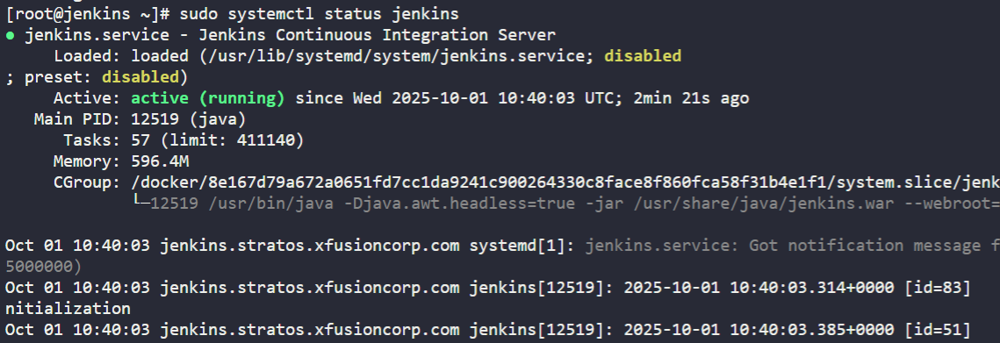

1. Install `Jenkins` on the jenkins server using the `yum` utility only, and start its service. - If you face a timeout issue while starting the Jenkins service, refer to [this](https://www.jenkins.io/doc/book/system-administration/systemd-services/#starting-services).

2. Jenkin's admin user name should be `theadmin`, password should be `Adm!n321`, full name should be `John` and email should be `john@jenkins.stratos.xfusioncorp.com`.

- `Note:`

 1. To access the `jenkins` server, connect from the jump host using the `root` user with the password `S3curePass`.

  2. After Jenkins server installation, click the `Jenkins` button on the top bar to access the Jenkins UI and follow on-screen instructions to create an admin user.

---

# Solution:
# Step 1: Connect to Jenkins server from jump host
# ssh root@jenkins (password: S3curePass)


2. Install `Java` and `Jenkins` using the following commands:
```bash
yum install wget -y
sudo wget -O /etc/yum.repos.d/jenkins.repo \
    https://pkg.jenkins.io/redhat-stable/jenkins.repo
sudo rpm --import https://pkg.jenkins.io/redhat-stable/jenkins.io-2023.key
sudo yum upgrade -y
# Add required dependencies for the jenkins package
sudo yum install fontconfig java-21-openjdk -y
sudo yum install jenkins -y
sudo systemctl daemon-reload
sudo systemctl restart jenkins

```
3. Start and enable the `Jenkins` service using the following commands:
```bash
systemctl start jenkins
systemctl enable jenkins
```


Enter the default password

```
cat /var/lib/jenkins/secrets/initialAdminPassword
```


# Step 2: Access Jenkins UI and create an admin user

1. Open the `Jenkins` UI by clicking the `Jenkins` button on the top bar.
2. On the Jenkins setup page, click on `Install suggested plugins` and wait for the installation to complete.
3. After the installation is complete, click on `Create First Admin User`.
4. Open the `Jenkins` UI by clicking the `Jenkins` button on the top bar.
5. Follow the on-screen instructions to create an admin user with the following details:
   - Username: `theadmin`
   - Password: `Adm!n321`
   - Full Name: `John`
   - Email: `siva@jenkins.stratos.xfusioncorp.com`
   - Name: `Siva`


