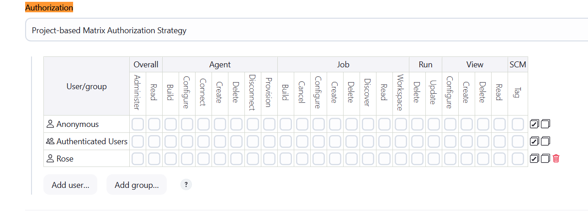
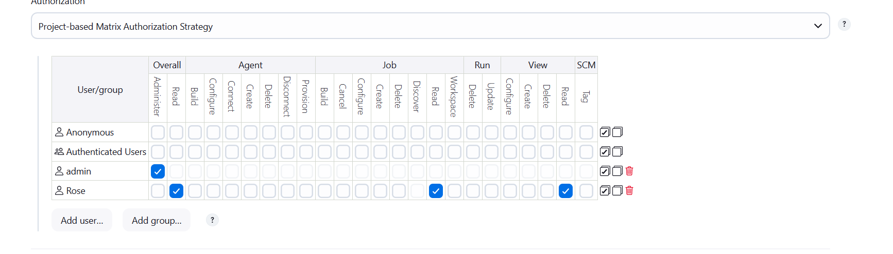

1. Click on the `Jenkins` button on the top bar to access the Jenkins UI. Login with username `admin` and password `Adm!n321`.

2. Create a jenkins user named `rose` with the password`LQfKeWWxWD`. Their full name should match `Rose`.

3. Utilize the `Project-based Matrix Authorization Strategy` to assign `overall read` permission to the `rose` user.

4. Remove all permissions for `Anonymous` users (if any) ensuring that the `admin` user retains overall `Administer` permissions.

5. For the existing job, grant `rose` user only `read` permissions, disregarding other permissions such as Agent, SCM etc.

`Note:`

1. You may need to install plugins and restart Jenkins service. After plugins installation, select `Restart Jenkins when installation is complete and no jobs are running` on plugin installation/update page.

2. After restarting the Jenkins service, wait for the Jenkins login page to reappear before proceeding. Avoid clicking `Finish` immediately after restarting the service.

3. Capture screenshots of your configuration for review purposes. Consider using screen recording software like `loom.com` for documentation and sharing.

---

# Solution:
1. Access the Jenkins UI by clicking on the `Jenkins` button on the top bar and log in with the username `admin` and password `Adm!n321`.
2. Create a new user named `rose` with the password `LQfKeWWxWD` and set their full name to `Rose`.
3. Install the `Matrix Authorization Strategy` plugin .
- **Install the Matrix Authorization Strategy Plugin:**

    - Navigate to `Manage Jenkins` &gt; `Manage Plugins`.
    - Go to the `Available` tab.
    - Search for "Matrix Authorization Strategy" and install it without restarting Jenkins.
- **Configure Global Security:**

    - Go to `Manage Jenkins` &gt; ` Security`.
    - In the `Authorization` section, select `Project-based Matrix Authorization Strategy`.
    - Click `Apply` and then `Save`.
- **Add the "rose" user and grant Overall Read permission:**

    - In the `Project-based Matrix Authorization Strategy` section of the `Security` page, locate the grid for permissions.
    - Click `Add user or group` and enter `rose` in the input field.
    - Find the `Overall` row and the `Read` column. Check the box at the intersection of the `rose` user row and the `Overall/Read` column.
    - Click `Save`.

