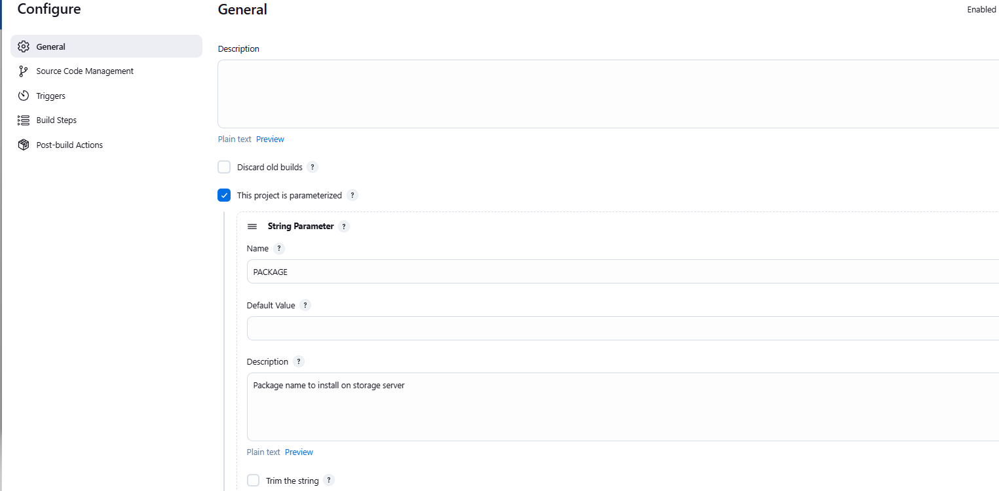
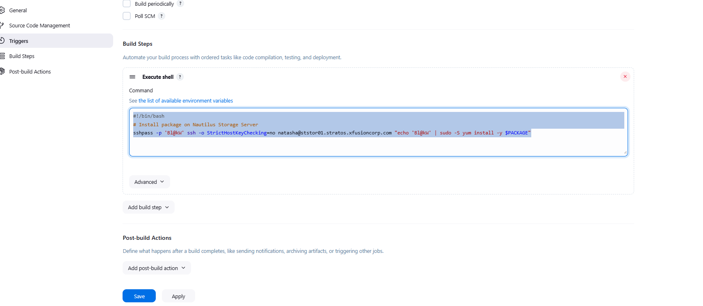
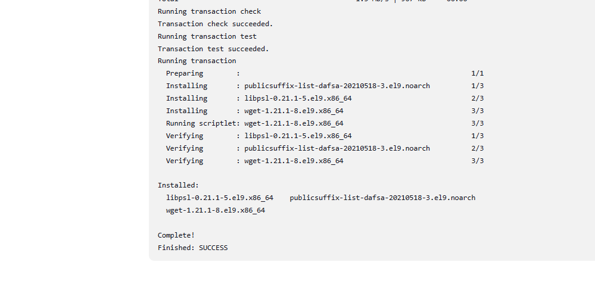

1. Access the Jenkins UI by clicking on the `Jenkins` button in the top bar. Log in using the credentials: username `admin` and password `Adm!n321`.

2. Create a new Jenkins job named `install-packages` and configure it with the following specifications:

- Add a string parameter named `PACKAGE`.
- Configure the job to install a package specified in the `$PACKAGE` parameter on the `storage server` within the `Stratos Datacenter`.

`Note`:

1. Ensure to install any required plugins and restart the Jenkins service if necessary. Opt for `Restart Jenkins when installation is complete and no jobs are running` on the plugin installation/update page. Refresh the UI page if needed after restarting the service.

2. Verify that the Jenkins job runs successfully on repeated executions to ensure reliability.

3. Capture screenshots of your configuration for documentation and review purposes. Alternatively, use screen recording software like `loom.com` for comprehensive documentation and sharing.

---

# Solution:


### Step 2: Create New Jenkins Job

1. **Create the job:**
    - Click on "New Item" from the Jenkins dashboard
    - Enter the job name: `install-packages`
    - Select "Freestyle project"
    - Click "OK"
2. **Configure the String Parameter:**
    - Check the box "This project is parameterized"
    - Click "Add Parameter" → "String Parameter"
    - Name: `PACKAGE`
    - Description (optional): `Package name to install on storage server`
    - Leave default value empty or add a common package name



3. **Configure Build Steps:**
    - Scroll down to "Build" section
    - Click "Add build step" → "Execute shell"
    - Add the following script:
```
#!/bin/bash
# Install package on Nautilus Storage Server
sshpass -p 'Bl@kW' ssh -o StrictHostKeyChecking=no natasha@ststor01.stratos.xfusioncorp.com "echo 'Bl@kW' | sudo -S yum install -y $PACKAGE"
```


4. ### Step 3: Test the Job (Optional)

To verify the job works correctly:

1. Click "Build with Parameters"
2. Enter a package name (e.g., `httpd`, `wget`, `vim-enhanced`)
3. Click "Build"
4. Check the Console Output to verify successful installation




### Part 1: `sshpass -p 'Bl@kW'`

- **`sshpass`**: A tool that provides password to SSH non-interactively
- **`-p 'Bl@kW'`**: Specifies the SSH password for user `natasha`
- This allows automated SSH login without manual password entry

### Part 2: `ssh -o StrictHostKeyChecking=no`

- **`ssh`**: Secure Shell command to connect to remote server
- **`-o StrictHostKeyChecking=no`**: SSH option that:
    - Disables the prompt asking "Are you sure you want to continue connecting?"
    - Automatically accepts the server's SSH fingerprint
    - Useful for automation but less secure (skips host verification)

### Part 3: `natasha@ststor01.stratos.xfusioncorp.com`

- **`natasha`**: Username to login as on the remote server
- **`@ststor01.stratos.xfusioncorp.com`**: Hostname/FQDN of the storage server

### Part 4: `"echo 'Bl@kW' | sudo -S yum install -y $PACKAGE"`

This entire section (in quotes) is the **remote command** executed on the storage server:

#### `echo 'Bl@kW' |`

- **`echo 'Bl@kW'`**: Outputs the password
- **`|`**: Pipe - sends the password as input to the next command

#### `sudo -S`

- **`sudo`**: Execute command with superuser (root) privileges
- **`-S`**: Read password from standard input (stdin) instead of terminal
- This is why we pipe the password from `echo`

#### `yum install -y $PACKAGE`

- **`yum install`**: YUM package manager command to install software
- **`-y`**: Automatically answer "yes" to all prompts (non-interactive)
- **`$PACKAGE`**: Variable containing the package name to install (from Jenkins parameter)