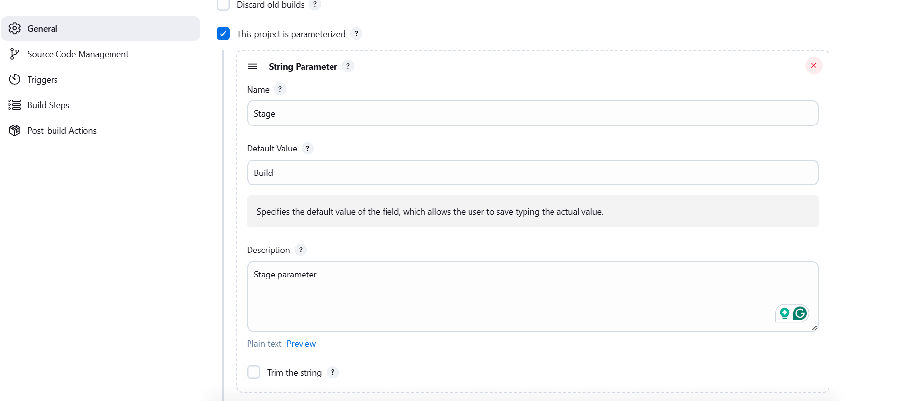
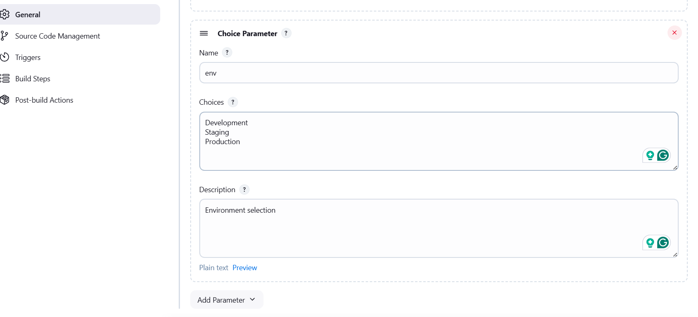

Click on the `Jenkins` button on the top bar to access the Jenkins UI. Login using username `admin` and password `Adm!n321`.

1. Create a `parameterized` job which should be named as `parameterized-job`

2. Add a `string` parameter named `Stage`; its default value should be `Build`.

3. Add a `choice` parameter named `env`; its choices should be `Development`, `Staging` and `Production`.

4. Configure job to execute a shell command, which should echo both parameter values (you are passing in the job).

5. Build the Jenkins job at least once with choice parameter value `Development` to make sure it passes.
---

# Solution:

$## Solution: Create Parameterized Jenkins Job

### Step 1: Create New Jenkins Job

1. **Go to Jenkins Dashboard**
  - Click on "New Item"
  - Enter job name: `parameterized-job`
  - Select "Freestyle project"
  - Click "OK"

### Step 2: Add String Parameter

1. **In the job configuration page:**
  - Check the box "This project is parameterized"
  - Click "Add Parameter" → "String Parameter"

  
2. **Configure String Parameter:**
  - Name: `Stage`
  - Default Value: `Build`
  - Description (optional): `Stage parameter`

### Step 3: Add Choice Parameter

1. **Add another parameter:**
  - Click "Add Parameter" → "Choice Parameter"
2. **Configure Choice Parameter:**
  - Name: `env`
  - Choices (one per line):

```
 Development
 Staging
 Production
```

- Description (optional): `Environment selection`

### Step 4: Configure Shell Command

1. **Scroll down to "Build" section:**
  - Click "Add build step" → "Execute shell"
2. **Add the following script:**

bash

```
 #!/bin/bash
 echo "Stage: $Stage"
 echo "Environment: $env"
```

### Step 5: Save and Build

1. **Click "Save"** at the bottom of the page
2. **Build the job:**
  - Click "Build with Parameters" on the left sidebar
  - You should see:
    - **Stage**: Build (default value)
    - **env**: Dropdown with Development, Staging, Production
  - Select **Development** from the env dropdown
  - Click "Build"
3. **Verify the output:**
  - Click on the build number (e.g., #1) in Build History
  - Click "Console Output"
  - You should see:

```
 Stage: Build
 Environment: Development
```


## Benefits of Parameterized Jenkins Jobs

### 1. **Reusability - One Job, Multiple Purposes**

Instead of creating separate jobs for each environment, you have ONE job that works everywhere.

### 2. **Consistency**

The same deployment logic runs across all environments, reducing configuration drift and errors.

### 3. **Flexibility**

Users can customize job behavior at runtime without modifying the job configuration.

### 4. **Reduced Maintenance**

Update logic in one place instead of multiple jobs.