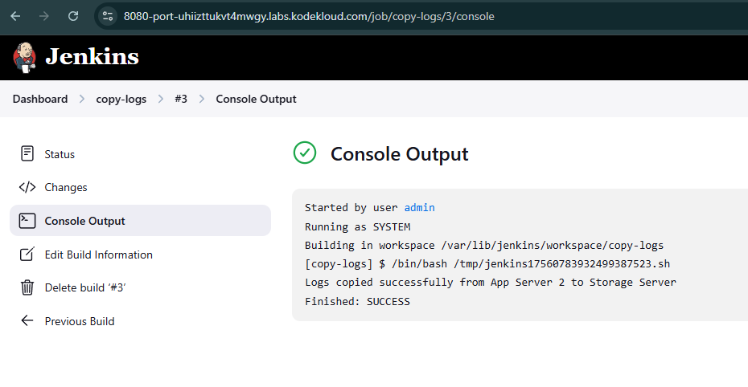
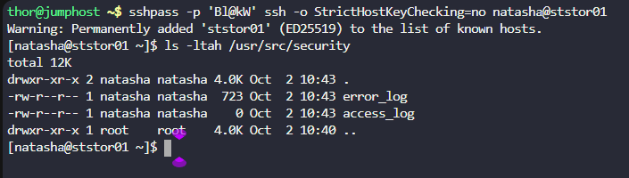

Click on the `Jenkins` button on the top bar to access the Jenkins UI. Login using username `admin` and password `Adm!n321`

1. Create a Jenkins jobs named `copy-logs`.

2. Configure it to periodically build `every 8 minutes` to copy the Apache logs (`both access_log and error_logs`) from `App Server 2` (`from default logs location`) to location `/usr/src/security` on `Storage Server`.

`Note:`

---

# Solution:

## There are multuple ways to accomplish this

### Method 01: Less Secure and Easy way.


## Step 1: Configure the Job

### Build Triggers:

1. Check **Build periodically**
2. In the Schedule field, enter: `*/8 * * * *`
    - This will run the job every 8 minutes

### Build Steps:

1. Click **Add build step** → **Execute shell**
2. Add the following script:

```
#!/bin/bash

# Copy Apache logs from App Server 2 to Jenkins Server

echo " Now, Copying Apache logs from App Server 2 to Jenkins Server"
sshpass -p 'Am3ric@' scp -o StrictHostKeyChecking=no steve@172.16.238.11:/var/log/httpd/access_log /tmp/access_log
sshpass -p 'Am3ric@' scp -o StrictHostKeyChecking=no steve@172.16.238.11:/var/log/httpd/error_log /tmp/error_log

# Copy logs from Jenkins Server to Storage Server

echo "Now, Copying logs from Jenkins Server to Storage Server"
sshpass -p 'Bl@kW' ssh -o StrictHostKeyChecking=no natasha@ststor01 "echo "Bl@kW" | sudo -S mkdir -p /usr/src/security"
sshpass -p 'Bl@kW' scp -o StrictHostKeyChecking=no /tmp/access_log natasha@ststor01:/usr/src/security
sshpass -p 'Bl@kW' scp -o StrictHostKeyChecking=no /tmp/error_log natasha@ststor01:/usr/src/security

# Clean up temp files on Jenkins Server
rm -f /tmp/access_log /tmp/error_log

```





# Method 02: Secure way by storing the credentails in Jenkins .
## Step 1: Store Credentials in Jenkins
1. Go to **Manage Jenkins** → **Manage Credentials** → (select domain) → **Add Credentials**
2. Add the following credentials:
   - For App Server 2:
     - Kind: SSH Username with private key
     - Username: steve
     - Private Key: Enter directly and paste the private key
     - ID: appserver2-ssh
   - For Storage Server:
     - Kind: SSH Username with private key
     - Username: natasha
     - Private Key: Enter directly and paste the private key
     - ID: storageserver-ssh
    - For sudo on Storage Server:
      - Kind: Username with password
      - Username: natasha
      - Password: Bl@kW
      - ID: storageserver-sudo
## Step 2: Configure the Job
### Build Triggers:
1. Check **Build periodically**
2. In the Schedule field, enter: `*/8 * * * *`
    - This will run the job every 8 minutes
### Build Steps:
1. Click **Add build step** → **Execute shell**
2. Add the following script:
```
#!/bin/bash
# Copy Apache logs from App Server 2 to Jenkins Server
echo " Now, Copying Apache logs from App Server 2 to Jenkins Server"
ssh -o StrictHostKeyChecking=no -i /var/lib/jenkins/.ssh/id_rsa steve@172.16.238.11
scp -o StrictHostKeyChecking=no steve@172.16.238.11:/var/log/httpd/access_log /tmp/access_log
scp -o StrictHostKeyChecking=no steve@172.16.238.11:/var/log/httpd/error_log /tmp/error_log
# Copy logs from Jenkins Server to Storage Server
echo "Now, Copying logs from Jenkins Server to Storage Server"
ssh -o StrictHostKeyChecking=no -i /var/lib/jenkins/.ssh/id_rsa natasha@ststor01 "echo '$(cat /var/lib/jenkins/credentials/storageserver-sudo)' | sudo -S mkdir -p /usr/src/security"
scp -o StrictHostKeyChecking=no /tmp/access_log natasha@ststor01:/usr/src/security
scp -o StrictHostKeyChecking=no /tmp/error_log natasha@ststor01:/usr/src/security
# Clean up temp files on Jenkins Server
rm -f /tmp/access_log /tmp/error_log
```


### Method 03

You can refer youtube :https://www.youtube.com/watch?v=uCRpKlh0TgQ