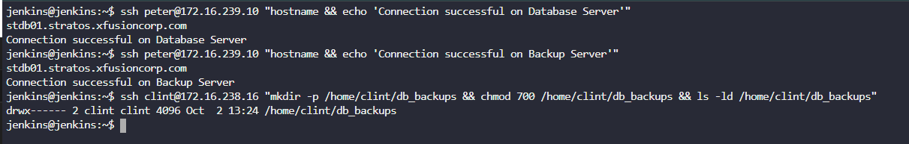
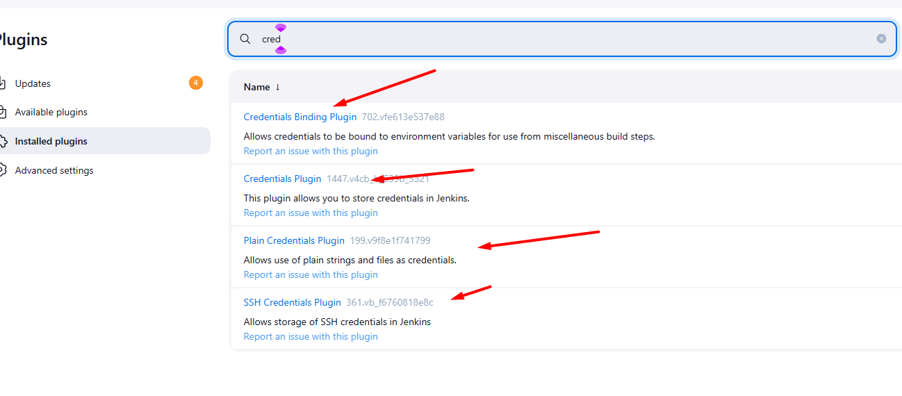
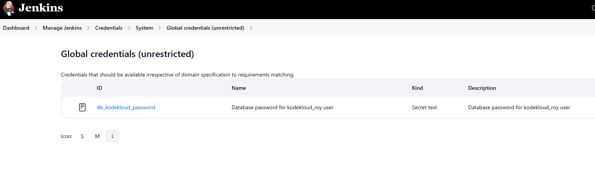
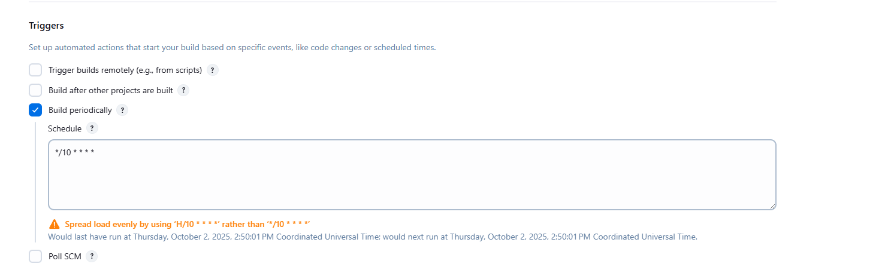
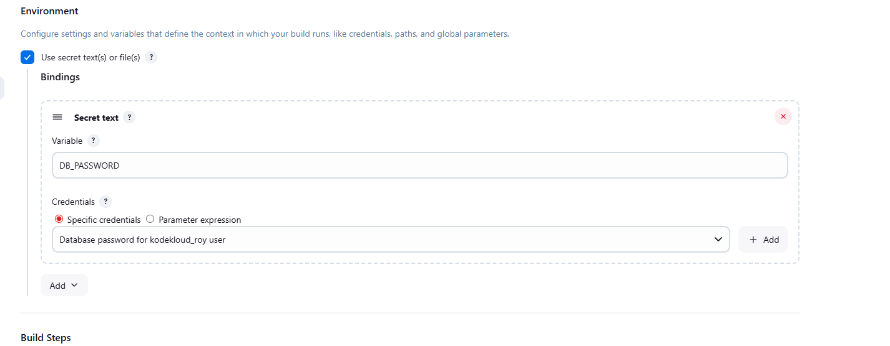
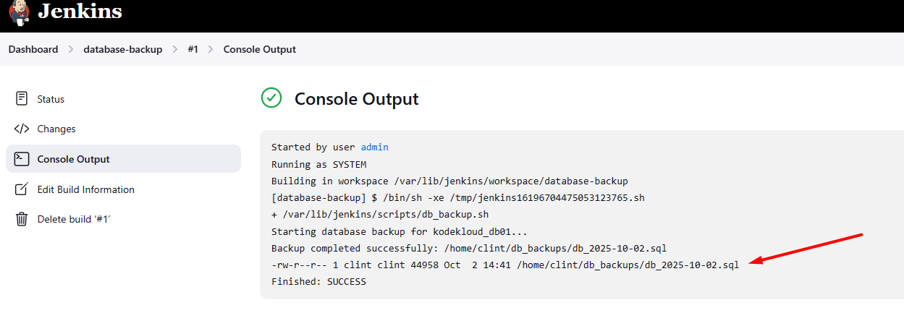
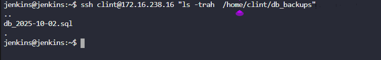

1. Create a Jenkins job named `database-backup`.
2. Configure it to take a database dump of the `kodekloud_db01` database present on the `Database server` in `Stratos Datacenter`, the database user is `kodekloud_roy` and password is `asdfgdsd`.
3. The dump should be named in `db_$(date +%F).sql` format, where `date +%F` is the current date.
4. Copy the `db_$(date +%F).sql` dump to the `Backup Server` under location `/home/clint/db_backups`.
5. Further, schedule this job to run periodically at `*/10 * * * *` (please use this exact schedule format).

---

# Solution: There are Multiple ways to do this task however, we will proceed with Production ready method.

### ✅ **Security Benefits:**

1. **Encrypted Storage**
    - Credentials are encrypted at rest in Jenkins
    - Uses Jenkins' master encryption key
    - Much more secure than plain text in scripts
2. **Masked in Logs**
    - Password appears as `****` in console output
    - Prevents accidental exposure in build logs
    - Protects against shoulder surfings

## ❌ **Cons and Limitations:**

### **1. Complexity**

- **More setup steps** compared to hardcoding
- **Learning curve** for Jenkins credentials system
- **UI navigation** can be confusing initially

### Step 1: Access Jenkins Server from Jump Host


```bash
# From jump_host (you're already logged in)
ssh jenkins@172.16.238.19
```
When prompted for password, enter: `j@rv!s`

### Step 2: Switch to Jenkins User and Generate SSH Keys

```bash
# Switch to jenkins user
sudo su - jenkins

# Generate SSH key pair (press Enter for all prompts to accept defaults)
ssh-keygen -t rsa -b 4096 -N ""
```

This creates:
- Private key: `~/.ssh/id_rsa`
- Public key: `~/.ssh/id_rsa.pub`

### Step 3: Copy SSH Public Key to Database Server

```bash
# Copy public key to Database Server
ssh-copy-id -o StrictHostKeyChecking=no peter@172.16.239.10
```
When prompted for password, enter: `Sp!dy`

**Test the connection:**
```bash
ssh peter@172.16.239.10 "hostname && echo 'Connection successful'"
```

### Step 4: Copy SSH Public Key to Backup Server

```bash
# Copy public key to Backup Server
ssh-copy-id -o StrictHostKeyChecking=no clint@172.16.238.16
```
When prompted for password, enter: `H@wk3y3`

**Test the connection:**
```bash
ssh clint@172.16.238.16 "hostname && echo 'Connection successful'"
```


### Step 5: Create Backup Directory on Backup Server

```bash
# Create and verify backup directory
ssh clint@172.16.238.16 "mkdir -p /home/clint/db_backups && chmod 700 /home/clint/db_backups && ls -ld /home/clint/db_backups"
```



### Step 6: Test Database Connection

```bash
# Test connecting to MySQL on Database Server
ssh peter@172.16.239.10 "mysql -u kodekloud_roy -pasdfgdsd -e 'SHOW DATABASES;'"
```

### Step 7: Access Jenkins Web Interface

1. Open browser and go to Jenkins server: `http://172.16.238.19:8080`
2. Use Jenkins credentials to login
3. Install below Plugins as it not installed by default


4. Create the Credentails

  - **Go to Jenkins Dashboard** (click the Jenkins logo at top left)
   - Click **Manage Jenkins** (left sidebar) and Credentails
   ###  Access Global Credentials

You'll see a page titled "Credentials" with a table showing "Stores scoped to Jenkins"

1. In the table, find the row with **System** in the "Store" column
2. Click on **Jenkins** (it's a clickable link in that row)
3. You'll see "Global credentials (unrestricted)"
4. Click on **Global credentials (unrestricted)**

###  Add New Credential

1. On the left sidebar, click **+ Add Credentials**

###  Fill in the Credential Form

You'll see a form with the following fields:

- **Kind:**
    - Click the dropdown
    - Select **Secret text**
- **Scope:**
    - Leave as **Global (Jenkins, nodes, items, all child items, etc)**
- **Secret:**
    - Enter: `asdfgdsd`
    - This is the actual database password
- **ID:**
    - Enter: `db_kodekloud_password`
    - This is how you'll reference it in Jenkins jobs
- **Description:**
    - Enter: `Database password for kodekloud_roy user`
    - This helps you identify the credential later

### Step 5: Save the Credential

- Click **OK** (or **Create** button at the bottom)

### Step 8: Create New Jenkins Job

1. Click **"New Item"**
2. Enter job name: `database-backup`
3. Select **"Freestyle project"**
4. Click **OK**

### Step 9: Configure Build Steps

In the job configuration page, add a **Build Step** → **Execute shell**:

```bash
#!/bin/bash
set -e

# Variables
DB_HOST="172.16.239.10"
DB_USER="kodekloud_roy"
# DB_PASS will come from Jenkins environment variable
DB_NAME="kodekloud_db01"
BACKUP_SERVER="172.16.238.16"
BACKUP_USER="clint"
BACKUP_DIR="/home/clint/db_backups"

# Check if DB_PASSWORD is set
if [ -z "$DB_PASSWORD" ]; then
    echo "Error: DB_PASSWORD environment variable not set"
    exit 1
fi

# Use DB_PASSWORD from environment
DB_PASS="$DB_PASSWORD"

# Generate filename with current date
FILENAME="db_$(date +%F).sql"

echo "Starting database backup for $DB_NAME..."

# Create database dump on Database Server
ssh peter@$DB_HOST "mysqldump -u $DB_USER -p$DB_PASS $DB_NAME > /tmp/$FILENAME"

# Copy the dump file to Jenkins server temporarily
scp peter@$DB_HOST:/tmp/$FILENAME /tmp/$FILENAME

# Copy the dump file to Backup Server
scp /tmp/$FILENAME $BACKUP_USER@$BACKUP_SERVER:$BACKUP_DIR/

# Cleanup temporary files
rm -f /tmp/$FILENAME
ssh peter@$DB_HOST "rm -f /tmp/$FILENAME"

echo "Backup completed successfully: $BACKUP_DIR/$FILENAME"

# Verify backup was created
ssh $BACKUP_USER@$BACKUP_SERVER "ls -la $BACKUP_DIR/$FILENAME"
```


### Step 10: Configure Build Triggers

1. In the job configuration, check **"Build periodically"**
2. In the **Schedule** field, enter: `*/10 * * * *`
3. This will run the job every 10 minutes



## Step 11: Configure the Job

### Build Environment Section:

- ☑ Check **Use secret text(s) or file(s)**
- Click **Add** → **Secret text**
    - **Variable:** `DB_PASSWORD`

#### Save and Test

1. Click **"Save"** to save the job configuration
2. Click **"Build Now"** to test the job manually
3. Check **"Console Output"** to verify the job runs successfully




### Step 12: Verify Scheduled Job

1. Check that the job is scheduled properly in Jenkins
2. Wait 10 minutes and verify the job runs automatically
3. Verify backup files are being created in `/home/clint/db_backups` on the Backup Server

```bash
# Verify backups on Backup Server
ssh clint@172.16.238.16 "ls -la /home/clint/db_backups/"
```



