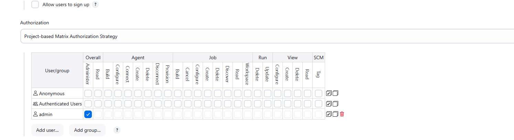
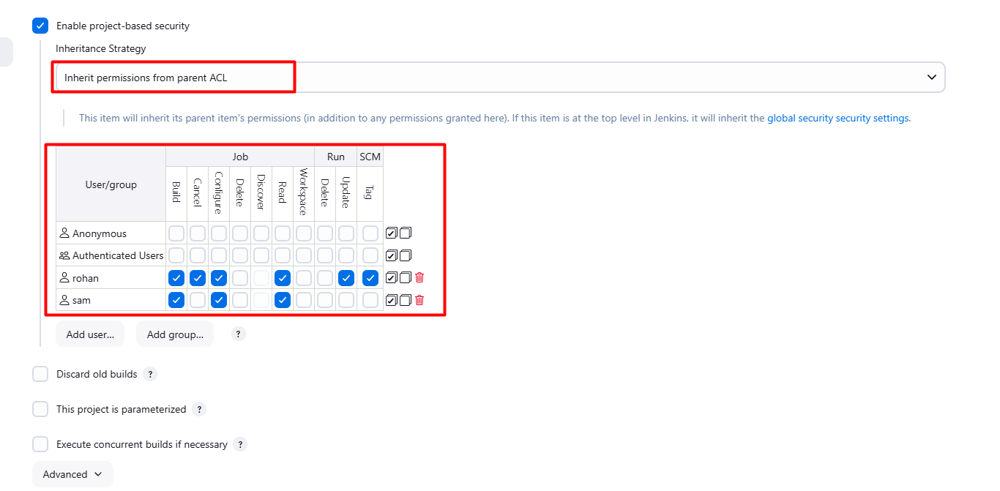

1. There is an existing Jenkins job named `Packages`, there are also two existing Jenkins users named `sam` with password `sam@pass12345` and `rohan` with password `rohan@pass12345`.
2. Grant permissions to these users to access `Packages` job as per details mentioned below:

    a.) Make sure to select `Inherit permissions from parent ACL` under `inheritance strategy` for granting permissions to these users.

    b.) Grant mentioned permissions to `sam` user : `build`, `configure` and `read`.

    c.) Grant mentioned permissions to `rohan` user : `build`, `cancel`, `configure`, `read`, `update` and `tag`.

`Note:`

1. Please do not modify/alter any other existing job configuration.

---

# Solution:

## Solution

Since this is a Jenkins configuration task, we'll need to access the Jenkins web interface to configure the job-specific permissions.

### Steps to Configure Jenkins Job Permissions:

**1. Access Jenkins Web Interface:**

- Login with Jenkins credentials if prompted**2. Install the Plugin:**

- Click on the **"Available"** tab
- Search for: **"Matrix Authorization Strategy Plugin"**
- Check the box next to it
- Click **"Install with restart"** or **"Download now and install after restart"**
- Wait for the installation to complete

## Please note even after the installation of plugin, relevant options are invisible give a two or three of jenkins service.

## Step 2: Enable Project-based Matrix Authorization

**1. Configure Global Security:**

- Go to: **Manage Jenkins → Configure Global Security**
- Under **"Authorization"** section, select: **"Project-based Matrix Authorization Strategy"**
- Make sure to grant yourself/admin appropriate permissions
- Click **"Save"**

## Step 3: Configure the Packages Job

**1. Navigate to Packages Job:**

- Go to: **Jenkins Dashboard → Packages → Configure**

**2. Enable Project-based Security:**

- Scroll down to find **"Enable project-based security"** checkbox
- Check this box

**3. Set Inheritance Strategy:**

- You should now see **"Inheritance Strategy"** dropdown
- Select: **"Inherit permissions from parent ACL"**

**4. Add User Permissions:**

**For user `sam`:**

- Click **"Add user or group"**
- Enter: `sam`
- Check these permissions:
    - ☑ Job/Build
    - ☑ Job/Configure
    - ☑ Job/Read

**For user `rohan`:**

- Click **"Add user or group"** again
- Enter: `rohan`
- Check these permissions:
    - ☑ Job/Build
    - ☑ Job/Cancel
    - ☑ Job/Configure
    - ☑ Job/Read
    - ☑ Job/Update
    - ☑ SCM/Tag

**5. Save the configuration**

That should complete the task! The Matrix Authorization Strategy Plugin is essential for project-level security in Jenkins.