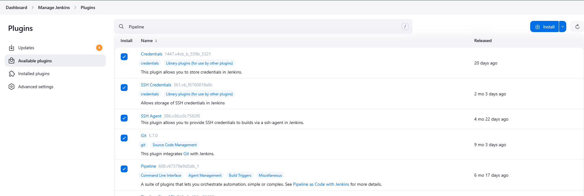
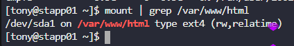

Click on the `Jenkins` button on the top bar to access the Jenkins UI. Login using username `admin` and password `Adm!n321`.

Similarly, click on the `Gitea` button on the top bar to access the Gitea UI. Login using username `sarah` and password `Sarah_pass123`. There under user `sarah` you will find a repository named `web_app` that is already cloned on `Storage server` under `/var/www/html`. sarah is a developer who is working on this repository.

1. Add a slave node named `Storage Server`. It should be labeled as `ststor01` and its remote root directory should be `/var/www/html`.
2. We have already cloned repository on `Storage Server` under `/var/www/html`.
3. Apache is already installed on all app Servers its running on port `8080`.
4. Create a Jenkins pipeline job named `devops-webapp-job` (it must not be a `Multibranch pipeline`) and configure it to:

    - Deploy the code from `web_app` repository under `/var/www/html` on `Storage Server`, as this location is already mounted to the document root `/var/www/html` of app servers. The pipeline should have a single stage named `Deploy` ( which is case sensitive ) to accomplish the deployment.

LB server is already configured. You should be able to see the latest changes you made by clicking on the `App` button. Please make sure the required content is loading on the main URL `https://<LBR-URL>` i.e there should not be a sub-directory like `https://<LBR-URL>/web_app` etc.

---

# Solution:


### Step 1: Access Jenkins and Install Required Plugins

First, let's access Jenkins UI (click the Jenkins button) and login with:
- Username: `admin`
- Password: `Adm!n321`

Navigate to **Manage Jenkins** → **Manage Plugins** → **Available plugins**

Install these plugins:
- **SSH Agent ** (for SSH connections)
- **Git Plugin** (should already be installed)
- **Pipeline Plugin** (should already be installed)
- **Credentials**
- **SSH Build Agents**



- Check "Restart Jenkins when installation is complete and no jobs are running"

- Best to install plugins one by one


### Step 2: Set Up SSH Credentials

If you prefer password-based authentication:

In Jenkins:
1. Go to **Manage Jenkins** → **Manage Credentials**
2. Click on **(global)** domain
3. Click **Add Credentials**
4. Configure:
   - **Kind**: `Username with password`
   - **Username**: `natasha`
   - **Password**: `Bl@kW`
   - **ID**: `storage-server-creds`
   - **Description**: `Storage Server Credentials`
5. Click **Create**


### Step 3: Add Storage Server as Jenkins Slave Node

While Jenkins restarts, let's prepare the Storage Server. From jump_host:

```bash
# SSH to Storage Server
ssh natasha@ststor01

# Enter password: Bl@kW

# Ensure Java is installed (required for Jenkins agent)
sudo yum install -y java-17-openjdk

# Create Jenkins user directory if needed
sudo mkdir -p /var/www/html
sudo chown -R natasha:natasha /var/www/html

# Exit storage server
exit
```

Now in Jenkins UI:
1. Go to **Manage Jenkins** → **Manage Nodes and Clouds**
2. Click **New Node**
3. Configure:
   - **Node name**: `Storage Server`
   - Select: **Permanent Agent**
   - Click **Create**

4. Fill in the configuration:
   - **Name**: `Storage Server`
   - **Number of executors**: `1`
   - **Remote root directory**: `/var/www/html`
   - **Labels**: `ststor01`
   - **Usage**: `anything`
   - **Launch method**: `Launch agents via SSH`
        - **Host**: 172.16.238.15
        - **Credentails** : Select the Storage Server Credentails
        - **Host Key Verification Strategy**: `Non verifying Verification Strategy`

5. Click **Save**


### Step 4: Verify Repository on Storage Server

```bash
# From jump_host, verify the repository link
ssh natasha@ststor01
cd /var/www/html


# Check the git status
git config --global --add safe.directory /var/www/html
git branch -a
git remote -v

# Exit
exit
```

### Step 5: Create Jenkins Pipeline Job

In Jenkins UI:
1. Click **New Item**
2. Enter name: `devops-webapp-job`
3. Select: **Pipeline** (NOT Multibranch Pipeline)
4. Click **OK**

5. In the job configuration:
   - **General section**: Check **Restrict where this project can be run**
     - **Label Expression**: `ststor01`

   - **Pipeline section**:
     - **Definition**: `Pipeline script`
     - **Script**: Paste the following:

**Please Note: Since the web_app repository is cloned directly at /var/www/html (not in a subdirectory)**

```groovy
pipeline {
    agent {
        label 'ststor01'
    }

    stages {
        stage('Deploy') {
            steps {
                sh '''
                    cd /var/www/html
                    git pull origin master || git pull origin main
                '''
            }
        }
    }
}
```

6. Click **Save**

### Step 6: Verify Apache Configuration on App Servers

The task mentions Apache is already installed and running on port 8080. Let's verify the mount point is working:

```bash
# From jump_host, check one app server
ssh tony@stapp01
# Password: Ir0nM@n

# Check if /var/www/html is mounted from storage server
df -h | grep /var/www/html
mount | grep /var/www/html

# Check Apache status
sudo systemctl status httpd

# Exit
exit
```


### Step 7: Run the Pipeline

1. Go to the `devops-webapp-job`
2. Click **Build Now**
3. Monitor the build progress
4. Check the console output for any errors


