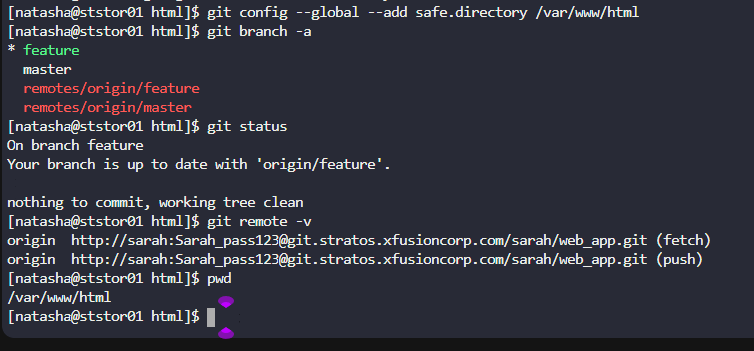
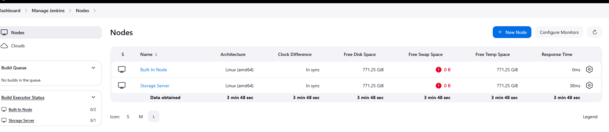
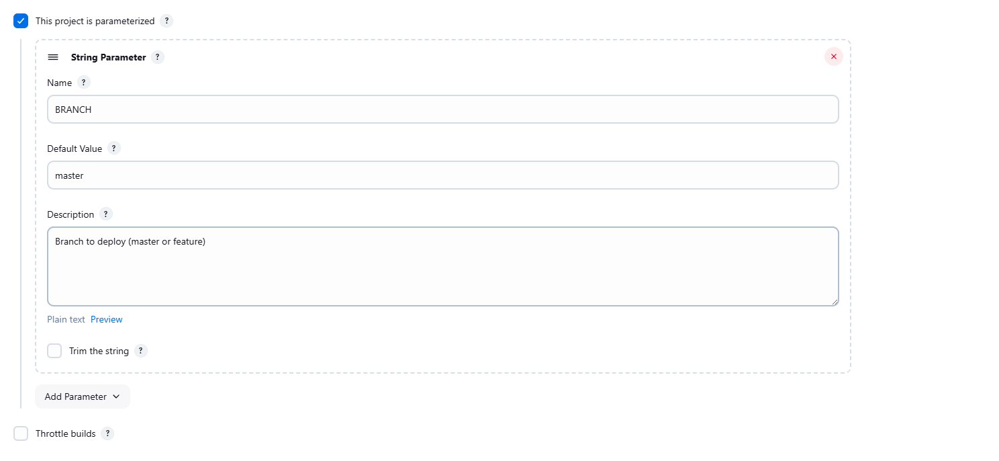

1. Add a slave node named `Storage Server`. It should be labeled as `ststor01` and its remote root directory should be `/var/www/html`.
2. We have already cloned repository on `Storage Server` under `/var/www/html`.
3. Apache is already installed on all app Servers its running on port `8080`.
4. Create a Jenkins pipeline job named `xfusion-webapp-job` (it must not be a `Multibranch pipeline`) and configure it to:

    - Add a string parameter named `BRANCH`.
    - It should conditionally deploy the code from `web_app` repository under `/var/www/html` on `Storage Server`, as this location is already mounted to the document root `/var/www/html` of app servers. The pipeline should have a single stage named `Deploy` ( which is case sensitive ) to accomplish the deployment.
    - The pipeline should be conditional, if the value `master` is passed to the `BRANCH` parameter then it must deploy the `master` branch, on the other hand if the value `feature` is passed to the `BRANCH` parameter then it must deploy the `feature` branch.

---

# Solution:

## Important Points to be known as per the scenario layed out for this task.

1. Both `master` and `feature` branches already exist in the Gitea repository

2. And The repository  points at the `/var/www/html` the Storage Server and this should have both branches available

3. You can verify branches exist with:

```bash

ssh natasha@ststor01

cd /var/www/html

git branch -a

```
4. This location `/var/www/html` on the Storage Server is mounted to `/var/www/html` of all app servers.Since this directory is mounted to all app servers, changes done on Storage server `/var/www/html` are immediately available to `/var/www/html` of all app servers

### Step 1: Access Jenkins and Install Required Plugins

First, let's access Jenkins UI (click the Jenkins button) and login with:
- Username: `admin`
- Password: `Adm!n321`

Navigate to **Manage Jenkins** → **Manage Plugins** → **Available plugins**

Install these plugins:
- **SSH Agent ** (for SSH connections)
- **Git Plugin** (should already be installed)
- **Pipeline Plugin** (should already be installed)
- **Credentials**
- **SSH**
- **SSH Build Agents**

## Important Points to Know

- Make Sure the Plugins Are all installed without any errors, properly otherwise you could face problem in implementing the Solution

- Check "Restart Jenkins when installation is complete and no jobs are running"

- Best to install plugins one by one and restart


### Step 2: Set Up SSH Credentials

If you prefer password-based authentication:

In Jenkins:
1. Go to **Manage Jenkins** → **Manage Credentials**
2. Click on **(global)** domain
3. Click **Add Credentials**
4. Configure:
   - **Kind**: `Username with password`
   - **Username**: `natasha`
   - **Password**: `Bl@kW`
   - **ID**: `storage-server-creds`
   - **Description**: `Storage Server Credentials`
5. Click **Create**


### Step 3: Add Storage Server as Jenkins Slave Node

While Jenkins restarts, let's prepare the Storage Server. From jump_host:

```bash
# SSH to Storage Server
ssh natasha@ststor01

# Enter password: Bl@kW

# Ensure Java is installed (required for Jenkins agent)
sudo yum install -y java-17-openjdk
sudo chown -R natasha:natasha /var/www/html
sudo chmod -R 755 /var/www/html

# Verify the user directory if needed


as we can in the image the git stepup is already confirgured

# Exit storage server
exit
```


#### Now in Jenkins UI:
1. Go to **Manage Jenkins** → **Manage Nodes and Clouds**
2. Click **New Node**
3. Configure:
   - **Node name**: `Storage Server`
   - Select: **Permanent Agent**
   - Click **Create**

4. Fill in the configuration:
   - **Name**: `Storage Server`
   - **Number of executors**: `1`
   - **Remote root directory**: `/var/www/html`
   - **Labels**: `ststor01`
   - **Usage**: `anything`
   - **Launch method**: `Launch agents via SSH`
        - **Host**: 172.16.238.15
        - **Credentails** : Select the Storage Server Credentails
        - **Host Key Verification Strategy**: `Non verifying Verification Strategy`

5. Click **Save**




### Step 4: Create Parameterized Pipeline Job

In Jenkins UI:
1. Click **New Item**
2. Enter name: `xfusion-webapp-job`
3. Select: **Pipeline** (NOT Multibranch Pipeline)
4. Click **OK**

### Step 5: Configure the Job

In the job configuration page:

#### General Section:
- Check **"This project is parameterized"**
- Click **Add Parameter** → **String Parameter**
  - **Name**: `BRANCH`
  - **Default Value**: `master` (optional)
  - **Description**: `Branch to deploy (master or feature)`



#### Pipeline Section:
- **Definition**: `Pipeline script`
- **Script**: Paste the following pipeline:

```groovy
pipeline {
    agent {
        label 'ststor01'
    }

    stages {
        stage('Deploy') {
            steps {
                sh """
                    cd /var/www/html
                    git stash
                    git checkout ${params.BRANCH}
                    git pull origin ${params.BRANCH}
                """
            }
        }
    }
}
```
- **`git stash`**:  This temporarily save changes in your working directory.
- **`git checkout ${params.BRANCH}`**: Switches to the specified branch (master or feature)
- **`git pull origin ${params.BRANCH}`**: Pulls the latest changes from that branch

### How This Works:

1. **String Parameter `BRANCH`**: Allows you to specify which branch to deploy
2. **Conditional Logic**:
    - If `BRANCH` = `master` → deploys master branch
    - If `BRANCH` = `feature` → deploys feature branch

### Step 6: Save and Test

1. Click **Save**
2. Click **Build with Parameters**
3. You'll see the **BRANCH** parameter field
4. Enter either `master` or `feature`
5. Click **Build**

### How This Works:

1. **String Parameter `BRANCH`**: Allows you to specify which branch to deploy
2. **Conditional Logic**:
   - If `BRANCH` = `master` → deploys master branch
   - If `BRANCH` = `feature` → deploys feature branch
3. **Single Stage "Deploy"**: Case-sensitive as required
4. **Git Operations**:
   - `git checkout <branch>`: Switches to the specified branch
   - `git pull origin <branch>`: Pulls latest changes from that branch
5. **Automatic Deployment**: Since `/var/www/html` is mounted to app servers, changes are immediately available

### Testing the Pipeline:

**Deploy Master Branch:**
- Click **Build with Parameters**
- BRANCH: `master`
- Click **Build**

**Deploy Feature Branch:**
- Click **Build with Parameters**
- BRANCH: `feature`
- Click **Build**

### Verify Deployment:


