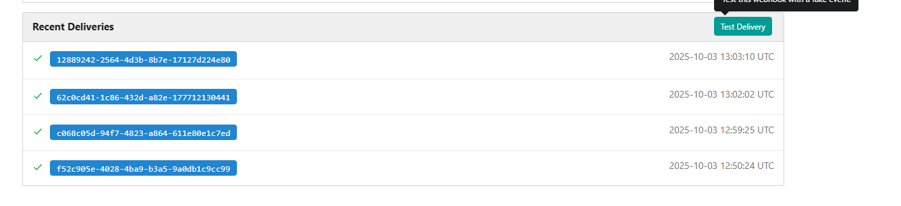

1. Install `httpd` (whatever version is available in the yum repo by default) and configure it to serve on port `8080` on All app servers. You can make it part of your Jenkins job or you can do this step manually on all app servers.

2. Create a Jenkins job named `nautilus-app-deployment` and configure it in a way so that if anyone pushes any new change to the origin repository in `master` branch, the job should auto build and deploy the latest code on the `Storage server` under `/var/www/html` directory. Since `/var/www/html` on `Storage server` is shared among all apps.
Before deployment, ensure that the ownership of the `/var/www/html` directory is set to user `sarah`, so that Jenkins can successfully deploy files to that directory.

3. SSH into `Storage Server` using `sarah` user credentials mentioned above. Under sarah user's home you will find a cloned Git repository named `web`. Under this repository there is an `index.html` file, update its content to `Welcome to the xFusionCorp Industries`, then push the changes to the `origin` into `master` branch. This push must trigger your Jenkins job and the latest changes must be deployed on the servers, also make sure it deploys the entire repository content not only `index.html` file.
---


---

# Solution:


## Step-by-Step Solution


###  Install Required Jenkins Plugins

Navigate to: **Manage Jenkins** → **Manage Plugins** → **Available** tab

Install the following plugins:

1. **Git Plugin** (usually pre-installed)
    - Allows Jenkins to use Git as SCM
2. **GitHub Plugin** (if using GitHub)
    - For GitHub integration
3. **SSH Agent Plugin**
    - For SSH credential management
4. **Publish Over SSH Plugin**
    - For deploying files over SSH
5. **Poll SCM Plugin** (usually pre-installed)
    - For polling Git repository for changes

- **SSH Agent** (for SSH connections)
- **Git Plugin** (should already be installed)
- **Pipeline Plugin** (should already be installed)
- **Credentials**
- **SSH Build Agents**

### Step 1: Install and Configure httpd on All App Servers

Let me SSH into each app server and install httpd configured on port 8080.

**For stapp01:**
```bash
sshpass -p 'Ir0nM@n' ssh -o StrictHostKeyChecking=no tony@172.16.238.10 << 'EOF'
echo 'Ir0nM@n' | sudo -S yum install -y httpd
echo 'Ir0nM@n' | sudo -S sed -i 's/^Listen 80$/Listen 8080/' /etc/httpd/conf/httpd.conf
echo 'Ir0nM@n' | sudo -S systemctl enable httpd
echo 'Ir0nM@n' | sudo -S systemctl start httpd
echo 'Ir0nM@n' | sudo -S systemctl status httpd
EOF
```

**For stapp02:**
```bash
sshpass -p 'Am3ric@' ssh -o StrictHostKeyChecking=no steve@172.16.238.11 << 'EOF'
echo 'Am3ric@' | sudo -S yum install -y httpd
echo 'Am3ric@' | sudo -S sed -i 's/^Listen 80$/Listen 8080/' /etc/httpd/conf/httpd.conf
echo 'Am3ric@' | sudo -S systemctl enable httpd
echo 'Am3ric@' | sudo -S systemctl start httpd
echo 'Am3ric@' | sudo -S systemctl status httpd
EOF
```

**For stapp03:**
```bash
sshpass -p 'BigGr33n' ssh -o StrictHostKeyChecking=no banner@172.16.238.12 << 'EOF'
echo 'BigGr33n' | sudo -S yum install -y httpd
echo 'BigGr33n' | sudo -S sed -i 's/^Listen 80$/Listen 8080/' /etc/httpd/conf/httpd.conf
echo 'BigGr33n' | sudo -S systemctl enable httpd
echo 'BigGr33n' | sudo -S systemctl start httpd
echo 'BigGr33n' | sudo -S systemctl status httpd
EOF
```
```
curl http://172.16.238.10:8080
curl http://172.16.238.11:8080
curl http://172.16.238.12:8080
```
### Step 2: Prepare Storage Server

Set up the `/var/www/html` directory with proper ownership for Jenkins deployment:

```bash
sshpass -p 'Bl@kW' ssh -o StrictHostKeyChecking=no natasha@172.16.238.15 << 'EOF'
echo 'Bl@kW' | sudo -S yum install -y java-17-openjdk
echo 'Bl@kW' | sudo -S chown -R sarah:sarah /var/www/html
echo 'Bl@kW' | sudo -S chmod -R 755 /var/www/html
ls -ld /var/www/html
EOF
```

### Step 3: Get Git Repository URL from Storage Server

```bash
sshpass -p 'Sarah_pass123' ssh -o StrictHostKeyChecking=no sarah@172.16.238.15 << 'EOF'
cd /var/www/html
git remote -v
git config --get remote.origin.url
pwd
EOF
```

and verifying the Mount


### Step 4: Set Up SSH Credentials

If you prefer password-based authentication:

In Jenkins:
1. Go to **Manage Jenkins** → **Manage Credentials**
2. Click on **(global)** domain
3. Click **Add Credentials**
4. Configure:
   - **Kind**: `Username with password`
   - **Username**: `sarah`
   - **Password**: `Sarah_pass123`
   - **ID**: `storage-server-creds`
   - **Description**: `Storage Server Credentials`
5. Click **Create**

#### Adding Storage Server as Jenkins Agent

Now in Jenkins UI:
1. Go to **Manage Jenkins** → **Manage Nodes and Clouds**
2. Click **New Node**
3. Configure:
   - **Node name**: `Storage Server`
   - Select: **Permanent Agent**
   - Click **Create**

4. Fill in the configuration:
   - **Name**: `Storage Server`
   - **Number of executors**: `1`
   - **Remote root directory**: `/var/www/html`
   - **Labels**: `ststor01`
   - **Usage**: `anything`
   - **Launch method**: `Launch agents via SSH`
        - **Host**: 172.16.238.15
        - **Credentials**: Select the Storage Server Credentials
        - **Host Key Verification Strategy**: `Non-verifying Verification Strategy`

5. Click **Save**

### Step 5: Configure Webhook in Gitea

If Gitea is accessible:

1. Login to Gitea web interface
2. Navigate to the **web** repository
3. Go to **Settings** → **Webhooks**
4. Click **Add Webhook** → **Gitea**
5. Configure:
    - **Target URL**: `http://172.16.238.19:8080/gitea-webhook/post`
    - **HTTP Method**: `POST`
    - **POST Content Type**: `application/json`
    - **Secret**: (leave empty or set if Jenkins configured)
    - **Trigger On**: Select `Push events`
    - **Branch filter**: `master`
    - ☑ **Active**
6. Click **Add Webhook**

### Step 6: Create Jenkins Job via Web UI



Configure Gitea

- Ensure the Gitea plugin is installed in Jenkins,

- configured under Manage Jenkins → Configure System → Gitea Servers. You should add your Gitea server URL (e.g. http://git.stratos.xfusioncorp.com) and credentials (Select the Credentials).

- Enable “manage hooks” (if supported), so Jenkins can auto-manage webhooks for repos.


Click **Test Delivery** in Gitea to verify Jenkins receives the webhook.


## Step 7: Test Webhook and Verify Deployment

### Detailed Step-by-Step Instructions:

1. **Create New Job**
   - From Jenkins Dashboard, click **New Item**
   - Enter item name: `nautilus-app-deployment`
   - Select **Pipeline**
   - Click **OK**

2. **General Section**
   - Description: `Auto-deploy Nautilus application from Git repository to Storage Server`

4. **Build Triggers Section**
   - Check ☑ **Poll SCM**

6. **Pipeline**
   - Click **Pipeline-Script**
   - Enter the following script:

```
pipeline {
  agent { label 'ststor01' }

  stages {
    stage('Checkout') {
      steps {
        // This will clone/fetch from the repo into workspace
        git url: 'http://git.stratos.xfusioncorp.com/sarah/web.git', branch: 'master'
      }
    }

    stage('Deploy') {
      steps {
        sh '''
          # Change directory to where you expect the web files
          # If your workspace is already the repo root, you may adapt.
          cd /var/www/html

          git stash
          git pull origin master || git pull origin main
        '''
      }
    }
  }
}
```

### Step 8: Test and Verify Deployment

1. **Test the Jenkins Job:**
   - Click **Build Now** to manually trigger the job
   - Check **Console Output** for any errors

2. **Make a Change to Trigger Webhook:**
   SSH into Storage Server and update the repository:
   ```bash
   sshpass -p 'Sarah_pass123' ssh -o StrictHostKeyChecking=no sarah@172.16.238.15 << 'EOF'
   cd ~/web
   echo 'Welcome to the xFusionCorp Industries' > index.html
   git add index.html
   git commit -m "Update welcome message"
   git push origin master
   EOF
   ```


